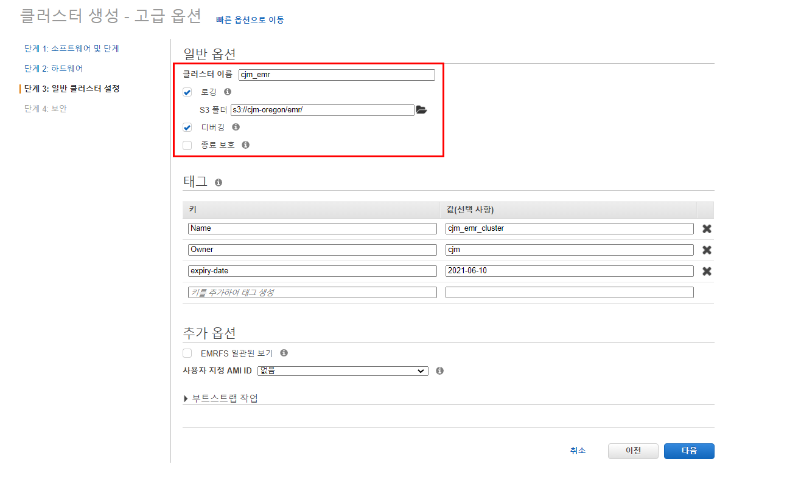

# Managed EMR

## 1. 소프트웨어 및 단계

1. 릴리즈 : **emr-6.0.0**
   어플리케이션 : **Hadoop 3.2.1, Hive 3.1.2, Hue 4.4.0**

   

## 2. 하드웨어

1. Cluster Composition : **균일한 인스턴스 그룹**

2. Networking : **public subnet**

   

3. Cluster Nodes and Instances

   - master : **m5.xlarge, 1개**
   - core : **m5.xlarge, 1개**
   - task : **m5.xlarge, 2개**

4. Cluster scaling : **disable**

5. EBS Root Volume : **100 GB**

   

   

## 3. 일반 클러스터 설정

1. 클러스터 이름 : **cjm_emr**

2. 디버깅 : **enable**

3. 종료보호 : **disable**

   

## 4. 보안

1. EC2 키 페어 : **{본인 key pair}**

2. EMR Role, EC2 Instance profile, Auto Scaling Role : **default**

   