# 1) 본인 계정 S3에 3개 Folder를 합쳐서 1개의 파일로 만들기

## glue로 s3 에서 crawling해서 merge 하기

1. crawler 생성

   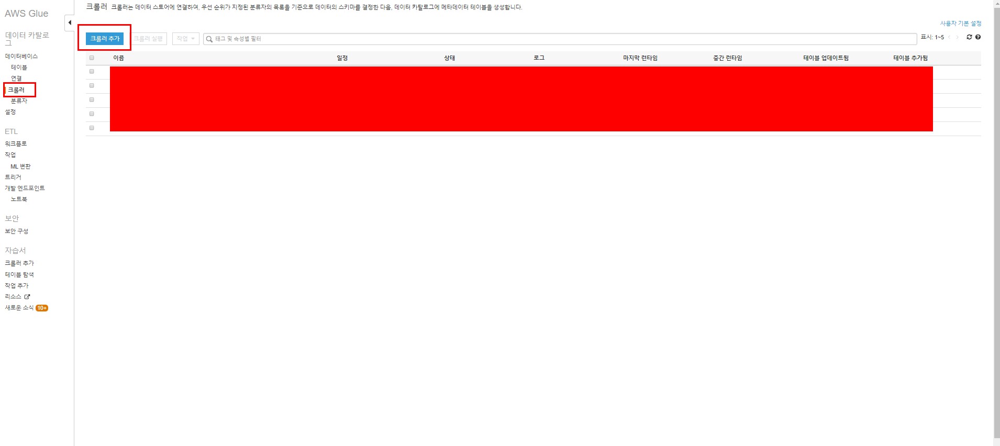

   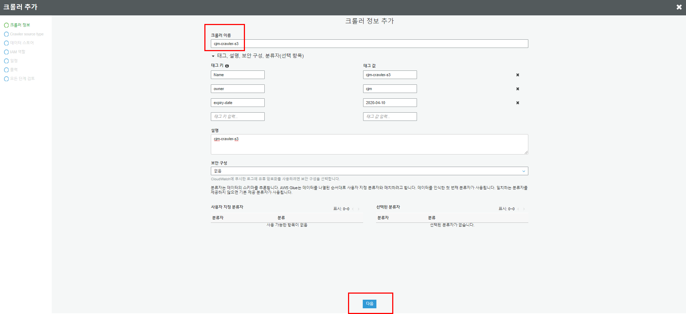

   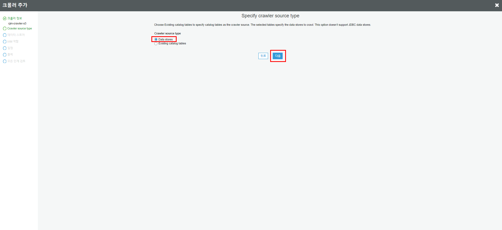

   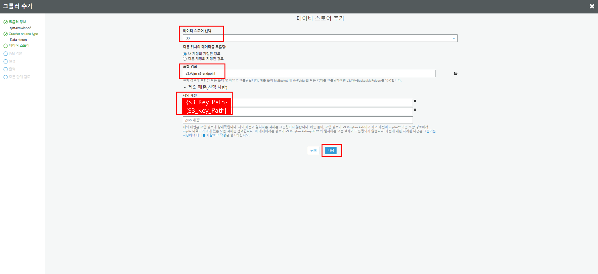

   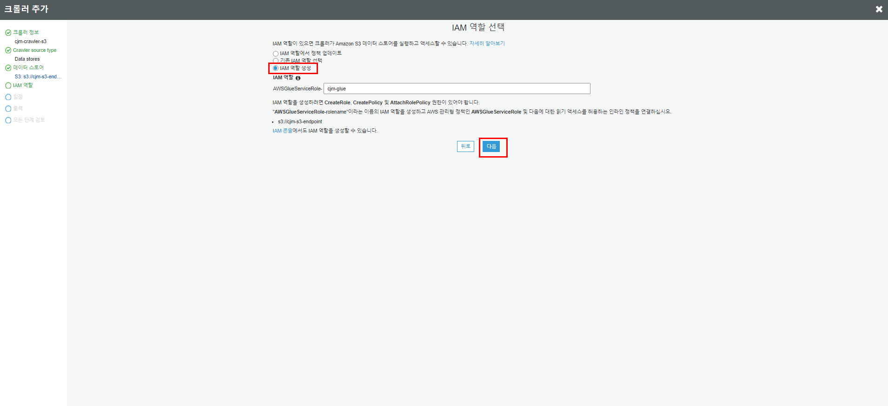

   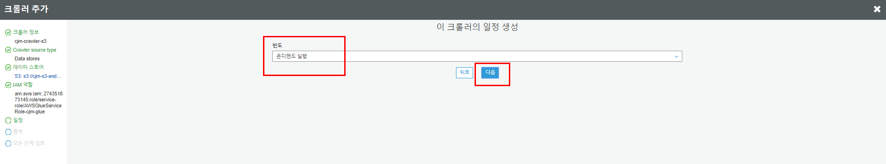

   데이터 베이스를 만들어두지 않았다면 여기서 같이 만들 수 있습니다.

   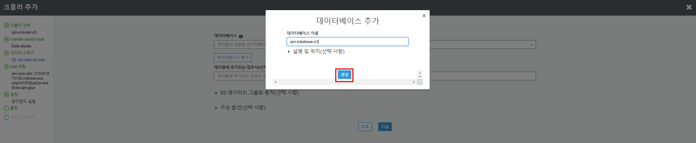

   크롤러를 실행하여 테이블을 생성한다.

   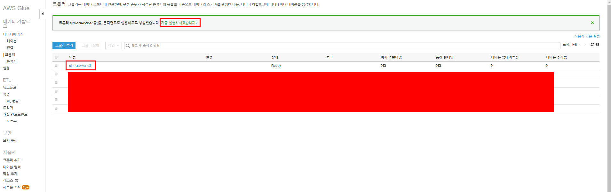

   테이블이 생성된 것을 볼 수 있습니다.

   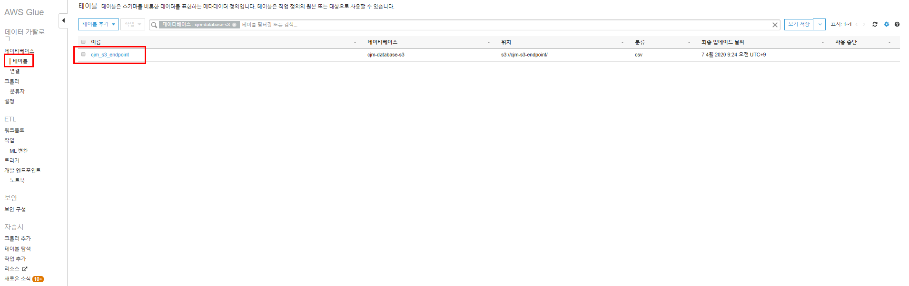

   테이블은 3개의 partition으로 구성된 것을 확인할 수 있습니다.

2. job 생성

   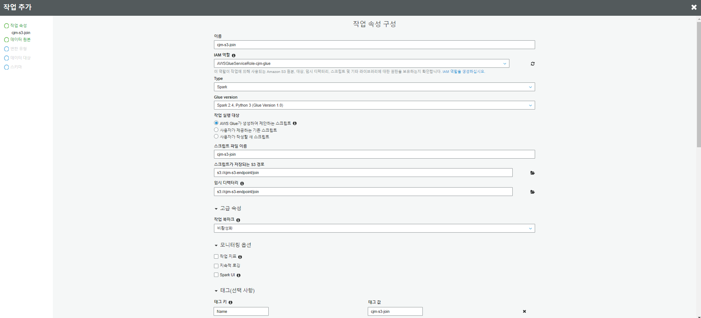

   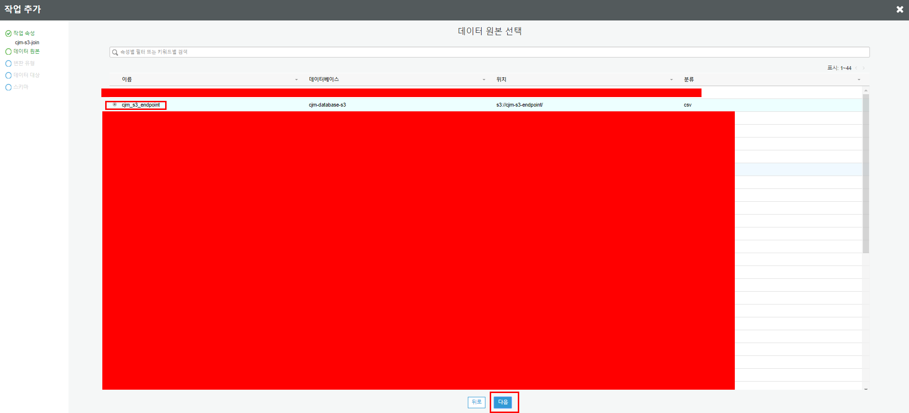

   작업 스크립트 입니다. 원하는 작업에 맞게 편집합니다.

   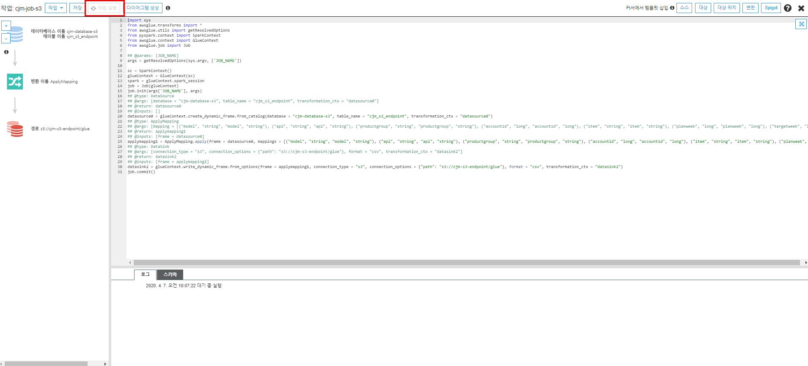

   ```python
   import sys
   from awsglue.transforms import *
   from awsglue.utils import getResolvedOptions
   from pyspark.context import SparkContext
   from awsglue.context import GlueContext
   from awsglue.job import Job
   
   sc = SparkContext.getOrCreate()
   glueContext = GlueContext(sc)
   datasource0 = glueContext.create_dynamic_frame.from_catalog(
       database = "{catalog database name}", 
       table_name = "mydir")
   repartition = datasource0.toDF()
   repartition.coalesce(1).write.mode('append').option("header", "true").csv('s3://{path}')
   ```

   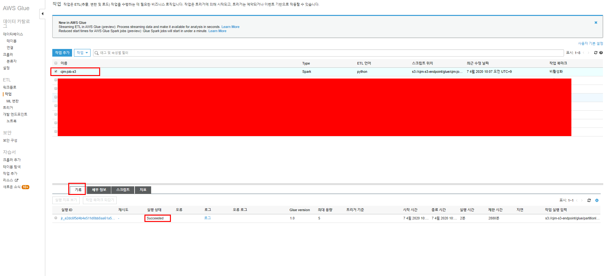

3. 실행한 작업 확인
   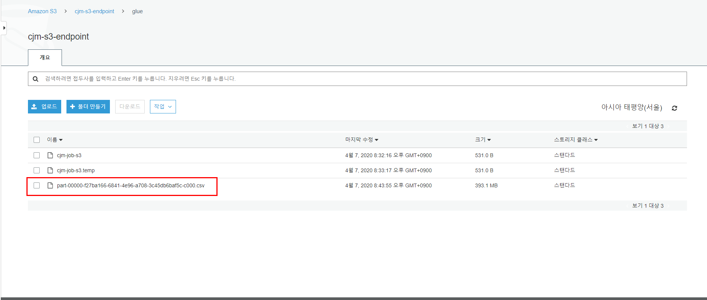

4. cli로 merge 여부 확인

   ```shell
   # csv의 처음과 끝을 확인, 다른 다른 폴더의 csv내용이 있는지 확인
   head /s3fs/glue/part-00000-f27ba166-6841-4e96-a708-3c45db6baf5c-c000.csv
   tail /s3fs/glue/part-00000-f27ba166-6841-4e96-a708-3c45db6baf5c-c000.csv
   ```

   

5. 다음번 사용을 위해 terraform으로 glue resource provisioning

   ```terraform
   // 프로 바이더 설정
   // 테라폼과 외부 서비스를 연결해주는 기능
   // {대문자}는 입력이 필요한 영역
   provider "aws" {
       profile    = "aws_provider"
       region     = var.my_region
       access_key = var.aws_access_key
       secret_key = var.aws_secret_key
   }
   
   # glue database
   resource "aws_glue_catalog_database" "cjm_database" {
     name           = "cjm-database-s3"
     description    = "cjm-database-s3"
   }
   
   # glue cralwer
   resource "aws_glue_crawler" "example" {
     database_name = "${aws_glue_catalog_database.cjm_database.name}"
     name          = "cjm-crawler-s3"
     role          = "{ROLE_ARN}"
   
     s3_target {
       path = "{S3_PATH}"
     }
   
     tags {
         Name            = "cjm-crawler-s3",
         owner           = "cjm",
         expiry-date     = "2020-04-10"
     }
   }
   
   resource "aws_glue_job" "cjm-job-s3" {
     name     = "cjm-job-s3"
     role_arn = "{ROLE_ARN}"
   
     command {
       script_location = "{S3_SCRIPT_PATH}"
     }
       tags {
         Name            = "cjm-job-s3",
         owner           = "cjm",
         expiry-date     = "2020-04-10"
     }
   }
   ```
   
   

## 파이썬 코드로 해결

[S3_mount_case](../s3fs&bash_script.md)라고 가정 시 이 방법도 가능합니다

1. py file 생성(s3 mount한 dir에서 파일 가져오기)

   ```shell
   vi files.py
   ```

   ```shell
   #!/usr/bin/env python3
   
   import glob
   import csv
   import os
   
   input_path = '/s3fs/mydir/'
   output_file = '/root/output/result.csv'
   file_list = os.listdir(input_path)
   is_first_file = True
   for dirc in file_list:
       specific_dir = dirc + "/*"
       allFile_list = glob.glob(os.path.join(r'/s3fs/mydir/', specific_dir))
       for input_file in allFile_list:
           with open(input_file,'r',newline='') as csv_in_file:
               with open(output_file,'a',newline='') as csv_out_file:
                   freader = csv.reader(csv_in_file)
                   fwriter = csv.writer(csv_out_file)
                   if is_first_file:
                       for row in freader:
                           fwriter.writerow(row)
                       is_first_file = False
                   else:
                       header = next(freader)
                       for row in freader:
                           fwriter.writerow(row)
   print("end")
   ```
   
2. 파일 권한 부여 및 실행

   ```shell
   chmod u+x files.py
   ./files.py
   ```

   


3. s3에 적재

   ```sh
   mv /root/output/result.csv /s3fs/mydir/
   ```

# 2-1) 각 폴더의 파일 갯수를 셀 수 있는 python 코드 

[S3_mount_case](../s3fs&bash_script.md)라고 가정 시 이 방법도 가능합니다

1. py file 생성(s3 mount한 dir에서 파일 가져오기)

   ```shell
   vi count.py
   ```

   ```shell
   #!/usr/bin/env python
   
   import pandas as pd
   import glob
   import os
   
   path = "/s3fs/mydir/"
   file_list = os.listdir(path)
   allcount = 0
   for dirc in file_list:
       specific_dir = dirc + "/"
       allFile_list = path + specific_dir
       allcount = allcount + len(os.walk(allFile_list).next()[2])
   
   print('{0} {1}'.format('All count number :',allcount))
   ```

2. 파일 권한 부여 및 실행

   ```shell
   chmod u+x count.py
   ./count.py
   ```

3. 결과

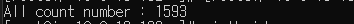


# 2-2) boto3로 파일 갯수를 셀 수 있는 python 코드

1. python file 생성(boto3 사용)

   ```shell
   vi count.py
   ```

   ```shell
   import boto3
   
   client = boto3.client('s3')
   bucket_name = '{Bucket-Name}'
   paginator = client.get_paginator('list_objects_v2')
   response_iterator = paginator.paginate(
       Bucket=bucket_name,
       Prefix='mydir/'
   )
   
   count=0
   for page in response_iterator:
       for content in page['Contents']:
           count=count+1
   print('{0} {1}'.format('All count number :',count))
   print("end")
   ```

2. 파일 권한 부여 및 실행

   ```shell
   chmod u+x count.py
   ./count.py
   ```

3. 결과

   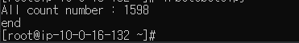