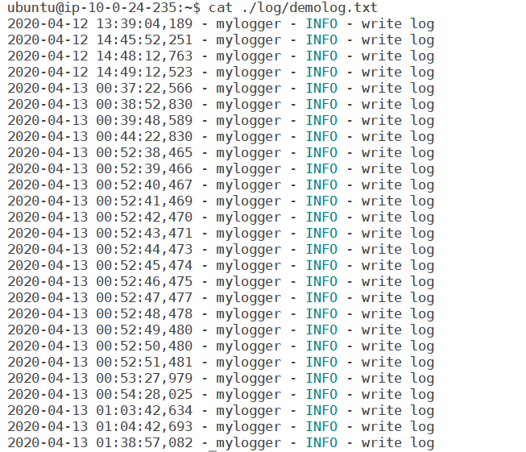
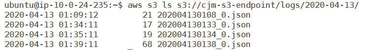
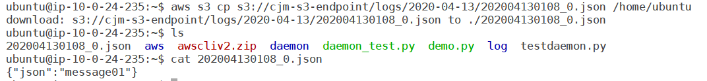

# Fluentd to s3

## 1. app 생성

1. 모듈 설치

   ```sh
   pip3 install python-daemon
   pip3 install pidlockfile
   ```

2. 로그가 저장될 디렉토리 생성

   ```sh
   mkdir /home/ubuntu/log
   mkdir /home/ubuntu/log/pos
   mkdir /home/ubuntu/daemon
   vi demo.py
   ```

3. log 생성 app 만들기

   ```python
   import sys
   import os
   import time
   import daemon
   from daemon import pidfile
   from daemon.pidfile import PIDLockFile
   from logging import handlers
   import logging
   import time
   
   
   _logger = logging.getLogger("mylogger")
   _logger.setLevel(logging.INFO)
   formatter = logging.Formatter('%(asctime)s - %(name)s - %(levelname)s - %(message)s')
   
   file_handler = handlers.RotatingFileHandler(
       "/home/ubuntu/log/demolog.txt",
       mode='a',
       maxBytes= (1024 * 1024 * 512), # 512GB
       backupCount=3
   )
   file_handler.setFormatter(formatter)
   _logger.addHandler(file_handler)
   pid_file = '/home/ubuntu/daemon/demo_test.pid'
   _logger.info("write log")
   
   def program():
       print('start_daemon')
       while True:
           _logger.info("write log")
           time.sleep(60)
   
   
   def start_daemon():
       pidfile=daemon.pidfile.PIDLockFile('/home/ubuntu/daemon/demo_test.pid')
       pidLockfile = pidfile
       logfile_fileno = file_handler.stream.fileno()
       context = daemon.DaemonContext(pidfile=pidLockfile,files_preserve = [logfile_fileno])
       # context = daemon.DaemonContext(pidfile=pidLockfile)
   
       
       #context.files_preserve = [logfile_fileno]
       if pidLockfile.is_locked():
           print ("running already (pid: %d)" % pidLockfile.read_pid())
           exit(1)
   
       print('start_daemon')
       with context:
           program()
   
   def main():
       try:
           if sys.argv[1] == 'start':
               start_daemon()
   
           elif sys.argv[1] == 'stop':
               pid = '999999'
               f = open(pid_file, 'r')
               for line in f:
                   pid = line = line.strip()
               f.close()
               print(pid)
               cmd = 'kill '+ pid
               os.system(cmd)
   
       except Exception as e:
           print(e)
   
   if __name__ == "__main__":
       main()
   ```

4. 파일 실행하기

   ```sh
   python3 demo.py start
   ```

5. 로그 값 확인

   ```sh
   cat ./log/demolog.txt
   ```

   

6.  app 종료하기

   ```sh
   python3 demo.py stop
   ```

   

## 2. fluentd 설정

1. 설치

   ```sh
   curl -L https://toolbelt.treasuredata.com/sh/install-ubuntu-xenial-td-agent3.sh | sh
   ```

2. . 데몬 실행

   ```shell
   sudo /etc/init.d/td-agent start 
   sudo /etc/init.d/td-agent status
   ```

3. 설정값 수정

   ```shell
   sudo vi /etc/td-agent/td-agent.conf
   ```

   ```shell
   ####
   ## Output descriptions:
   ##
   
   <source>
           @type tail
           path /home/ubuntu/log/demolog.txt
           pos_file /home/ubuntu/log/pos/position.log
           rotate_wait 60
           read_lines_limit 1000
           read_from_head true
           tag log.demo
           <parse>
                   @type none
           </parse>
   </source>
   
   <match log.**>
       @type s3
   
       aws_key_id [YOUR_AWS_KEY_ID]
       aws_sec_key [YOUR_AWS_SECRET_KEY]
       s3_region [YOUR_S3_REGION]
       s3_bucket [YOUR_S3_BUCKET]
   
       path logs/%Y-%m-%d/
       s3_object_key_format %{path}%{time_slice}_%{index}.%{file_extension}
       store_as json
   
       <buffer tag,time>
           @type file
           path /var/log/td-agent/s3
           timekey 1m
           timekey_wait 10s
           timekey_use_utc true # use utc
       </buffer>
       <format>
           @type json
       </format>
   </match>
   ```

4. 데몬 재실행

   ```shell
   sudo /etc/init.d/td-agent restart 
   ```

5. 로그 보내졌는지 확인

   ```shell
   aws s3 ls s3://{Bucket_Name}/{Key_path}
   ```

   

   ```shell
   aws s3 cp s3://{Bucket_Name}/{Key_path} /home/ubuntu
   ```

   
