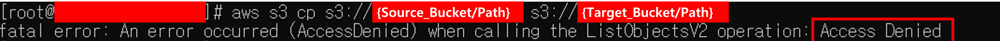
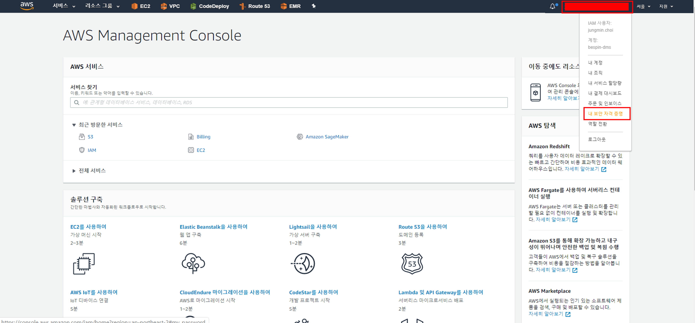
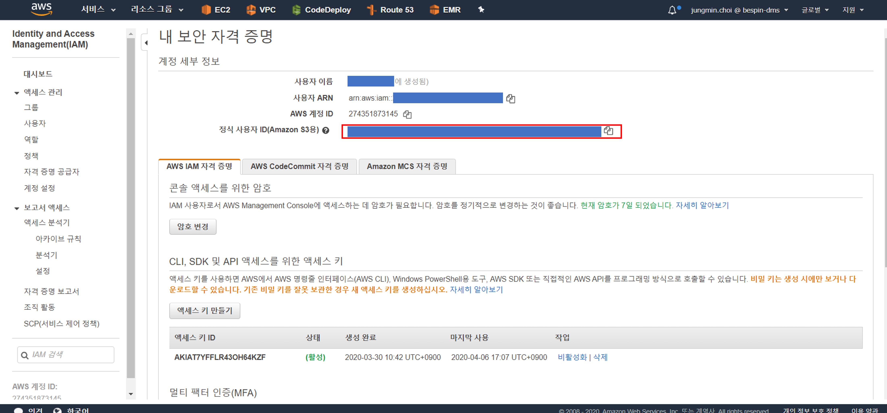
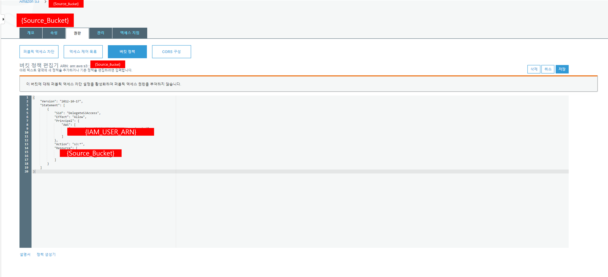
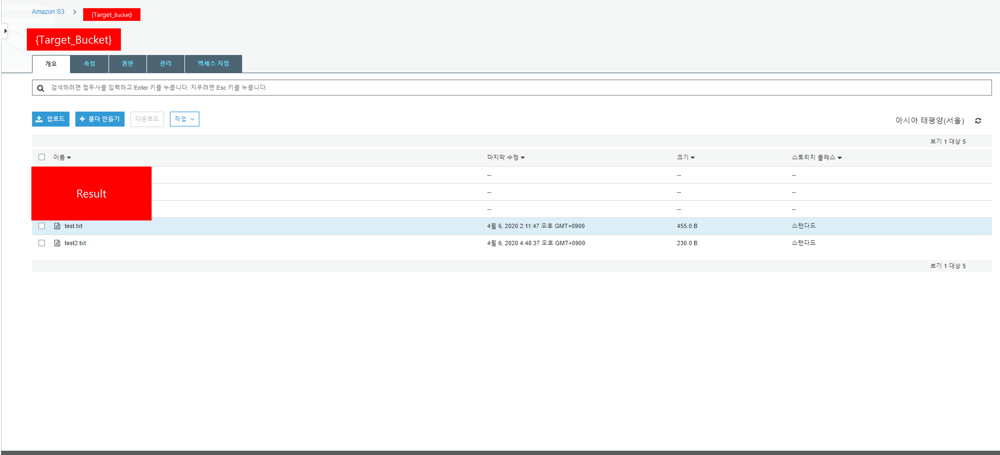

# S3 Cross Account copy

A 계정 Bucket을 Source_Bucket, B 계정 Bucket을 Target_Bucket이라 표현하겠습니다.

1. 현재 상태 확인 하기
   

   거부되었습니다.

2. 나의 계정 정식 ID 파악

   

   

   cli로 확인하기

   ```sh
   aws s3api list-buckets --query "Owner.ID"
   ```

   

3. 버킷에 대한 사용자 추가(내 계정)

   

   cli로 추가하기

   ```sh
   aws s3api put-bucket-acl --bucket {Source_Bucket} --grant-full-control id=[aws s3용 정식 id]
   ```

   

4. bucket 정책 생성

   

   cli로 수행하는 방법
   policy를 생성합니다.

   ```sh
   vi policy.json
   ```

   ```sh
   {
      "Version": "2012-10-17",
      "Statement": [
         {
            "Sid": "DelegateS3Access",
            "Effect": "Allow",
            "Principal": {
            		"AWS": "{IAM_USER_ARN}"
            },
            "Action": "s3:*",
            "Resource": "{Source_Bucket_ARN}"
         }
      ]
   }
   ```

   생성한 policy를 Source_Bucket에 적용합니다.

   ```sh
   aws s3api put-bucket-policy --bucket changyoon.oregon --policy file://policy.json
   ```

5. ec2에 계정 정보 설정

   ```shell
   aws configure --profile jungmin
   ```

6. bucket 복사하기

   ```sh
   aws s3 cp --profile jungmin s3://{Source_Bucket/Path} /s3fs/mydir/IRAN --recursive
   aws s3 cp --profile jungmin s3://{Source_Bucket/Path} /s3fs/mydir/SAMCOL --recursive
   aws s3 cp --profile jungmin s3://{Source_Bucket/Path} /s3fs/mydir/SAPL --recursive
   ```

   > 상단의 내용은 EC2의 /s3fs에 Target_Bucket을 mount했다는 가정입니다.
   >
   > Mount하지 않았다면 Target_Bucket 주소를 작성해야 합니다.

7. 복사 여부 확인하기
   

참조 : [https://medium.com/@labcloud/s3-bucket-cross-account-access-%ED%95%B4%EB%B3%B4%EA%B8%B0-81f1bbb8d5db](https://medium.com/@labcloud/s3-bucket-cross-account-access-해보기-81f1bbb8d5db)
https://github.com/miztiik/AWS-Demos/tree/master/How-To/setup-s3-bucket-copy-across-accounts