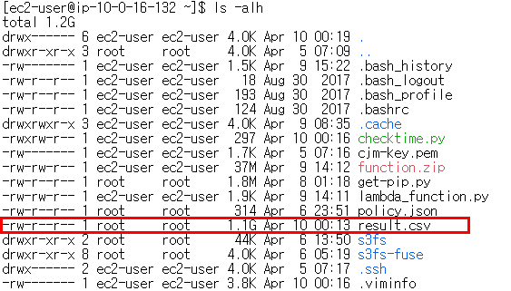
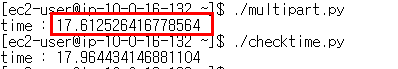

# s3 bucket에 특정 file(1GB) upload

## 1. upload_file

1. 1GB 이상의 파일 준비
   
   
   
2. 파일을 이용한 upload code create

   ```shell
   # py 코드 생성
   vi checktime.py 
   ```

   ```shell
   #!/usr/bin/env python3
   import boto3
   import time
   
   client = boto3.client('s3')
   bucket_name = '{bucket_name}'
   out_file = 'result.csv'
   new_file_key = "part2/result.csv"
   
   start = time.time()  # start time
   client.upload_file(out_file, bucket_name, new_file_key)
   print("time :", time.time() - start)  
   ```

3. 실행 시켜서 소요 시간 확인하기

   ```shell
   chmod u+x checktime.py
   ./checktime.py
   ```

   


## 2. multi part upload

1. 1GB 이상의 파일 준비
   
   
   
2. 파일을 이용한 upload code create

   ```shell
   # py 코드 생성
   vi multipart.py 
   ```

   ```shell
   #!/usr/bin/env python3
   
   import threading
   import boto3
   import os
   import sys
   from boto3.s3.transfer import TransferConfig
   import time
   
   KB = 1024
   MB = KB * KB
   client = boto3.client('s3')
   bucket_name = '{bucket_name}'
   out_file = 'result.csv'
   new_file_key = "part2/multi_part_result.csv"
   
   
   def multi_part_upload_with_s3():
       # Multipart upload
       config = TransferConfig(multipart_threshold= 8*MB, max_concurrency=5,
                               multipart_chunksize= 8*MB, use_threads=True)
   
       client.upload_file(out_file, bucket_name, new_file_key,
                               Config=config)
   
   
   start = time.time()  # start time
   multi_part_upload_with_s3()
   print("time :", time.time() - start)
   ```

3. 실행 시켜서 소요 시간 확인하기

   ```shell
   chmod u+x checktime.py
   ./multipart.py
   ./checktime.py
   ```



