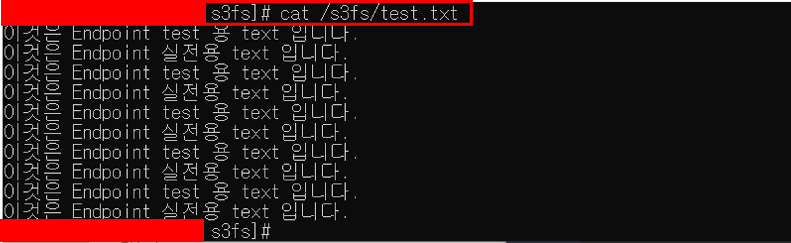
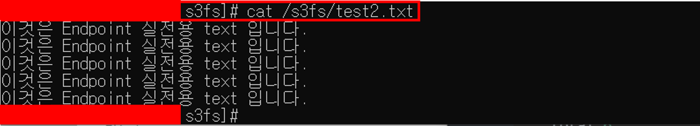
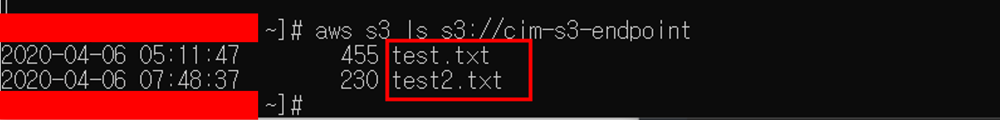

# S3 파일의 특정 단어가 들어간 Line을 제거 후 S3에 Upload

1. [EC2에 AWS S3 mount (s3fs)](#1-s3fs를-이용해-aws-s3-mount-해서-사용하기)
   1. [s3fs Install](#1-ec2에-s3fs-설치-및-mount)
   2. [s3 mount](#2-s3fs로-aws-s3-mount)
2. [TXT 파일 변경 및 S3 Upload](#2-txt-파일-변경-및-s3-upload)
3. [결과 확인](#3.-aws-cli로-s3에-load-되었는지-확인)

## 1. s3fs를 이용해 AWS S3 mount 해서 사용하기

### 1. ec2에 s3fs 설치 및 mount

CentOS 기준으로 설치합니다.

**1. Package 설치**

```shell
sudo yum install automake fuse-devel gcc-c++ git libcurl-devel libxml2-devel make openssl-devel
```

**2. s3fs 설치**

git 을 통해 source를 download 받습니다.

```shell
git clone https://github.com/s3fs-fuse/s3fs-fuse.git

's3fs-fuse'에 복제합니다...
remote: Counting objects: 2912, done.
remote: Compressing objects: 100% (2/2), done.
remote: Total 2912 (delta 0), reused 0 (delta 0), pack-reused 2910
오브젝트를 받는 중: 100% (2912/2912), 1.72 MiB | 312.00 KiB/s, 완료.
델타를 알아내는 중: 100% (1985/1985), 완료.
연결을 확인하는 중입니다...완료.
```

autogen.sh 실행

```shell
cd s3fs-fuse/
./autogen.sh 
--- Make commit hash file -------
--- Finished commit hash file ---
--- Start autotools -------------
configure.ac:26: installing './config.guess'
configure.ac:26: installing './config.sub'
configure.ac:27: installing './install-sh'
configure.ac:27: installing './missing'
src/Makefile.am: installing './depcomp'
parallel-tests: installing './test-driver'
--- Finished autotools ----------
```

configure

```shell
./configure
checking build system type... x86_64-unknown-linux-gnu
checking host system type... x86_64-unknown-linux-gnu
checking target system type... x86_64-unknown-linux-gnu
checking for a BSD-compatible install... /usr/bin/install -c
checking whether build environment is sane... yes
checking for a thread-safe mkdir -p... /bin/mkdir -p
checking for gawk... gawk
checking whether make sets $(MAKE)... yes
checking whether make supports nested variables... yes
checking for g++... g++
```

make install 

```shell
make
make  all-recursive
make[1]: Entering directory `/home/ec2-user/s3fs-fuse'
Making all in src
make[2]: Entering directory `/home/ec2-user/s3fs-fuse/src'
g++ -DHAVE_CONFIG_H -I. -I..  -D_FILE_OFFSET_BITS=64 -I/usr/include/fuse -I/usr/include/libxml2      -g -O2 -Wall -D_FILE_OFFSET_BITS=64 -MT s3fs.o -MD -MP -MF .deps/s3fs.Tpo -c -o s3fs.o s3fs.cpp
mv -f .deps/s3fs.Tpo .deps/s3fs.Po
g++ -DHAVE_CONFIG_H -I. -I..  -D_FILE_OFFSET_BITS=64 -I/usr/include/fuse -I/usr/include/libxml2      -g -O2 -Wall -D_FILE_OFFSET_BITS=64 -MT curl.o -MD -MP -MF .deps/curl.Tpo -c -o curl.o curl.cpp
mv -f .deps/curl.Tpo .deps/curl.Po
g++ -DHAVE_CONFIG_H -I. -I..  -D_FILE_OFFSET_BITS=64 -I/usr/include/fuse -I/usr/include/libxml2      -g -O2 -Wall -D_FILE_OFFSET_BITS=64 -MT cache.o -MD -MP -MF .deps/cache.Tpo -c -o cache.o cache.cpp
mv -f .deps/cache.Tpo .deps/cache.Po
g++ -DHAVE_CONFIG_H -I. -I..  -D_FILE_OFFSET_BITS=64 -I/usr/include/fuse -I/usr/include/libxml2      -g -O2 -Wall -D_FILE_OFFSET_BITS=64 -MT string_util.o -MD -MP -MF .deps/string_util.Tpo -c -o string_util.o string_util.cpp
mv -f .deps/string_util.Tpo .deps/string_util.Po
```

설치 완료. 

### 2. s3fs로 AWS S3 mount

1. AWS access key / secret key 를 파일에 설정합니다.
   해당 key는 S3에 대한 권한이 있는 IAM_User의 key 입니다.
    key 정보 파일의 default path는 `/etc/passwd-s3fs` 이다. 

   ```shell
   echo AccessKey:SecretKey > /etc/passwd-s3fs
   ```

2. Key file 권한 변경

   ```shell
   # permission을 600으로 설정
   chmod 600 /etc/passwd-s3fs
   ```

3. mount directory 생성

   ```shell
   # 하단 directory에 s3 mount
   mkdir -p /s3fs
   ```

4. s3fs 로 mount 설정소스 컴파일로 설치시 s3fs 명령 파일은 `/usr/local/bin` 에 있습니다.

   s3fs로 S3 bucket을 mount 실행합니다.

    ```shell
   /root/s3fs-fuse/src/s3fs {Bucket_Name}/{Mount_Path}
    ```

   위와 같이 /s3fs 디렉토리에 잘 마운트 된 것을 볼 수 있습니다.

   

## 2. TXT 파일 변경 및 S3 Upload

변경에 필요한 예시 txt 파일을 작성 합니다.

[test.txt](../Data/test.txt)

```shell
touch /s3fs/test
ls -al /s3fs/
total 5
drwx------  1 root root    0 Jan  1  1970 .
dr-xr-xr-x 26 root root 4096 Apr  6 05:24 ..
-rw-r-----  1 root root  455 Apr  6 05:11 test.txt
```

test.txt 내용 확인


test.txt에서 'test'라는 단어가 들어가 있으면 제거하여 test2.txt에 저장

```shell
sed '/test/d' /s3fs/test.txt > /s3fs/test2.txt
total 6
drwx------  1 root root    0 Jan  1  1970 .
dr-xr-xr-x 26 root root 4096 Apr  6 05:24 ..
-rw-r--r--  1 root root  230 Apr  6 07:48 test2.txt
-rw-r-----  1 root root  455 Apr  6 05:11 test.txt
```

확인

```shell
cat /s3fs/test2.txt
```



'test' 문자열이 모두 제거 되어 s3에 Load 되었다.

## 3. aws cli로 s3에 Load 되었는지 확인

aws cli 2.0 설치

[리눅스에 aws cli 설치가이드](https://docs.aws.amazon.com/ko_kr/cli/latest/userguide/install-cliv2-linux.html)

1. `curl` 명령을 사용하여 파일을 다운로드할 수 있습니다. 다음 예제 명령의 옵션을 사용하면 다운로드한 파일이 로컬 이름 `awscliv2.zip`으로 현재 디렉터리에 기록됩니다.

   ```shell
   curl "https://awscli.amazonaws.com/awscli-exe-linux-x86_64.zip" -o "awscliv2.zip"
   ```

   

2. 설치 관리자의 압축을 풉니다. 다음 예제 명령은 현재 폴더에 패키지의 압축을 풉니다. Linux 배포에 기본 제공 `unzip` 명령이 없는 경우 선호하는 패키지 관리자 또는 이와 동등한 패키지 관리자를 사용하여 설치합니다.

   ```shell
   unzip awscliv2.zip
   ```

   

3. 설치 프로그램을 실행합니다.

   ```sh
   sudo ./aws/install
   ```

4. 설치를 확인합니다.

   ```shell
   aws --version
   ```

5. bucket 확인

   ```sh
   aws s3 ls s3://[bucket-name]
   ```

   