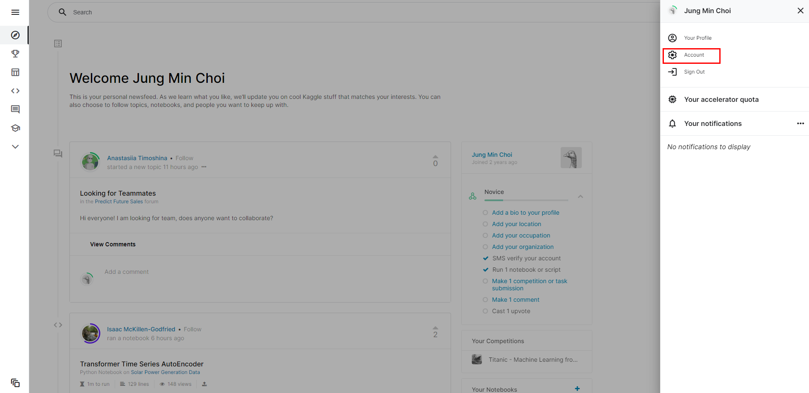
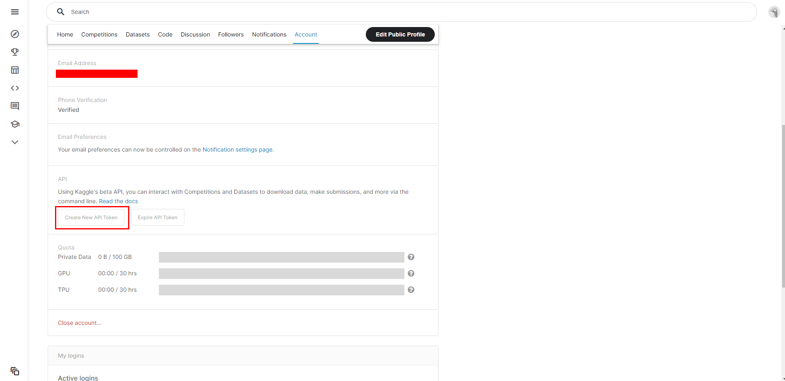

# Elasticsearch에 Data 적재 및 확인

## 1. 데이터 선정 (kaggle)

1. [allposts.csv](https://www.kaggle.com/brianhamachek/nearby-social-network-all-posts): 43.09 GB 
2. [deletedposts.csv](https://www.kaggle.com/brianhamachek/nearby-social-network-all-posts) : 5 GB
3. [chats_2021-04.csv](https://www.kaggle.com/uetchy/vtuber-livechat) : 11.17 GB

## 2. kaggle 작업 환경 구성

[참고 자료](https://github.com/mullue/amazon-sagemaker-architecting-for-ml/blob/master/Starter-Code-kr/How_to_downlaod_kaggle_data/0.download_kaggle_dataset.ipynb)

1. kaggle api key 생성
   

   

   `kaggle.json` 파일이 로컬에 download 됩니다.

2. sftp로 kaggle.json 파일 server에 upload

3. library 설치 및 데이터 download

   ```sh
   pip3 install --user kaggle
   
   # sftp 로 kaggle.json 파일 ~/에 upload
   
   mkdir -p ~/.kaggle # 유저의 홈디렉토리에 .kaggle 폴더 생성
   cp kaggle.json ~/.kaggle/kaggle.json # 현재 폴더의 kaggle.json 파일을 복사
   chmod 600 ~/.kaggle/kaggle.json # kaggle.json을 오너만 읽기, 쓰기 권한 할당
   
   export PATH=$PATH:/home/ec2-user/.local/bin # kaggle 명령어를 실행어를 어디서나 실행하기 위해 Path 설정
   # 아래 명령어는 위에서 Kaggle Dataset API 복사 된 것을 붙이기 하세요
   {KAGGLE API COMMAND}  -p download_data # kaggle 명령어 실행해서 다운로드
   
   mkdir -p datas # data_dir 폴더 생성
   unzip  download_data/{download zip file} -d datas/{data dir}
   
   rm -rf download_data # downlaod_dir 폴더 제거
   ```

   {KAGGLE API COMMAND} : 
   


## 3. data 적재

1. library 설치

   ```sh
   sudo pip3 install elasticsearch
   sudo pip3 install pandas
   ```

2. down 받은 data encoding 확인

   > csv 파일을 적재할 경우 bulk 형태로 적재하게 되는데 UTF-8 type만 허용

   ```sh
   file -bi {data file}
   iconv -f {data file encoding} -t UTF-8 {data file} > utf_{data file}
   ```

3. data 적재 script 작성

   1. json file

      ```python
      from elasticsearch import Elasticsearch
      import pprint as ppr
      import json
      
      json_file = ""
      index_name = ""
      doc_name = ""
      
      es = Elasticsearch(
          # 마스터 계정정보를 이용하여 http로 ES와 통신
          hosts = [{'host': '{host}', 'port': '{port}'}],
          http_auth = ('{username}', '{password}'),
          scheme="http"
      )
      
      with open(json_file, "r", encoding="utf-8") as jsonfile:
          data = json.loads(jsonfile.read())
          for n, doc in enumerate(data):
              res = es.index(index=index_name, doc_type=doc_name,body=doc)
      
      jsonfile.close()
      
      print("=========================== {csv_file} ===========================")
      print("ES index count : ", es.count(index=index_name,doc_type=doc_name)['count'])
      ```

   2. csv file

      ```python
      from elasticsearch import helpers, Elasticsearch
      import csv
      from pprint import pprint
      import sys
      maxInt = sys.maxsize
      # csv file read max로 증가
      csv.field_size_limit(maxInt)
      import warnings
      warnings.filterwarnings(action='ignore')
      
      csv_file = ""
      index_name = ""
      doc_name = ""
      
      es = Elasticsearch(
          # 마스터 계정정보를 이용하여 http로 ES와 통신
          hosts = [{'host': '{host}', 'port': '{port}'}],
          http_auth = ('{username}', '{password}'),
          scheme="http"
      )
      
      with open(csv_file) as csvfile:
          reader = csv.DictReader(csvfile)
          helpers.bulk(es, reader, index=index_name, doc_type=doc_name)
          
      csvfile.close()
      
      print("=========================== {csv_file} ===========================")
      print("ES index count : ", es.count(index=index_name,doc_type=doc_name)['count'])
      
      ```

4. background로 data 적재

   ```python
   nohup python3 -u {data 적재 script} > input.log &
   ```

   

