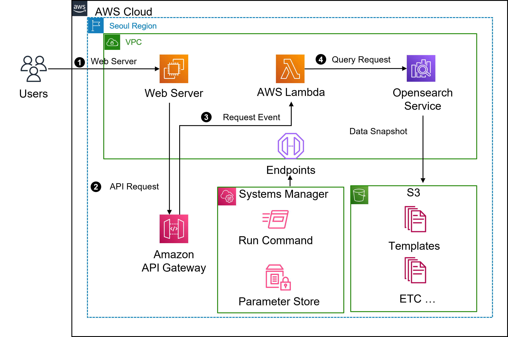

# AWS Opensearch 기반의 검색엔진 구축

1. [Architecture](#architecture)
2. [Data](#data)
3. [Cloudformation Template](#cloudformation-template)
4. [Lambda Script](#lambdascript)
5. [Opensearch Index](#opensearch-index)
6. [수행 방법](#수행-방법)

<div style="page-break-after: always; break-after: page;"></div>

## Architecture

| Resource        | Detail          | Count | Purpose                                                      |
| --------------- | --------------- | ----- | ------------------------------------------------------------ |
| EC2             |                 | 1     | Web Server 및, Data Generator                                |
| Cloudformation  | Stack           | 5     | Resource 생성 및 참조                                        |
|                 | ChangeSet       | 2     | Resource 변경 분 최신화                                      |
| Api Gateway     |                 | 1     | Web Server와 Lambda 통신 URL 제공                            |
| Lambda Function |                 | 1     | Web Server 요청 수신 및 Opensearch에 질의 역할               |
| System Manager  | Parameter Store | 7     | Resource 생성 시 발생한 변수 저장                            |
|                 | Run Command     |       | Resource 생성 시 수행해야하는 Shell Command 자동화           |
| Opensearch      |                 | 1     | Data 적재, 검색 엔진 구성, 동의어 사전                       |
| S3              |                 | 1     | Cloudformation Template 및 기타 파일 저장, Opensearch Data Snapshot |
| IAM             | Role            | 2     | EC2, Lambda 에서 사용되는 Role                               |
|                 | Policy          | 2     | Opensearch 역할 위임 용도                                    |
| VPC             | Endpoint        | 1     | Lambda Function과 SSM 통신                                   |



> 검색 엔진 사용 흐름
>
> 1. 사용자가 웹서버에 접속하여 품목을 검색합니다.
> 2. Web Server는 Api Gateway Url에 GET Request를 합니다.
> 3. Api Gateway의 Target인 Lambda에 해당 Request가 전달 됩니다.
> 4. Lambda는 Request를 기반으로 Opensearch에 질의 하게 됩니다.
> 5. 질의 결과물을 Lambda -> Api Gateway -> Web Server -> User 순으로 전달합니다.

<div style="page-break-after: always; break-after: page;"></div>

## Data

[광동제약온라인몰 - 인터파크](https://store.interpark.com/3002890592-2/category/all) 의 html 파일을 기준으로 Data를 생성했습니다.

[Product Data](Data/sample-master.bulk) : Master 상품 정보

```json
// bulk 로 Input 했습니다.
// 첫 번째는 Index에 관련 정보
/*
_index : Master Data 가 저장될 Index 이름
_id : Document 별 ID (영문, 숫자 조합 랜덤 8 글자)
*/
{
    "index": {
        "_index": "master_product",
        "_id": "tt2229499"
    }
}
// 두 번째는 Data에 관련 정보
/*
Name : 상품 이름
Price : 상품 가격
Img_url : 상품 이미지가 있는 URL
PrdNo : 상품 고유 번호
*/
{
    "Name": "광동 옥수수수염차 340ml x 40펫트",
    "Price": 28900,
    "Img_url": "https://openimage.interpark.com/goods_image/9/8/0/9/7497989809s.jpg",
    "PrdNo": "7497989809"
}
```

[Account Data](Data/sample-account.bulks) : Web Server Login 계정 정보

```json
// bulk 로 Input 했습니다.
// 첫 번째는 Index에 관련 정보
/*
_index : Account Data 가 저장될 Index 이름
_id : Account ID
*/
{
    "index": {
        "_index": "user_account",
        "_id": "jungmin.choi"
    }
}
// 두 번째는 Data에 관련 정보
/*
Name : 회원 명
Password : 계정 비밀 번호
Email : 회원 Email
*/
{
    "Name": "최정민",
    "Password": "Bespin12!",
    "Email": "jungmin.choi@bespinglobal.com"
}
```


## Cloudformation Template

[amazon-opensearch-movies-app](https://github.com/aws-samples/amazon-opensearch-movies-app) 을 참고하여 작성했습니다.

사전에 필요한 작업들이 있습니다.

- Cloudformation에서 사용할 IAM Role 생성 (다양한 권한이 필요하므로 Admin 권한이 편합니다.)
- Cloudformation에서 Opensearch package 기능을 제공하지 않으므로 미리 **동의어 사전에 대한 Package**를 생성해놓으셔야 합니다.

1. [network_resource.yaml](Templates/network_resource.yaml)

   > 선택적 작업 입니다.
   >
   > 기존 Resource들을 Stack 위에 Import 하는 작업을 진행하는 Template 입니다. 
   >
   > VPC, Subnet (Public, Private), Security Group, Security Group 등을 Import 합니다.
   >
   > 각 서비스들은 **IDENTIFIER_FILE**을 통해 서비스의 ID를 인지하고 Import 합니다.
   >
   > 만일 상단에 명시한 Resource들이 없다면 Import가 아닌 생성 작업이 필요합니다.
   >
   > 추가적으로 후에 Lambda Function을 VPC 내부에 구성하기 때문에 SSM과 통신하기 위해서는 VPC Endpoint가 필요합니다.
   >
   > 필요한 Endpoint를 생성하는 작업을 합니다.
   >
   > Code 상의 변경해야할 변수들 :
   >
   > - {YOUR_VPC_CIDR}
   > - {YOUR_PUBLIC_SUBNET_CIDR_1}
   > - {YOUR_PUBLIC_SUBNET_CIDR_2}
   > - {YOUR_PRIVATE_SUBNET_CIDR_1}
   > - {YOUR_PRIVATE_SUBNET_CIDR_2}
   > - {YOUR_S3_BUCKET_NAME}

2. [main_es_diy.yaml](Templates/main_es_diy.yaml)

   > 위에서 생성한 Stack을 업데이트하고 타 Service들을 생성하는 Nested Stack을 생성할 Root Stack이 되는 Template 입니다.
   >
   > 하단에 해당하는 Template들을 **DependsOn** 이라는 조건을 통해 순서를 정의하여 생성합니다.
   >
   > 각 Nested Stack은 **Parameters**를 통해 Root Stack이 가지고 있는 정보들이나 앞서 생성된 다른 Nested Stack의 Output을 가져올 수 있습니다.
   >
   > Code 상의 변경해야할 변수들 :
   >
   > - {YOUR_VPC_CIDR}
   > - {YOUR_PUBLIC_SUBNET_CIDR_1}
   > - {YOUR_PUBLIC_SUBNET_CIDR_2}
   > - {YOUR_PRIVATE_SUBNET_CIDR_1}
   > - {YOUR_PRIVATE_SUBNET_CIDR_2}
   > - {YOUR_S3_BUCKET_NAME}
   > - {S3_HTTP_URL_STACK_TEMPLATE-instance_to_es.yaml}
   > - {S3_HTTP_URL_STACK_TEMPLATE-es_cluster.yaml}
   > - {S3_HTTP_URL_STACK_TEMPLATE-ingest_to_es.yaml}
   > - {S3_HTTP_URL_STACK_TEMPLATE-lambda-api-cf_diy.yaml}
   > - {OWNER}

3. [instance_to_es.yaml](Templates/instance_to_es.yaml)

   > 가장 처음으로 생성되는 Nested Stack 입니다.
   >
   > EC2와 EC2에 사용되는 IAM Role, Security Group을 생성합니다.
   >
   > 해당 EC2는 아래의 업무들을 수행합니다.
   >
   > - Opensearch에 Index(상품 Master Index, User Account Index, 실시간 Ranking Index) 생성 
   > - Opensearch에 Data(상품 Master Data, User Account Data, 실시간 Ranking Data) 적재
   > - Opensearch Index에 Alias 및 Pipeline 적용
   > - Lambda Script 변경
   > - Web Server Rendering
   >
   > Security Group은 VPC 내의 모든 통신과 생성자의 현재 IP에 대해 22, 80 Port만 허용합니다.
   >
   > IAM Role은 EC2의 Instance Profile로 부착되면 아래와 같은 권한이 부여됩니다.
   >
   > - AmazonEC2RoleforSSM
   > - AmazonS3FullAccess
   > - AWSLambda_FullAccess
   > - AmazonOpenSearchServiceFullAccess
   >
   > Code 상의 변경해야할 변수들 :
   >
   > - {YOUR_INSTANCE_NAME}
   > - {OWNER}

4. [es_cluster.yaml](Templates/es_cluster.yaml)

   > Opensearch와 Lambda를 위한 Role, Opensearch 정보에 대한 Parameter Store 를 생성합니다.
   >
   > IAM Role은 Lambda의 Role로 부착되면 아래와 같은 권한이 부여됩니다.
   >
   > - AWSLambdaBasicExecutionRole
   > - AmazonVPCFullAccess
   > - AmazonSSMFullAccess
   >
   > 해당 Opensearch는 Root Stack에서 Parameter로 제공 받은 Master UserName과 Password를 사용하여 **세분화 된 액세스 제어**를 제공합니다.
   >
   > Code 상의 변경해야할 변수들 :
   >
   > - {OWNER}

5. [ingest_to_es.yaml](Templates/ingest_to_es.yaml)

   > 상단에 생성한 EC2에 Run Command를 수행하는 Nested Stack 입니다.
   >
   > 필요한 Python Library를 설치합니다. (boto3, requests, requests_aws4auth)
   >
   > 상단에 설치한 Opensearch에 동의어 사전 Package 활성화
   >
   > Opensearch Index들 생성 및 데이터 적재, alias 적용
   >
   > Code 상의 변경해야할 변수들 :
   >
   > - {YOUR_OPENSEARCH_PACKAGE}

6. [lambda-api-cf_diy.yaml](Templates/lambda-api-cf_diy.yaml)

   > Lambda 및 API Gateway를 생성하고 웹서버를 활성화 시키는 Nested Stack 입니다.
   >
   > API Gateway의 Type의 Region 입니다.
   >
   > API Gateway에서 GET 요청을 받으면 Lambda에 POST 요청을 합니다.
   >
   > 상단에 생성한 EC2에 Run Command를 수행하여 Web Server를 활성화 합니다.
   >
   > Nginx 설치 및 html, javascript, css 등을 download 받고 시작합니다.
   >
   > Code 상의 변경해야할 변수들 :
   >
   > - {YOUR_S3_PATH-search-es-lambda.py}

## Python Script

1. [attach_package.py](Python_Script/attach_package.py)

   > [ingest_to_es.yaml](Templates/ingest_to_es.yaml) 에서 수행되는 Script 입니다.
   >
   > [es_cluster.yaml](Templates/es_cluster.yaml)에서 생성한 Opensearch Domain에 기존에 생성한 Package를 부착합니다.

2. [search-es-lambda.py](Python_Script/search-es-lambda.py)

   > [lambda-api-cf_diy.yaml](Templates/lambda-api-cf_diy.yaml)에서 Lambda Function에 부작하는 Script 입니다.
   >
   > event 파라미터의 **es_action**이라는 Key값을 기준으로 Opensearch query문을 다르게 합니다.
   >
   > - rank-list : 실시간 검색 기능으로서 최근 3시간 동안 검색 내용에 대한 질의를 합니다.
   >
   >   - Index : rank_list
   >
   >   - API : GET
   >
   >   - Query : 
   >
   >     ```json
   >     {
   >         "size": 10,
   >         "query": { "term": { "UserName": {검색어} } },
   >         "aggs": {
   >             "time_filter": {
   >                 "filter": {
   >                     "range": {
   >                         "@timestamp": {
   >                             "gte": "now-3h",
   >                             "lt": "now"
   >                         }
   >                     }
   >                 },
   >                 "aggs": {
   >                     "product_name": {
   >                         "terms": {
   >                             "field": "Name"
   >                         }
   >                     }
   >                 }
   >             }
   >         }
   >     }
   >     ```
   >
   > - login : 로그인 기능으로서 계정 검색 및 일치 여부를 확인합니다.
   >
   >   - Index : user_account
   >
   >   - API : GET
   >
   >   - Query : 
   >
   >     ```json
   >     {
   >         "size": 1,
   >         "query": {
   >             "multi_match": {
   >                 "query": {검색어},
   >                 "fields": ["_id"]
   >             }
   >         }
   >     }
   >     ```
   >
   >     
   >
   > - search : 검색 내역에 대한 저장을 합니다.
   >
   >   - Index : rank_list
   >
   >   - API : PUT
   >
   >   - Query : 
   >
   >     ```json
   >     {
   >         "UserName": {USER_NAME},
   >         'Name': {Product_Name},
   >         'Search_word': {검색어},
   >         'PrdNo': {상품 번호},
   >         "@timestamp": {TIMESTAMP, YYYY-mm-dd HH:MM:SS}
   >     }
   >     ```
   >
   >     
   >
   > - else : 검색 기능으로서 검색어에 대한 Text 분석을 수행합니다. Score 기반의 정렬도 수행합니다.
   >
   >   - Index : master_product
   >
   >   - API : GET
   >
   >   - Query : 
   >
   >     ```json
   >     {
   >         "size": 25,
   >         "query": {
   >             "multi_match": {
   >                 "query": {검색어},
   >                 "fields": ["Name"]
   >             }
   >         },
   >         "sort" : ["_score"]
   >     }
   >     ```
   >
   >     

## Opensearch Index

## 수행 방법
