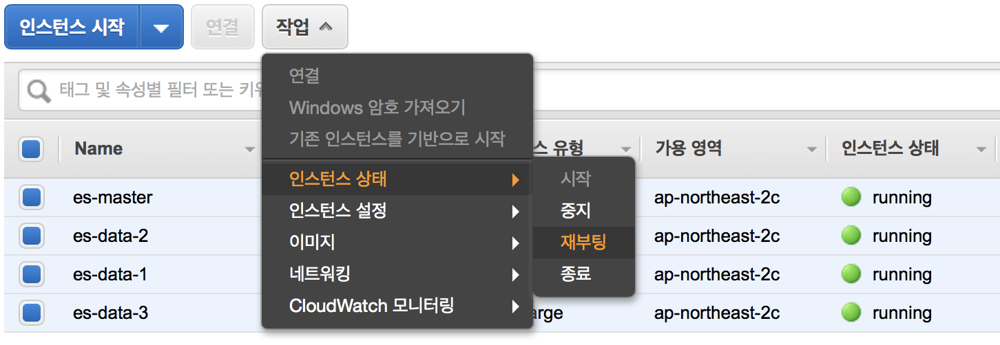
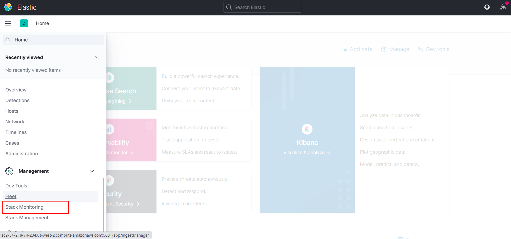

# ES Cluster 구성

모든 내용은 김종민(kimjmin@gmail.com) 님이 작성하신 `Elastic Cluster 구성`을 토대로 수행해본 것입니다
URL : http://kimjmin.net/2018/01/2018-01-build-es-cluster-1/

**Index**

1. [서버 생성 및 Elasticsearch RPM 설치](#1-서버-생성-및-elasticsearch-rpm-설치)
2. [메모리, 네트워크 설정 및 플러그인 설치](#2-메모리--네트워크-설정-및-플러그인-설치)
3. [클러스터 구성 및 마스터, 데이터 노드 설정](#3-클러스터-구성-및 마스터--데이터-노드-설정)
4. [Kibana 설치 및 X-Pack Monitoring 확인](#4-kibana-설치-및-x-pack-monitoring-확인)
5. [NFS 구성 및 elasticsearch 추가 설정](#5-nfs-구성-및-elasticsearch-추가-설정)
6. [X-Pack Security를 이용한 SSL 및 TLS 설정](#6-x-pack-security를-이용한-ssl-및-tls-설정)
7. [X-Pack License 적용 및 사용자 생성](#7-x-pack-license-적용-및-사용자-생성)
8. [8. Logstash 설치 및 Elasticsearch 기본 템플릿 설정](#8-logstash-설치-및-elasticsearch-기본-템플릿-설정)

컨셉 아키텍쳐


> - 3개의 데이터 전용 노드, 1개의 마스터 전용 노드로 구성
> - Master Node가 설치된 서버에는 Kibana, Logstash 및 기타 프로그램들을 같이 설치
> - 마스터 노드만 HTTP REST API를 열고, Data Node 들은 Transport 통신
> - Kibana, Logstash 및 기타 프로그램은 Master Node 와 REST로 통신
> - 데이터는 Master Node 를 통해서만 색인

<div style="page-break-after: always; break-after: page;"></div>

## 1. 서버 생성 및 Elasticsearch RPM 설치

### 1. 시간대 설정

서버의 초기 시간 설정이 UTP로 되어 있는데, 대한민국 서울 시간으로 변경

```shell
sudo cp -p /usr/share/zoneinfo/Asia/Seoul /etc/localtime
```

### 2. Java 업그레이드

Elasticsearch 를 지원하는 Java 버전은 [Support Matrix](https://www.elastic.co/support/matrix#matrix_jvm) 페이지에서 확인이 가능합니다. 1.8 버전에서 안정적으로 사용이 가능

Amazon Linux2 는 CentOS 기반이기 때문에 Yum 설치가 가능합니다. Java를 1.8로 설치

```shell
sudo yum install java-1.8.0-openjdk-devel.x86_64 -y
```

### 3. Elasticsearch 설치

다음 링크를 참고하여 elasticsearch 를 yum 을 이용한 rpm 으로 설치
https://www.elastic.co/guide/en/elasticsearch/reference/current/rpm.html

최신 버전의 elasticsearch를 yum 으로 설치하기 위해서는 `/etc/yum.repos.d/` 디렉토리 아래에 `elasticsearch.repo` 파일을 만들고 아래와 같이 내용을 입력

```shell
cd /etc/yum.repos.d/
sudo vi elasticsearch.repo
```


```
[elasticsearch]
name=Elasticsearch repository for 7.x packages
baseurl=https://artifacts.elastic.co/packages/7.x/yum
gpgcheck=1
gpgkey=https://artifacts.elastic.co/GPG-KEY-elasticsearch
enabled=0
autorefresh=1
type=rpm-md
```

파일을 추가하고 나서 이제 yum을 이용해서 Elasticsearch를 설치

```shell
cd ~/
sudo yum install --enablerepo=elasticsearch elasticsearch -y
```

elasticsearch rpm 설치 문서에 나와 있는대로 `ps -p 1` 를 이용해서 SysV `init` 과 `systemd` 중 어떤 서비스를 사용하는지 확인

```shell
ps -p 1
#  PID TTY          TIME CMD
#    1 ?        00:00:01 systemd
```

systemd 를 사용. 서비스에 등록하기 위해 다음 명령을 실행

```shell
# [init의 경우]
## 자동실행을 위한 service 등록
sudo chkconfig --add elasticsearch

# [systemd의 경우]
## 자동실행을 위한 system demon 등록
sudo /bin/systemctl daemon-reload
sudo /bin/systemctl enable elasticsearch.service
# Created symlink from /etc/systemd/system/multi-user.target.wants/elasticsearch.service to /usr/lib/systemd/system/elasticsearch.service.
```

Elasticsearch는 이제 service 명령으로 실행 또는 종료가 가능

```shell
# [init의 경우]
sudo -i service elasticsearch start
# Starting elasticsearch (via systemctl):                    [  OK  ]
sudo -i service elasticsearch stop
# Stopping elasticsearch (via systemctl):                    [  OK  ]


# [systemd의 경우]
sudo systemctl start elasticsearch.service
sudo systemctl status elasticsearch.service
# ● elasticsearch.service - Elasticsearch
#    Loaded: loaded (/usr/lib/systemd/system/elasticsearch.service; disabled; vendor preset: disabled)
#    Active: active (running) since Sat 2021-01-09 15:59:50 KST; 25s ago
#      Docs: https://www.elastic.co
#  Main PID: 3631 (java)
#    CGroup: /system.slice/elasticsearch.service
#            ├─3631 /usr/share/elasticsearch/jdk/bin/java -Xshare:auto -Des.networkaddress.cache.ttl=60 -Des.networkaddress.cache.negative.ttl=10 -XX:+Always...
#            └─3818 /usr/share/elasticsearch/modules/x-pack-ml/platform/linux-x86_64/bin/controller
# 
# Jan 09 15:59:33 es-master systemd[1]: Starting Elasticsearch...
# Jan 09 15:59:50 es-master systemd[1]: Started Elasticsearch.
sudo systemctl stop elasticsearch.service
```

### 4. 호스트명 변경

호스트명을 변경하기 위해서는 Amazon Linux 2: **hostnamectl** 명령으로 호스트 이름을 설정하여 정규화된 도메인 이름을 반영

```shell
sudo hostnamectl set-hostname es-master
hostname
# es-master
```

나중에 설정 및 모니터링을 편하게 하기 위함이며 생성하는 각 인스턴스 별로 `HOSTNAME=es-master`, `HOSTNAME=es-data-1`, `HOSTNAME=es-data-2` , `HOSTNAME=es-data-3` 등과 같이 설정

elasticsearch 서비스는 자동으로 잘 실행 되는지 한번 확인

```shell
curl localhost:9200
```

output

```json
{
  "name" : "es-master",
  "cluster_name" : "elasticsearch",
  "cluster_uuid" : "spdx1UIFQhesRIaQM3pkag",
  "version" : {
    "number" : "7.10.1",
    "build_flavor" : "default",
    "build_type" : "rpm",
    "build_hash" : "1c34507e66d7db1211f66f3513706fdf548736aa",
    "build_date" : "2020-12-05T01:00:33.671820Z",
    "build_snapshot" : false,
    "lucene_version" : "8.7.0",
    "minimum_wire_compatibility_version" : "6.8.0",
    "minimum_index_compatibility_version" : "6.0.0-beta1"
  },
  "tagline" : "You Know, for Search"
}
```

### 5. Elasticsearch 설정

RPM 버전의 기본적인 설치 경로

- 기본 프로그램 ($ES_HOME) :`/usr/share/elasticsearch`
  - 실행 파일 : `bin/elasticsearch`
  - 플러그인 : `plugins`
- 설정 : `elasticsearch.yml`
  - `jvm.options`
  - `log4j2.properties`
- 데이터 (**path.data**) : `/var/lib/elasticsearch`
- 로그 (**path.logs**) : `/var/log/elasticsearch`

데이터와 로그 파일의 경로는 `/etc/elasticsearch/elasticsearch.yml` 설정 파일에서 수정이 가능
모든 경로에 접근하기 위해서는 기본적으로 root 권한을 필요

예를 들어 elasticsearch.yml 설정 파일을 vim 으로 편집하려고 하면 다음과 같이 실행

```shell
sudo vim /etc/elasticsearch/elasticsearch.yml
```

Elasticsearch의 기본 클러스터명은 **elasticsearch** 로 되어 있습니다. Elasticsearch의 노드들은 클러스터명을 기준으로 바인딩이 되기 때문에 처음 설치가 끝나면 우선적으로 클러스터명을 바꿔 줘야 나중에 실수로 노드가 엉뚱한 클러스터에 바인딩 되는 것을 막을 수 있습니다. 
`elasticsearch.yml`설정 파일을 열고 먼저 클러스터명을 변경

```shell
cluster.name: es-demo
```

노드들도 나중에 구분하기 편하도록 노드명에 호스트 이름을 사용하도록 설정

```
node.name: ${HOSTNAME}
```

이제 elasticsearch 를 재시작하여 노드명과 클러스터명이 정상적으로 반영이 되었는지를 확인

```shell
sudo systemctl restart elasticsearch.service
curl localhost:9200
```

output

```json
{
  "name" : "es-master",
  "cluster_name" : "es-demo", // 변경됨을 확인
  "cluster_uuid" : "spdx1UIFQhesRIaQM3pkag",
  "version" : {
    "number" : "7.10.1",
    "build_flavor" : "default",
    "build_type" : "rpm",
    "build_hash" : "1c34507e66d7db1211f66f3513706fdf548736aa",
    "build_date" : "2020-12-05T01:00:33.671820Z",
    "build_snapshot" : false,
    "lucene_version" : "8.7.0",
    "minimum_wire_compatibility_version" : "6.8.0",
    "minimum_index_compatibility_version" : "6.0.0-beta1"
  },
  "tagline" : "You Know, for Search"
}
```

이제 Elasticsearch의 기본 설치 완료!

<div style="page-break-after: always; break-after: page;"></div>

## 2. 메모리, 네트워크 설정 및 플러그인 설치

### 1. Java Heap 메모리 설정.

Java Heap 메모리는 `jvm.options` 파일에서 설정

```shell
sudo vim /etc/elasticsearch/jvm.options
```

마스터 노드는 4GB, 데이터 노드는 2GB로 각각 설정을 할 예정입니다. 여기서는 우선 4GB로 설정

```
-Xms4g
-Xmx4g
```

Java Heap 외에 시스템 메모리의 절반은 루씬 파일 캐시를 위해 남겨둬야 합니다. 

자세한 설명이 아래 블로그들에 나와 있으니 한번은 꼭 읽어보는 것 권장

- [Elasticsearch 인덱싱에 대한 성능 고려 사항](https://www.elastic.co/kr/blog/performance-considerations-elasticsearch-indexing)
- [Elasticsearch 2.0 인덱싱 성능 고려사항](https://www.elastic.co/kr/blog/performance-indexing-2-0)
- [A Heap of Trouble: Managing Elasticsearch’s Managed Heap](https://www.elastic.co/blog/a-heap-of-trouble)

### 2. 네트워크 설정

네트워크 설정은 `elasticsearch.yml` 설정 파일의 `network.host` 부분을 수정합니다.

```shell
sudo vim /etc/elasticsearch/elasticsearch.yml
```

보통은 `network.host: 192.168.0.1` 과 같은 형식으로 IP 주소를 직접 입력해도 되지만, 더 간편하게 `_local_`, `_site_`, `_global_` 같은 값 들을 이용할 수도 있습니다. 아래와 같이 설정

```shell
network.host: {private ip}
```

network.host 의 값들에 대해서는 아래 페이지를 참고
https://www.elastic.co/guide/en/elasticsearch/reference/7.1/modules-network.html#network-interface-values

### 3. Bootstrap Check

기본적으로 아래 문서에 나와있는 설정들은 모두 확인 하도록 합니다.
https://www.elastic.co/guide/en/elasticsearch/reference/7.1/important-settings.html

### 4. bootstrap.memory_lock 활성

`elasticsearch.yml` 설정 파일에서 `bootstrap.memory_lock` 을 활성화 합니다.

```shell
bootstrap.memory_lock: true
```

설정 후 elasticsearch를 재시작하면 실행에 실패하는 경우가 있습니다. 시스템 로그를 보면 친절하게 어떻게 설정을 해 줘야 하는지 안내하고 있습니다.

`/etc/security/limits.conf` 파일을 열고

```shell
sudo vim /etc/security/limits.conf
```

`elasticsearch soft memlock unlimited`, `elasticsearch hard memlock unlimited` 내용을 추가 해 줍니다.

```shell
...
#ftp             hard    nproc           0
#@student        -       maxlogins       4

elasticsearch soft memlock unlimited
elasticsearch hard memlock unlimited

# End of file
```

### 5. Unicast 설정

노드끼리 통신할 수 있도록 노드의 ip 주소로 입력 해 줍니다. 나중에는 Data node의 ip도 추가되어야하며 Data node들의 yml 파일에도 똑같이 적용되어야 합니다.  네트워크 주소는 `ifconfig` 또는 `ip addr` 명령으로 확인합니다.

```shell
discovery.seed_hosts: [All nodes private ip]
cluster.initial_master_nodes: ["es-master"]
```

실제로 설치된 서버의 IP 주소 작성

### 6. Split Brain 문제

보통 노드가 10개 내의 클러스터는 마스터 노드를 따로 구분하지 않고 데이터 노드 중 임의의 노드가 마스터 역할을 병행해서 수행하도록 해도 큰 문제는 없습니다. 10개 이상의 노드로 구성된 클러스터인 경우 마스터 전용 노드와 데이터 전용 노드를 분리하는 것이 좋으며, 이 때 마스터 기능의 수행이 가능한 후보(master-eligible) 노드를 3(또는 그 이상의 홀수)개를 두어 실제 마스터 노드가 다운된 경우 다른 노드가 그 역할을 대신 할 수 있도록 합니다. 2개만 두는 경우에는 네트워크 단절로 인한 클러스터 분리 문제 (quorum)로 인해 하나의 클러스터가 서로 다른 마스터를 가진 2개의 클러스터로 나누어 져서 나중에 동기화 문제가 생길 수 있습니다. 이를 [Split Brain](https://www.elastic.co/guide/en/elasticsearch/reference/6.1/modules-node.html#split-brain) 이라고 합니다.

마스터 후보 노드를 3개(또는 그 이상의 홀수)로 두는 경우에는 네트워크 단절로 인해 클러스터가 분리가 되면 마스터 후보가 2개인 클러스터만 실제로 동작하고 1개인 클러스터는 동작을 멈추게 됩니다. 그렇게 해서 다시 네트워크가 복구 되었을 때 활성 상태였던 클러스터 노드들의 업데이트 정보가 비활성 상태였던 클러스터 노드들로 자연스럽게 동기화가 될 수 있습니다.

### 7. X-Pack 설치

X-Pack 설치에 대한 내용은 아래 도큐먼트를 참고해서 진행합니다.
https://www.elastic.co/guide/en/elasticsearch/reference/current/setup-xpack.html

X-Pack은 보안, 경고, 모니터링,보고, 기계 학습 및 기타 여러 기능을 제공하는 Elastic Stack 확장입니다. 기본적으로 Elasticsearch를 설치하면 X-Pack이 설치됩니다.

모든 X-Pack 기능을 사용해 보려면 [30 일 평가판을 시작할](https://www.elastic.co/guide/en/kibana/7.10/managing-licenses.html) 수 있습니다 . 평가 기간이 끝나면 구독을 구매하여 X-Pack 구성 요소의 전체 기능을 계속 사용할 수 있습니다. 자세한 내용은 [https://www.elastic.co/subscriptions를](https://www.elastic.co/subscriptions) 참조.

6.8 / 7.1 버전은 security 가 basic 라이선스로도 사용가능

링크 참고 : https://www.elastic.co/kr/blog/security-for-elasticsearch-is-now-free

모두 설치후에는 xpack을 활성화 시켜줘야되는데 elasticsearch.yml 가장 하단에 같은 문구들을 삽입시켜준다.

```shell
xpack.security.enabled: true
```

위의 내용을 ssl 인증 없이 사용하게 될 경우 data node가 올라오지 않는 이슈 발생

암호 설정 (elastic,apm_system,kibana,kibana_system,logstash_system,beats_system,remote_monitoring_user)

```shell
cd /usr/share/elasticsearch/bin
sudo ./elasticsearch-setup-passwords interactive
Bespin12
```


### 8. SSL/TLS

X-Pack Security는 노드간, 그리고 클러스터와 클라이언트 간의 통신을 암호화 하는 SSL/TLS 기능을 가지고 있습니다. 특히 elasticsearch 6.0 부터는 X-Pack Security를 사용하기 위해서는 SSL/TLS 설정을 반드시 활성화 해야 오류나 경고 메시지가 나타나지 않습니다.

### 9. 한글 형태소 분석기 설치 (해당 내용은 완벽히 적용을 못했습니다. skip해도 됩니다.)

참조 링크 : https://www.elastic.co/kr/blog/arirang-analyzer-with-elasticsearch

#### git 설치

```shell
sudo yum install -y git
```

#### arirang 프로젝트 clone 

기본적으로 master branch 를 받습니다.

```sh
git clone https://github.com/korlucene/arirang.morph.git
git clone https://github.com/korlucene/arirang-analyzer-6.git
```

#### Maven build

두 프로젝트 모드 maven project로 빌드 장비에 maven 이 설치가 되어 있어야 합니다.

**※ maven 설치 참고** : https://maven.apache.org/

```shell
wget https://downloads.apache.org/maven/maven-3/3.6.3/binaries/apache-maven-3.6.3-bin.tar.gz
# 터미널을 열고 디렉토리를 / opt 폴더로 변경합니다.
cd /opt
# apache-maven 아카이브를 opt 디렉토리에 추출합니다.
sudo tar -xvzf ~/apache-maven-3.6.3-bin.tar.gz
# nano터미널 자체에서 파일을 편집하는 데 사용할 수 있습니다 . 다음 명령을 실행하고 아래와 같이 내용을 수정합니다.
sudo nano /etc/environment
# M2_HOME="/opt/apache-maven-3.6.3"
# mvn 명령을 업데이트합니다.
sudo update-alternatives --install "/usr/bin/mvn" "mvn" "/opt/apache-maven-3.6.3/bin/mvn" 0
sudo update-alternatives --set mvn /opt/apache-maven-3.6.3/bin/mvn
# Tab을 여러 번 눌러 복잡한 Maven 명령을 완료 할 수 있도록 mvn에 Bash 완성을 추가합니다.
sudo wget https://raw.github.com/dimaj/maven-bash-completion/master/bash_completion.bash --output-document /etc/bash_completion.d/mvn
# 로그 아웃하고 컴퓨터에 로그인 한 후 다음 명령을 사용하여 Maven 버전을 확인합니다.
mvn --version
```

arirang-analyzer-6 프로젝트에 기본적으로 arirang.morph 패키지가 등록이 되어 있기 때문에 별도 arirang.morph를 수정 하지 않았다면 arirang-analyzer-6 만 빌드하시면 됩니다.

```sh
# 정상 빌드
cd ~/arirang.morph/
mvn clean package

# 오류 발생
cd ~/arirang-analyzer-6/
mvn clean package
# 위의 내용에서 오류 발생 이유는 모름
```

따라서 다른 내용 참조: https://esbook.kimjmin.net/06-text-analysis/6.7-stemming/6.7.2-nori

#### Nori 개요

  Elasticsearch 6.6 버전 부터 공식적으로 **Nori(노리)** 라고 하는 한글 형태소 분석기를 Elastic사에서 공식적으로 개발해서 지원을 하기 시작했습니다. 특이하게 nori는 프랑스 엔지니어인 [Jim Ferenczi](https://github.com/jimczi) 에 의해 처음 개발이 되었습니다. Jim 은 아파치 루씬의 커미터이며 Elasticsearch의 일본어 형태소 분석기인 **Kuromoji(구로모지)** 역시 Jim 이 처음 개발했습니다. Nori 는 **은전한닢**에서 사용하는 **mecab-ko-dic** 사전을 재 가공 하여 사용하고 있습니다. Nori 는 루씬의 기능으로 개발되었으며 루씬 소스에 반영되어 있으며 개발 이력은 https://issues.apache.org/jira/browse/LUCENE-8231 에서 확인 할 수 있고 프로그램 소스는 https://github.com/apache/lucene-solr/tree/master/lucene/analysis/nori 에서 확인이 가능합니다.

#### Nori 설치

  Nori 를 사용하기 위해서는 먼저 elasticsearch에 analysis-nori 플러그인을 설치해야 합니다. elasticsearch 홈 디렉토리에서 다음 명령을 실행하면 버전에 맞는 nori 플러그인을 받아서 자동으로 설치합니다.

```shell
# nori 플러그인 설치
sudo /usr/share/elasticsearch/bin/elasticsearch-plugin install analysis-nori
```

  설치된 nori 플러그인을 제거하려면 다음 명령을 실행합니다.

```shell
# nori 플러그인 제거
sudo /usr/share/elasticsearch/bin/elasticsearch-plugin remove analysis-nori
```

<div style="page-break-after: always; break-after: page;"></div>

## 3. 클러스터 구성 및 마스터, 데이터 노드 설정

### 1. 데이터 노드 추가

앞의 내용에서 Elasticsearch 서버 설치를 완료 했습니다. 4개 서버로 구성된 클러스터를 만들기 위해서는 앞의 내용대로 서버를 하나씩 만드는 방법도 있겠지만, AWS 에는 서버의 이미지 스냅샷을 찍어 그 이미지를 기준으로 새로운 서버를 만드는 기능이 있어 저는 그 방법을 이용하도록 하겠습니다.

먼저 앞서 만든 인스턴스의 이미지를 저장합니다.


이제 새로운 인스턴스를 생성할 때 저장 해 놓은 이미지를 가지고 생성을 합니다.


새 서버들이 완성되면 이 서버들 끼리는 통신이 가능하도록 보안 그룹을 설정 해 주어야 합니다.
보안 그룹을 하나 만들고 나서 소스에 해당 보안 그룹의 id를 적으면 그 보안그룹에 소속된 인스턴스 끼리 자유롭게 통신이 가능합니다.

**Master SG**

| **Type**    | **Protocol** | **Port range** | **Source**  | **Description - optional** |
| :---------- | :----------- | :------------- | :---------- | :------------------------- |
| All traffic | All          | All            | {Office IP} | office                     |
| All traffic | All          | All            | 10.0.0.0/16 | for Data Node              |

**Data node SG**

| **Type**    | **Protocol** | **Port range** | **Source**  | **Description - optional** |
| :---------- | :----------- | :------------- | :---------- | :------------------------- |
| All traffic | All          | All            | 10.0.0.0/16 | VPC                        |


이제 설정을 완료 한 뒤에 추가한 3개의 노드들을 차례로 실행시키면서 마스터 노드의 로그를 살펴보면 노드 바인딩이 되지 않습니다.

아마 이미지를 복사하지 않고 하나씩 만들었다면 위와 같은 로그가 나타나지 않을 것입니다. 처음 저장한 이미지에서 elasticsearch의 path.data 경로에 이미 생성된 노드의 정보가 있어서 오류가 난 것입니다. 추가한 노드들에서는 이 데이터들을 먼저 삭제 한 후에 실행을 해야 합니다.

데이터 노드를 추가한 뒤에 먼저 다음 설정들을 진행합니다.

- 서비스 중지

  ```sh
  sudo service elasticsearch stop
  ```

- 데이터 디렉토리 삭제

  ```sh
  sudo rm -rf /var/lib/elasticsearch/nodes
  ```

- 호스트 네임 변경: 노드 이름이 호스트명으로 할당되도록 설정되어 있으므로, 각 데이터 노드들의 호스트명을 해당 노드에 맞게 바꿔줍니다.

  ```sh
  sudo hostnamectl set-hostname {hostname}
  sudo vim /etc/sysconfig/network
  HOSTNAME={hostname}
  ```

- 이제 서버를 재시작 합니다.

  ```shell
  sudo reboot
  ```

### 2. configuration 설정.

클러스터 구성이 완료 되었으니 이제 각 노드별로 상이한 옵션들을 설정 하겠습니다.
먼저 마스터 노드의 Java Heap 메모리는 4gb로 조정합니다.

```shell
sudo vim /etc/elasticsearch/jvm.options

#-Xms4g
#-Xmx4g
```

마스터 노드는 데이터를 저장하지 않도록 `elasticsearch.yml` 에서 `node.master: true`, `node.data: false` 를 추가합니다.

```shell
sudo vim /etc/elasticsearch/elasticsearch.yml

node.master: true
node.data: false
```


각 데이터 노드들은 반대로 `node.master: false`, `node.data: true` 를 추가합니다.

```shell
sudo vim /etc/elasticsearch/elasticsearch.yml

node.master: false
node.data: true
```

이제 모든 노드들의 서비스 또는 서버를 재시작합니다.



구성한 노드들의 상태를 알아보는 명령어

```shell
# Cluster 상태 확인
curl http://{master private ip}:9200/_cluster/health?pretty
# Cluster node 확인
curl {master private ip}:9200/_cat/nodes?v
```

elasticsearch를 다시 실행 후 상태를 확인해 보면 다음과 같은 issue가 발생합니다.

```json
{
  "error" : {
    "root_cause" : [
      {
        "type" : "master_not_discovered_exception",
        "reason" : null
      }
    ],
    "type" : "master_not_discovered_exception",
    "reason" : null
  },
  "status" : 503
}
```

이 사례에서 오류의 근본 원인은 ElasticSearch 노드를 즉시 시작했기 때문입니다. 동일한 "클러스터 이름"(es-demo)을 사용하도록 두 노드의 구성 파일을 변경하더라도 ElasticSearch 노드가 처음 시작 되었기 때문에 이미 개별 클러스터를 시작했습니다 (클러스터 ID는 다르지만 같은 이름). 데이터 손실 가능성을 피하기 위해 ElasticSearch는 두 클러스터의 두 노드를 하나로 병합하는 것을 허용하지 않습니다. [여기](https://www.elastic.co/guide/en/elasticsearch/reference/master/modules-discovery-bootstrap-cluster.html) 와 [여기](https://www.elastic.co/guide/en/elasticsearch/reference/current/add-elasticsearch-nodes.html) 에 더 자세히 설명되어 있습니다.

ElasticSearch 인스턴스가 모두 비어 있기 때문에 문제를 해결하는 것은 매우 쉽습니다. 두 ElasticSearch 노드의 데이터 디렉터리를 삭제하고 두 서비스를 다시 시작해야합니다.

**ES-마스터**  및 **ES-데이터 ** , 다음 명령을 실행합니다 :

```shell
# Run these commands on both es-master and es-data

sudo systemctl stop  elasticsearch.service
sudo rm -rf /var/lib/elasticsearch
sudo mkdir /var/lib/elasticsearch
sudo chown elasticsearch:elasticsearch /var/lib/elasticsearch
sudo systemctl start elasticsearch.service
```

다시 상태 체크해보면 정상적으로 노드들이 올라온 것이 확인 가능합니다.

<div style="page-break-after: always; break-after: page;"></div>

## 4. Kibana 설치 및 X-Pack Monitoring 확인

### 1. Kibana 설치

다음 링크를 참고하여 Kibana 역시 yum 을 이용한 rpm 으로 설치하겠습니다.
https://www.elastic.co/guide/en/kibana/current/rpm.html

```shell
rpm --import https://artifacts.elastic.co/GPG-KEY-elasticsearch
```

Kibana도 elasticsearch와 마찬가지로 `/etc/yum.repos.d/` 디렉토리 아래에 `kibana.repo` 파일을 만들고 아래와 같이 내용을 입력합니다.

```shell
cd /etc/yum.repos.d/
sudo vi kibana.repo
```

```shell
[kibana-7.x]
name=Kibana repository for 7.x packages
baseurl=https://artifacts.elastic.co/packages/7.x/yum
gpgcheck=1
gpgkey=https://artifacts.elastic.co/GPG-KEY-elasticsearch
enabled=1
autorefresh=1
type=rpm-md
```

파일을 추가하고 나서 이제 yum을 이용해서 Kibana를 설치합니다. 오류가 나지 않도록 설치 된 elasticsearch 와 동일한 버전으로 설치합니다.

```shell
sudo yum install kibana -y
```

마찬가지로 위와 같이 하면 최신 버전이 설치되고, 특정 버전을 설치하고 싶으면 다음과 같이 뒤에 버전을 명시 해 주면 됩니다.

```shell
sudo yum install kibana-6.0.0 -y
```

설치 문서에 나와 있는대로 `ps -p 1` 를 이용해서 SysV `init` 과 `systemd` 중 어떤 서비스를 사용하는지 확인합니다. 제가 만든 인스턴스는 init 을 사용하고 있습니다. 서비스에 등록하기 위해 다음 명령을 실행합니다.

```shell
sudo chkconfig --add kibana
```


이제 Kibana도 service 명령으로 실행 또는 종료가 가능합니다.

```shell
sudo -i service kibana start
sudo -i service kibana stop
```

### 2. Kibana 설정

Kibana RPM 버전의 기본적인 설치 경로들은 아래와 같습니다. 대부분의 설정이 [1. 서버 생성 및 Elasticsearch RPM 설치](http://kimjmin.net/2018/01/2018-01-build-es-cluster-1/#Elasticsearch-설치) 포스트에서 다루었던 Elasticsearch 설정과 유사합니다.

- 기본 프로그램 ( $KIBANA_HOME ) : 

  ```shell
  /usr/share/kibana
  ```

  - 실행 파일 : `bin/kibana`
  - 플러그인 : `plugins`

- 설정 : `/etc/kibana/kibana.yml`

- 데이터 (**path.data**) : `/var/lib/kibana`

- optimize : `/usr/share/kibana/optimize`

- 로그 (**path.logs**) : `/var/log/kibana`

데이터와 로그 파일의 경로는 `/etc/kibana/kibana.yml` 설정 파일에서 수정이 가능합니다.
모든 경로에 접근하기 위해서는 기본적으로 root 권한을 필요로 합니다. 예를 들어 elasticsearch.yml 설정 파일을 vim 으로 편집하려고 하면 다음과 같이 실행해야 합니다.

```shell
sudo vim /etc/kibana/kibana.yml
```

### 3. X-Pack 설치

Kibana도 Elasticsearch 와 마찬가지로 X-Pack을 설치 해야 합니다. X-Pack 설치에 대한 내용은 아래 도큐먼트를 참고해서 진행합니다.
https://www.elastic.co/guide/en/kibana/current/installing-xpack-kb.html

```shell
cd /usr/share/kibana
sudo bin/kibana-plugin install x-pack
Plugin installation was unsuccessful due to error "Kibana now contains X-Pack by default, there is no longer any need to install it as it is already present."
# 이미 설치됨
```

패스워드는 Elasticsearch 에서 설정 했기 때문에 Kibana 에서는 따로 설정하지 않아도 됩니다.

[7.x]는 자동으로 xpack이 설치되기 때문에 수동으로 작업할 필요가 없다

### 4. kibana.yml 설정

이제 Kibana 를 실행하고 실행 로그

```shell
sudo service kibana start
sudo systemctl start kibana.service
sudo tail -f /var/log/kibana/kibana.stdout
```

아래와 같은 오류들이 나타납니다.

```json
{"type":"log","@timestamp":"2018-01-02T07:09:36Z","tags":["warning","elasticsearch","admin"],"pid":3388,"message":"Unable to revive connection: http://localhost:9200/"}
{"type":"log","@timestamp":"2018-01-02T07:09:36Z","tags":["warning","elasticsearch","admin"],"pid":3388,"message":"No living connections"}
```

Elasticsearch와 정상적으로 통신을 하고, 외부에서 접근하기 위해 `kibana.yml`에 몇가지 설정을 추가해야 합니다.

```shell
sudo vim /etc/kibana/kibana.yml
```

먼저 Kibana 는 기본적으로 localhost:9200 을 통해 elasticsearch에 접근하도록 되어 있습니다. 저희는 앞에서 elasticsearch의 `network.host`를 실제 IP 주소로 수정했기 때문에 Kibana 역시 실제 IP 주소로 elasticsearch를 찾도록 `elasticsearch.url` 설정을 실제 IP 주소로 설정 해 주어야 합니다.

```yml
elasticsearch.hosts: "http://{master private ip}:9200"
```

그리고 외부에서 접근하기 위해서는 `server.host` 도 실제 IP 주소로 수정해야 합니다.

```yml
server.host: "{master private ip}"
path.data: "/var/lib/kibana"
```

그리고 X-Pack Security를 설치했기 때문에 Elasticsearch 에 접속을 위한 kibana 계정의 아이디와 패스워드도 입력합니다.

```yml
elasticsearch.username: "elastic"
elasticsearch.password: "Bespin12"
```

Kibana는 기본적으로 5601 포트를 사용합니다. (AWS의 경우) 외부에서 접근 가능하도록 보안 그룹에 5601 포트를 추가로 오픈 해 줍니다.

log를 남기기위해 path 설정

```yml
logging.dest: /var/log/kibana.log
```

Kibana index 삭제

```shell
curl -X DELETE 'http://{master private ip}:9200/.kibana*'
```

xpack monitoring 설정

```yml
xpack.monitoring.collection.enabled : true
```

```sh
# kibana log가 쌓일 수 있게 설정
sudo touch /var/log/kibana.log
sudo chown kibana:kibana /var/log/kibana.log
```

모든 설정이 끝나면  elsaticsearch를 restart 합니다.

### 5.  Stack Monitoring 설정

Metricbeat 설치 및 구성

- 모니터링하려는 각 시스템에 Metricbeat를 설치합니다.
- 수집 할 메트릭을 지정하십시오.
- Elasticsearch로 메트릭 보내기
- Kibana에서 메트릭 데이터 시각화

1 단계 : Metricbeat 설치

모니터링하려는 서비스에 최대한 가깝게 Metricbeat를 설치합니다. 예를 들어 MySQL이 실행중인 4 개의 서버가있는 경우 각 서버에서 Metricbeat를 실행하는 것이 좋습니다. 이를 통해 Metricbeat는 localhost에서 서비스에 액세스 할 수 있으며 추가 네트워크 트래픽을 유발하지 않으며 네트워크 문제가있을 때 Metricbeat가 메트릭을 수집하지 못하도록 방지합니다. 여러 Metricbeat 인스턴스의 메트릭이 Elasticsearch 서버에서 결합됩니다.

Metricbeat를 다운로드하고 설치하려면 시스템에서 작동하는 명령을 사용하십시오.

```shell
# 1. Download and install the public signing key:
sudo rpm --import https://packages.elastic.co/GPG-KEY-elasticsearch
# 2. install Metricbeat
sudo yum install metricbeat -y
# 3. To configure Metricbeat to start automatically during boot, run:
sudo systemctl enable metricbeat
```

 2 단계 : Elastic Stack에 연결

Metricbeat를 설정하려면 Elasticsearch 및 Kibana에 대한 연결이 필요합니다.

에서 연결 정보를 설정합니다 `metricbeat.yml`. 이 구성 파일을 찾으려면 [디렉토리 레이아웃을](https://www.elastic.co/guide/en/beats/metricbeat/7.10/directory-layout.html) 참조하십시오 .

```shell
sudo vim /etc/metricbeat/metricbeat.yml
```

1. Metricbeat가 Elasticsearch 설치를 찾을 수있는 호스트 및 포트를 설정하고 Metricbeat를 설정할 권한이있는 사용자의 사용자 이름과 비밀번호를 설정합니다. 예를 들면 :

   ```yaml
   output.elasticsearch:
     hosts: ["{master private ip}:9200"]
     username: "elastic"
     password: "{password}" 
   ```

2. 사전 구축 된 Kibana 대시 보드를 사용하려는 경우 Kibana 엔드 포인트를 구성하십시오. Kibana가 Elasticsearch와 동일한 호스트에서 실행중인 경우이 단계를 건너 뜁니다.

   ```yaml
    setup.kibana:
       host: "mykibanahost:5601" 
       username: "elastic"  
       password: "{password}"
   ```

3 단계 : 메트릭 수집 모듈 활성화 및 구성

Metricbeat는 모듈을 사용하여 메트릭을 수집합니다. 각 모듈은 Redis 또는 MySQL과 같은 특정 서비스에서 데이터를 수집하기위한 기본 논리를 정의합니다. 모듈은 데이터를 가져오고 구조화하는 메트릭 세트로 구성됩니다. 자세한 내용은 [Metricbeat 작동 방식](https://www.elastic.co/guide/en/beats/metricbeat/7.10/how-metricbeat-works.html) 을 읽어보십시오 .

1. 활성화해야하는 모듈을 식별합니다. 사용 가능한 [모듈](https://www.elastic.co/guide/en/beats/metricbeat/7.10/metricbeat-modules.html) 목록을 보려면 다음을 실행하십시오.

   ```sh
   cd /usr/share/metricbeat
   sudo metricbeat modules list
   ```

2. 설치 디렉토리에서 하나 이상의 모듈을 활성화합니다. 추가 모듈을 활성화하지 않고 기본 구성을 수락하면 Metricbeat는 시스템 메트릭 만 수집합니다.

   다음 명령은 디렉토리 에서 `apache`및 `mysql`구성을 활성화합니다.

   ```sh
   sudo metricbeat modules enable apache mysql
   ```

   이 명령에 대한 자세한 내용은 [`modules`명령](https://www.elastic.co/guide/en/beats/metricbeat/7.10/command-line-options.html#modules-command) 을 참조하십시오 . Docker 이미지를 사용하는 경우 Docker에서 [Metricbeat 실행을](https://www.elastic.co/guide/en/beats/metricbeat/7.10/running-on-docker.html) 참조 [하십시오](https://www.elastic.co/guide/en/beats/metricbeat/7.10/running-on-docker.html) .

3. 의 모듈 구성에서 `modules.d`환경에 맞게 모듈 설정을 변경합니다. 사용 가능한 설정에 대한 자세한 내용은 [표준 구성 옵션](https://www.elastic.co/guide/en/beats/metricbeat/7.10/configuration-metricbeat.html#module-config-options) 을 참조하십시오 .

   ```sh
   sudo metricbeat modules enable elasticsearch-xpack
   ```

   yml 파일 수정

   ```sh
   sudo vim /etc/metricbeat/modules.d/elasticsearch-xpack.yml
   ```

   ```yml
   # Module: elasticsearch
   # Docs: https://www.elastic.co/guide/en/beats/metricbeat/7.10/metricbeat-module-elasticsearch.html
   
   - module: elasticsearch
     xpack.enabled: true
     period: 10s
     hosts: ["http://{master private ip}:9200"]
     #username: "user"
     #password: "secret"
   ```

   

4 단계 : asset 설정

Metricbeat는 데이터 구문 분석, 인덱싱 및 시각화를위한 사전 정의 된 자산과 함께 제공됩니다. 이러한 자산을로드하려면 :

1. `metricbeat.yml`에 지정된 사용자가 [Metricbeat를 설정할 수있는 권한](https://www.elastic.co/guide/en/beats/metricbeat/7.10/privileges-to-setup-beats.html) 이 있는지 확인합니다 .

   ```sh
   metricbeat setup -e
   ```

   `-e` 옵션은 구성된 로그 출력 대신 표준 오류로 출력을 보냅니다.

2. 설치 디렉토리에서 다음을 실행하십시오.

5 단계 : Metricbeat 시작

Metricbeat를 시작하기 전에에서 사용자 자격 증명을 수정하고 [이벤트 게시 권한](https://www.elastic.co/guide/en/beats/metricbeat/7.10/privileges-to-publish-events.html)`metricbeat.yml` 이있는 사용자를 지정 [합니다](https://www.elastic.co/guide/en/beats/metricbeat/7.10/privileges-to-publish-events.html) .

Metricbeat를 시작하려면 다음을 실행하십시오.

```sh
# 시작
sudo systemctl start metricbeat.service
# 상태 확인
sudo systemctl status metricbeat.service -l
```

6 단계 : Kibana에서 데이터보기

Metricbeat는 로그 데이터 시각화를위한 사전 구축 된 Kibana 대시 보드 및 UI와 함께 제공됩니다. `setup`명령을 실행할 때 이전에 대시 보드를로드했습니다 .

대시 보드를 열려면 :

1. Kibana를 시작합니다.

### 6. X-Pack Monitoring 확인

이제 웹브라우저를 열고 해당 **http://{master  private ip}:5601**로 접속을 하면 Kibana 화면이 나타납니다.


왼쪽의 Monitoring 메뉴를 클릭 해 보면 현재 시스템 상태를 확인 해 볼 수 있습니다.



`Nodes`를 클릭해서 들어가 보면 ★ 표시가 된 마스터 노드, 그리고 데이터 노드들(구성 도중 1개의 데이터 노드는 미실행)이 보이고, 마스터 노드에는 데이터가 저장되지 않은 것을 확인할 수 있습니다.


<div style="page-break-after: always; break-after: page;"></div>

## 5. NFS 구성 및 elasticsearch 추가 설정

### 1. NFS 설정

NFS 설정은 다음 포스트를 참고했습니다.
https://www.digitalocean.com/community/tutorials/how-to-set-up-an-nfs-mount-on-centos-6

마스터 노드를 코디네이터 노드로 변경하고 마스터 노드는 데이터 노드 중에서 선출하는 형태로 수정할 예정입니다.
편의상 코디네이트 노드를 서버, 데이터 노드 3대를 클라이언트 라고 표현 하겠습니다. 

#### NFS (네트워크 파일 시스템) 마운트 정보

NFS 마운트는 여러 서버간에 디렉토리를 공유하도록 작동합니다. 홈 디렉토리는 한 서버에만 보관되고 다른 서버는 네트워크를 통해 연결할 수 있기 때문에 디스크 공간을 절약 할 수있는 이점이 있습니다. 마운트를 설정할 때 NFS는 항상 액세스 할 수 있어야하는 영구 고정 디렉토리에 가장 효과적입니다.

NFS 마운트는 두 개 이상의 서버 사이에 설정됩니다. 공유 네트워크를 호스팅하는 머신을 서버라고하고 여기에 연결하는 머신을 '클라이언트'라고합니다.

4개의 모든 서버에서 먼저 elasticsearch 서비스를 중지합니다.

```sh
sudo service elasticsearch stop
sudo service kibana stop
sudo service metricbeat stop
```

#### NFS 서버 설정

1. 필요한 소프트웨어 다운로드

   yum 을 사용하여 nfs 프로그램을 설치하여 시작하십시오. Amazon linux2 서버에는 `nfs-utils`,`nfs-utils-lib` 가 이미 설치 되어 있습니다. 

   ```sh
   sudo yum install -y nfs-utils nfs-utils-lib
   ```

   그런 다음 NFS 서버에 대해 여러 시작 스크립트를 실행합니다.

   ```sh
   sudo chkconfig nfs on 
   sudo service rpcbind start 
   sudo service nfs start
   ```

### 2. `/usr/share/elasticsearch` 공유 설정

먼저 elasticsearch 프로그램들이 들어있는 `/usr/share/elasticsearch` 디렉토리 공유를 설정하겠습니다. 공유를 하는 목적은 업그레이드나 플러그인 설치 등을 각 서버별로 하지 않고 한번에 적용할 수 있도록 하기 위함입니다.

#### 서버 (master)

서버에서 `/etc/exports` 파일을 열고

```sh
sudo vim /etc/exports
```

아래 내용을 추가합니다.

```sh
# data nodes
/usr/share/elasticsearch  {data node1 private ip}(rw,sync,no_root_squash,no_subtree_check)
/usr/share/elasticsearch  {data node2 private ip}(rw,sync,no_root_squash,no_subtree_check)
/usr/share/elasticsearch  {data node3 private ip}(rw,sync,no_root_squash,no_subtree_check)
```

그리고 설정을 적용 해 줍니다.

```sh
sudo exportfs -a
```

이러한 설정은 여러 작업을 수행합니다.

- **rw :** 이 옵션을 사용하면 클라이언트 서버가 공유 디렉토리 내에서 읽고 쓸 수 있습니다.
- **sync :** 동기화는 변경 사항이 커밋 된 후에 만 공유 디렉터리에 대한 요청을 확인합니다.
- **no_subtree_check :** 이 옵션은 하위 트리 검사를 방지합니다. 공유 디렉토리가 더 큰 파일 시스템의 하위 디렉토리 인 경우 nfs는 권한과 세부 정보를 확인하기 위해 그 위에있는 모든 디렉토리를 스캔합니다. 하위 트리 검사를 비활성화하면 NFS의 안정성이 향상되지만 보안이 저하 될 수 있습니다.
- **no_root_squash :** 이 구문은 루트가 지정된 디렉토리에 연결할 수 있도록합니다.

#### 클라이언트 (data)

이제 클라이언트를 설정합니다. 3개 시스템에 모두 적용 해 줘야 합니다.
먼저 기존의 `/usr/share/elasticsearch` 를 삭제하고 빈 디렉토리로 다시 만듭니다.

```sh
sudo rm -rf /usr/share/elasticsearch
sudo mkdir /usr/share/elasticsearch
```

그리고 나서 서버의 네트워크 디렉토리를 마운트 해 줍니다.

```sh
sudo mount {master private ip}:/usr/share/elasticsearch /usr/share/elasticsearch
```

시스템 재시작 후에도 공유 디렉토리가 유지되도록 `/etc/fstab` 파일에 다음 내용을 추가합니다.

```sh
sudo vim /etc/fstab
{master private ip}:/usr/share/elasticsearch    /usr/share/elasticsearch  nfs     auto,noatime,nolock,bg,nfsvers=3,intr,tcp,actimeo=1800  0 0
```

### 3. `/etc/elasticsearch` 공유 설정

다음은 config 파일들이 들어있는 `/etc/elasticsearch` 디렉토리 공유를 설정하겠습니다. config 파일들은 코디네이터 노드와 데이터 노드들이 구분되어야 하기 때문에 데이터 노드들은 서버에 `/etc/elasticsearch-data` 라는 디렉토리를 새로 만들어 이 디렉토리와 공유되도록 하겠습니다.

#### 서버 (master)

먼저 서버에서 기존 `/etc/elasticsearch` 디렉토리를 권한 그대로 `/etc/elasticsearch-data`로 복사합니다.

```sh
sudo cp -pr /etc/elasticsearch /etc/elasticsearch-data-1
sudo cp -pr /etc/elasticsearch /etc/elasticsearch-data-2
sudo cp -pr /etc/elasticsearch /etc/elasticsearch-data-3
```

다시 `/etc/exports` 파일을 열고

```sh
sudo vim /etc/exports
```

아래 내용을 추가합니다.

```sh
/etc/elasticsearch-data-1  {data node1 private ip}(rw,sync,no_root_squash,no_subtree_check)
/etc/elasticsearch-data-2  {data node2 private ip}(rw,sync,no_root_squash,no_subtree_check)
/etc/elasticsearch-data-3  {data node3 private ip}(rw,sync,no_root_squash,no_subtree_check)
```

그리고 설정을 실행 해 줍니다.

```sh
sudo exportfs -a
```

#### 클라이언트 (data)

다시 클라이언트로(3개 모두 실행해야 합니다) 가서 기존의 `/etc/elasticsearch` 에 있는 파일들을 모두 삭제 해 줍니다. 루트 권한으로 들어가서 삭제 하는 것이 편합니다.

```sh
sudo su
cd /etc/elasticsearch
rm -rf ./*
exit
```

서버의 `/etc/elasticsearch-data` 네트워크 디렉토리를 클라이언트의 `/etc/elasticsearch`로 마운트 해 줍니다.

```sh
sudo mount {master private ip}:/etc/elasticsearch-data-1 /etc/elasticsearch
sudo mount {master private ip}:/etc/elasticsearch-data-2 /etc/elasticsearch
sudo mount {master private ip}:/etc/elasticsearch-data-3 /etc/elasticsearch
```

시스템 재시작 후에도 NFS가 유지되도록 `/etc/fstab` 파일에 다음 내용을 추가합니다.

```sh
sudo vim /etc/fstab
{master private ip}:/etc/elasticsearch-data  /etc/elasticsearch  nfs     auto,noatime,nolock,bg,nfsvers=3,intr,tcp,actimeo=1800  0 0
```

> 만약 재시작 후 데이터 노드에서 오류가 나면 기존 데이터 디렉토리를 삭제해야 합니다.
> 아직 운영 데이터는 없기를 바랍니다.
>
> ```sh
> sudo rm -rf /var/lib/elasticsearch/*
> ```
>
> 그리고 혹시 클라이언트에 X-Pack 같은 플러그인 설정 파일들이 없다면 서버의 마스터 설정 디렉토리 `/etc/elasticsearch` 에서 데이터 설정 디렉토리 `/etc/elasticsearch-data` 로 복사 해줘야 합니다.
>
> ```sh
> sudo cp -rp /etc/elasticsearch/elasticsearch.keystore /etc/elasticsearch-data-1/elasticsearch.keystore
> sudo cp -rp /etc/elasticsearch/elasticsearch.keystore /etc/elasticsearch-data-2/elasticsearch.keystore
> sudo cp -rp /etc/elasticsearch/elasticsearch.keystore /etc/elasticsearch-data-3/elasticsearch.keystore
> ```
>
> 파일 접근 권한 때문에 데이터 노드들이 실행이 안 될수 있습니다. 데이터 노드들의 그룹 권한을 아래와 같이 elasticsearch로 설정 해 주어야 합니다.
>
> ```sh
> sudo chown -R root:elasticsearch /etc/elasticsearch
> ```

### 4. elasticsearch 재설정

이제 이전 포스트들을 참고 해서 `/etc/elasticsearch`,`/etc/elasticsearch-data` 안에 있는 설정 파일들을 데이터 노드 설정에 맞게 바꾸도록 합니다. 기존에 마스터 노드였던 노드는 코디네이터 노드로 다시 변경하겠습니다. 이후 모든 명령은 코디네이터 노드에서 실행 해 줍니다.

새로운 아키텍쳐의 구성은 다음과 같습니다.


- 데이터노드 1~3개 중 임의의 노드 하나가 마스터 노드를 겸하게 됩니다.
- 기존 마스터 노드는 코디네이트 노드로 Kibana 및 다른 애플리케이션과의 통신만 처리하게 됩니다.
- 코디네이트 노드는 다른 애플리케이션과 REST API를 사용합니다.(9200 포트)
- 코디네이트 노드와 데이터 노드들은 transport 프로토콜(9300 포트)로 데이터를 교환합니다.
- 데이터 노드들은 REST API를 사용하지 않도록 설정합니다. `http.enabled: false`
- 코디네이트 노드 서버의 `/usr/share/elasticsearch` 디렉토리를 데이터 노드와 공유합니다.
- 보안그룹 1은 코디네이트 노드 서버에만 적용 되며 허가된 포트로만 외부 클라이언트와 통신이 가능합니다.
- 보안그룹 2는 모든 서버에 적용되며 이 그룹 안의 서버들 끼리는 자유롭게 통신이 가능합니다.

### 5. Coordinate (Client) Node

먼저 코디네이트 노드의 메모리는 기존에 4GB 에서 2GB로 줄이도록 하겠습니다. 데이터 노드는 8GB 그대로 둡니다.

```sh
sudo vim /etc/elasticsearch/jvm.options
#-Xms2g
#-Xmx2g
```

이제 코디네이트 노드의 `elasticsearch.yml` 설정을 변경합니다.

```sh
sudo vim /etc/elasticsearch/elasticsearch.yml
```

마스터 노드가 코디네이트 노드로 바뀌었기 때문에 unicast 설정도 데이터노드 3개의 아이피를 넣어줍니다. 코디네이트 노드와 데이터 노드 설정 파일 모두 적용해야 합니다.

```yml
cluster.initial_master_nodes: ["es-data-1","es-data-2","es-data-3"]
```

다음은 코디네이트 노드의 마스터와 데이터 설정을 모두 비활성화 시킵니다.

```yml
node.master: false
node.data: false
```

### 6. Data Node

데이터 노드의 `elasticsearch.yml` 설정을 변경합니다. 코디네이트 노드가 있는 서버에서 공유 디렉토리에 있는 설정 파일을 편집하면 됩니다.

```sh
sudo vim /etc/elasticsearch-data/elasticsearch.yml
```

코디네이트 노드와 마찬가지로 unicast 설정을 데이터노드 3개의 아이피로 변경합니다.

```yml
cluster.initial_master_nodes: ["es-data-1", "es-data-2", "es-data-3"]
```

기존의 `node.master: false` 부분은 삭제합니다.

마지막으로 데이터 노드들은 REST API를 사용하지 않도록 http 포트를 비활성화 시킵니다.

```yml
http.cors.enabled: false
```

이제 모든 설정이 끝났으면 서버들을 재시작 합니다. 개인적인 경험인데 한꺼번에 동시에 재시작 하니까 데이터노드 하나가 클러스터에 안 붙는 경우가 있었는데 그 서버만 다시 재시작 하면 정상적으로 붙습니다.

X-Pack 모니터링 화면에서 확인 해 보면 이번에는 데이터 노드 중 하나가 마스터를 겸하고 있고 기존의 마스터 노드는 계속 데이터를 저장하지 않는 코디네이트 노드로 남은 것을 확인할 수 있습니다.


<div style="page-break-after: always; break-after: page;"></div>

## 6. X-Pack Security를 이용한 SSL 및 TLS 설정

X-Pack은 Elastic에서 배포하는 공식 상용 플러그인이며 다음과 같은 모듈들을 가지고 있습니다.


- [Security](https://www.elastic.co/kr/products/x-pack/security): 사용자/권한 기반의 인증 및 통신 암호화 기능을 제공합니다.
- [Alerting](https://www.elastic.co/kr/products/x-pack/alerting): 쿼리 기반의 자동 알림 기능을 제공합니다.
- [Monitoring](https://www.elastic.co/kr/products/x-pack/monitoring): ES 클러스터의 상태 모니터링 기능을 제공합니다.
- [Graph](https://www.elastic.co/kr/products/x-pack/graph): 관계도 분석 기능을 제공합니다.
- [Reporting](https://www.elastic.co/kr/products/x-pack/reporting): Kibana 대시보드를 PDF로 내려받거나 데이터를 CSV 파일로 저장합니다.
- [Machine Learning](https://www.elastic.co/kr/products/x-pack/machine-learning): 시계열 데이터 기반의 실시간 이상징후 탐지 기능을 제공합니다.

다른 모듈들에 대해서는 각 제목에 링크된 공식 홈페이지 내용을 참고

작업 내용:

- Elasticsearch 노드들 간의 통신에 TLS를 설정 하고, Elasticsearch와 다른 클라이언트 프로그램들 간에는 http로 유지.
- Kibana 에 SSL을 적용해서 사용자가 Kibana에 접속할 때 https://{private ip}:5601 로 접속 가능.
- Audit(감사) 로그를 수집 가능.


### 1. Elasticsearch 노드들 간의 TLS 설정

Elasticsearch 6.0 부터는 X-Pack 설치 이후에는 기본적으로 노드들 간의 통신에 TLS를 설정 해 주어야 합니다. 그렇지 않으면 계속 해서 경고가 표시되고 심지어 기술지원 라이센스의 등록도 되지 않습니다.

### 2. 인증서 파일 생성

X-Pack은 이미 설치가 되어 있으니 이제 인증서 파일을 만들어 줍니다. 공인 인증기관으로부터 구매한 인증서가 있다면 사용하셔도 되고, X-Pack 에는 Elastic 에서 발행하는 사설 인증서를 생성하는 도구인 `certgen` 을 포함하고 있습니다. `certgen`에 대한 내용은 아래 링크를 참고하세요.
https://www.elastic.co/guide/en/elasticsearch/reference/7.x/certgen.html

인증서를 생성하기 위해 설치 디렉토리로 가서 다음과 같은 명령을 실행합니다.

```sh
cd /usr/share/elasticsearch/
sudo bin/elasticsearch-certgen
******************************************************************************
Note: The 'elasticsearch-certgen' tool has been deprecated in favour of the
      'elasticsearch-certutil' tool. This command will be removed in a future
      release.
******************************************************************************

This tool assists you in the generation of X.509 certificates and certificate
signing requests for use with SSL in the Elastic stack. Depending on the command
line option specified, you may be prompted for the following:

* The path to the output file
    * The output file is a zip file containing the signed certificates and
      private keys for each instance. If a Certificate Authority was generated,
      the certificate and private key will also be included in the output file.
* Information about each instance
    * An instance is any piece of the Elastic Stack that requires an SSL certificate.
      Depending on your configuration, Elasticsearch, Logstash, Kibana, and Beats
      may all require a certificate and private key.
    * The minimum required value for each instance is a name. This can simply be the
      hostname, which will be used as the Common Name of the certificate. A full
      distinguished name may also be used.
    * A filename value may be required for each instance. This is necessary when the
      name would result in an invalid file or directory name. The name provided here
      is used as the directory name (within the zip) and the prefix for the key and
      certificate files. The filename is required if you are prompted and the name
      is not displayed in the prompt.
    * IP addresses and DNS names are optional. Multiple values can be specified as a
      comma separated string. If no IP addresses or DNS names are provided, you may
      disable hostname verification in your SSL configuration.
* Certificate Authority private key password
    * The password may be left empty if desired.

Let's get started...

```

몇가지 질문이 나옵니다.
인증서 파일 세트를 담은 압축 파일은 `certificate-bundle.zip` 그대로 두겠습니다. 비워두고 그냥 엔터를 칩니다.

```sh
Please enter the desired output file [certificate-bundle.zip]:
```

인증서 인스턴스 이름은 임의의 이름을 입력하면 됩니다. 여기서는 `es-demo` 라고 하겠습니다. `es-demo`를 입력하고 엔터를 칩니다.

```sh
Enter instance name: es-demo
```

디렉토리, 파일 이름은 인증서 이름이랑 동일하게 하면 됩니다. 그냥 엔터를 칩니다.

```sh
Enter name for directories and files [es-demo]:
```

인증서에 적용할 IP 주소들을 적습니다. 저희 노드를 설치한 서버들의 IP 주소들을 콤마로 구분해서 모두 적어줍니다.

```sh
Enter IP Addresses for instance (comma-separated if more than one) []: {master private ip},{data node1 private ip},{data node2 private ip},{data node3 private ip}
```

DNS는 없으니까 비워두겠습니다.

```sh
Enter DNS names for instance (comma-separated if more than one) []:
```

추가 인증서는 만들지 않으니 `n`을 입력하고 엔터를 칩니다.

```sh
Would you like to specify another instance? Press 'y' to continue entering instance information: n
```

그럼 이제 `/usr/share/elasticsearch/certificate-bundle.zip` 경로에 인증서가 담긴 압축 파일이 생성됩니다.

```sh
Certificates written to /usr/share/elasticsearch/certificate-bundle.zip

This file should be properly secured as it contains the private keys for all
instances and the certificate authority.

After unzipping the file, there will be a directory for each instance containing
the certificate and private key. Copy the certificate, key, and CA certificate
to the configuration directory of the Elastic product that they will be used for
and follow the SSL configuration instructions in the product guide.

For client applications, you may only need to copy the CA certificate and
configure the client to trust this certificate.
```

이제 이 압축 파일을 `/etc/elasticsearch` 아래에 `config` 라는 디렉토리를 만들고 이곳으로 옮겨 압축을 풀도록 하겠습니다.

```sh
sudo mkdir /etc/elasticsearch/config
sudo mv certificate-bundle.zip /etc/elasticsearch/config
sudo unzip /etc/elasticsearch/config/certificate-bundle.zip
Archive:  certificate-bundle.zip
   creating: ca/
  inflating: ca/ca.crt
  inflating: ca/ca.key
   creating: es-demo/
  inflating: es-demo/es-demo.crt
  inflating: es-demo/es-demo.key
  
# 인증 파일들 Data node에도 복사
sudo cp -pr /etc/elasticsearch/config /etc/elasticsearch-data-1/
sudo cp -pr /etc/elasticsearch/config /etc/elasticsearch-data-1/
sudo cp -pr /etc/elasticsearch/config /etc/elasticsearch-data-1/
```

압축을 풀면 `ca` 디렉토리 아래에 `ca.crt`, `ca.key` 파일, 그리고 `es-demo` 디렉토리 아래에 `es-demo.crt`, `es-demo.key` 파일, 총 4개의 파일이 생성됩니다.

### 3. Elasticsearch 설정

이제 인증서가 만들어 졌으니 elasticsearch 설정을 합니다. 설정은 아래 페이지를 참고하여 진행합니다.
https://www.elastic.co/guide/en/x-pack/current/ssl-tls.html#enable-ssl

코디네이터, 마스터, 데이터 노드의 `elasticsearcy.yml` 파일을 열고

```sh
sudo vim /etc/elasticsearch/elasticsearch.yml
```

아래와 같이 입력 해 줍니다.

```yml
xpack.security.http.ssl.key: /usr/share/elasticsearch/es-demo/es-demo.key
xpack.security.http.ssl.certificate: /usr/share/elasticsearch/es-demo/es-demo.crt
xpack.security.http.ssl.certificate_authorities: [ "/usr/share/elasticsearch/ca/ca.crt" ]
```

이제 노드들을 재시작 하고 나면 정상적으로 실행 되는 것을 확인할 수 있습니다.

```sh
sudo systemctl restart elasticsearch.service
```

### 4. Kibana SSL 설정

이제 Kibana에도 SSL을 설정 해 보도록 하겠습니다. 먼저 `kibana.yml` 파일을 열어서

```sh
sudo vim /etc/kibana/kibana.yml
```

아래 내용을 추가 해 줍니다. 중간에 잘 찾아 보면 주석 처리 된 부분이 있는데 이 부분을 풀고 수정 해도 됩니다.

```yml
server.ssl.enabled: true
server.ssl.key: /usr/share/elasticsearch/es-demo/es-demo.key
server.ssl.certificate: /usr/share/elasticsearch/es-demo/es-demo.crt
```

이제 Kibana를 재시작하고 나면

```sh
sudo systemctl restart kibana.service
```

Kibana도 `https://서버주소:5601` 로 접속할 수 있습니다. 그런데 접속 해 보면 사설인증서를 알리는 경고창이 뜹니다.


`고급` > `{DNS}(안전하지 않음)`를 누르면 Kibana 화면이 나타납니다.


### 5. Audit(감사) 로그 설정

X-Pack Security 에는 접속 및 사용 이력을 기록하는 감사 로그를 설정할 수 있습니다. 감사 로그 설정은 아래 문서를 참고해서 진행합니다.
https://www.elastic.co/guide/en/x-pack/current/auditing.html

감사 로그는 다음의 두가지 방법으로 기록할 수 있습니다. 둘 다 동시에 하는것도 가능합니다.

1. elasticsearch 시스템 로그 파일에 기록
2. elasticsearch 인덱스 안에 도큐먼트로 색인

저희는 2번째 방법처럼 elasticsearch 인덱스 안에 기록하도록 하겠습니다. `elasticsearcy.yml` 파일을 열고

```sh
sudo vim /etc/elasticsearch/elasticsearch.yml
```

아래 내용을 추가합니다.

```yml
xpack.security.audit.enabled: true
```

이제 elasticsearch를 재시작 하고 나면 이제부터 감사 로그가 `.security_audit_log-yyyy.mm.dd` 인덱스에 쌓이게 됩니다.

Kibana의 Dev Tool 에서

```
curl -XGET "http://{private ip}:9200/.security_audit_log-*/_search?pretty"
```

로 확인이 가능합니다.

그런데 감사 로그는 기본적으로 모든 접속에 대한 이력을 쌓기 때문에 데이터가 쌓이는 속도가 어마무시 합니다. 가만히 있어도 .monitoring 이나 .watcher-history 같은 데이터와 같이 쌓이기 때문에 세밀하게 접속 정보를 모니터링 할게 아니라면 쌓이는데 필터링을 해 주는 것이 좋습니다.

<div style="page-break-after: always; break-after: page;"></div>

## 7. X-Pack License 적용 및 사용자 생성

### 1. X-Pack License 적용

X-Pack 을 설치하면 기본적으로 30일 간 Trial 버전으로 사용이 가능합니다. X-Pack는 각각 Basic(무료), Gold, Platinum, Enterprise(ECE) 라이센스들이 있으며 각 라이센스 별 기술과 기능의 지원 범위는 아래 페이지에서 확인 가능합니다.
https://www.elastic.co/kr/subscriptions


Elastic Stack - Elasticsearch, Logstash, Kibana, Beats 는 완전한 오픈소스 라이센스이고, X-Pack Monitoring의 경우 Basic 라이센스를 통해 사용이 가능합니다. 그 외의 기능은 Gold 이상의 라이센스가 필요하며 Graph, Machine Learning 의 경우 Platinum 이상에서 제공됩니다. 라이센스는 Elastic사와 구독을 통해 기술지원 계약을 맺게 되면 라이센스가 저장된 키 파일을 제공받습니다.

라이센스 키는 json 문서가 저장된 .json 형태의 파일입니다. 라이센스는 `_xpack/license` API에 저장이 되는데, 먼저 GET 명령으로 이 API를 적용시켜 보면 현재 라이센스 정보를 확인할 수 있습니다. 아래는 라이센스가 적용되지 않은 Trial 상태의 라이센스 정보입니다.


```
GET _xpack/license
```


상태는 `"type":"basic"` 로 되어 있는것을 확인할 수 있습니다.

이제 아래 링크의 문서를 참고해서 라이센스를 적용 해 보겠습니다.
https://www.elastic.co/guide/en/x-pack/current/installing-license.html

```sh
curl -XPUT -u elastic 'https:/{master private ip}:9200/_xpack/license' -H "Content-Type: application/json" -d @es-demo-fcc1-580-8dd0-8a389a-v5.json
Enter host password for user 'elastic':
```

또는 라이센스 파일의 내용을 Kibana의 Dev Tools 에서 PUT 으로 입력 불가


다음과 같이 시작 가능합니다.


```
POST _xpack/license/start_trial?acknowledge=true
```


라이센스 적용 후 다시 `GET _xpack/license` API를 확인 해 보면


상태가 `"type":"trial"`, 만료 일자는 계약 만료일인 `"expiry_date":"2021-02-24..."` 로 설정 된 것을 확인할 수 있습니다.

> 참고로 이전 포스트에서 설정한 TLS 설정이 활성화 되어 있지 않으면 X-Pack 라이센스가 적용이 되지 않습니다. TLS 설정은 X-Pack Gold 이상을 사용하기 위한 최소한으로 해 주어야 하는 설정입니다.

### 2. 사용자 생성

X-Pack 이 설치되면 Kibana의 Management 메뉴에 Security 를 설정하는 메뉴가 나타납니다. Security 에서는 사용자(User)와 권한(Role)을 생성하거나 관리할 수 있습니다.


`Roles` 메뉴에서 허용할 인덱스, 필드 및 도큐먼트에 대한 접근 권한들을 설정할 수 있습니다.


`Roles` 메뉴의 항목들은 다음과 같습니다.

- **Name**: 권한 이름. 1개의 영문+숫자 단어여야 합니다.
- **Cluster Privileges**: 클러스터에 대한 권한
- **Add a user…**: 이 권한을 적용받는 사용자. 이 항목은 비워 둔 다음 권한을 먼저 만들고 나중에 사용자를 만들때 권한을 적용하는것도 가능합니다.
- **Indices**: 접근 가능한 인덱스들. `*`로 설정하면 모든 인덱스에 접근이 가능합니다.
- **Privileges**: 앞의 인덱스들에 대해 read, create, delete 등의 권한 설정이 가능합니다.
- **Granted Documents Query**: 해당 권한의 사용자가 쿼리를 할 때 항상 적용 될 서브쿼리를 적습니다. 권한에 따라 특정 도큐먼트를 필터링 하기 위함입니다.
- **Granted Fields**: 이 권한의 사용자에게는 이 항목에 입력된 필드들만 나타납니다. 권한에 따라 특정 필드를 필터링 하기 위함입니다.

또한 `Users` 메뉴에서 신규 사용자의 생성이 가능합니다.


`Roles` 항목 에서 이 사용자에게 어떤 권한을 부여할지 입력합니다. 권한은 1개 이상이 될 수 있으며 ***여러개의 권한을 부여하는 경우 부여된 모든 권한에 대해 접근 가능 범위가 적용이 됩니다\***. 다시말해 OR 조건으로 권한이 부여되며 어떤 유저가 `superuser` 그리고 `new_user` 의 권한을 부여받으면 이 유저는 `superuser` 권한이 가진 모든 권한을 헹사할 수 있습니다. 그렇기 때문에 적용할 권한은 최소한, 겹치는 영역 없이 하는것이 (가능하면 1 사용자 : 1 권한) 바람직합니다.

## 8. Logstash 설치 및 Elasticsearch 기본 템플릿 설정

아래는 저희가 지금까지 설치한 아키텍쳐입니다.


Service 서버에 Logstash 설치

- 공식 도큐먼트 : https://www.elastic.co/guide/en/logstash/current/index.html
- 또는 비디오: https://www.elastic.co/kr/webinars/getting-started-logstash

### 1. Logstash 설치

Logstash도 지금까지 설치한 Elasticsearch, Kibana와 마찬가지로 서비스로 돌릴 수 있도록 설치 해 보겠습니다.
Logstash도 Elasticsearch와 마찬가지로 Java 에서 실행되며 1.8 버전을 권장합니다. 

### 2. Yum 설치

아래 문서를 참고해서 설치를 진행하겠습니다.
https://www.elastic.co/guide/en/logstash/current/installing-logstash.html#_yum

공개 서명 키를 다운로드하고 설치합니다.

```sh
sudo rpm --import https://artifacts.elastic.co/GPG-KEY-elasticsearch
```

Yum 설치를 위해 `/etc/yum.repos.d/`에 `logstash.repo` 파일을 만들고 아래 내용을 추가합니다.

```sh
cd /etc/yum.repos.d/
sudo vi logstash.repo
```

```sh
[logstash-7.x]
name=Elastic repository for 7.x packages
baseurl=https://artifacts.elastic.co/packages/7.x/yum
gpgcheck=1
gpgkey=https://artifacts.elastic.co/GPG-KEY-elasticsearch
enabled=1
autorefresh=1
type=rpm-md
```

그리고 설치합니다.

```sh
sudo yum install -y logstash
```

Logstash의 RPM 버전 설치 경로들은 아래와 같습니다.

- 기본 프로그램 ($LS_HOME) : `/usr/share/logstash`
  - 실행 파일 : `bin/logstash`
- 설정 : `logstash.yml`
  - `jvm.options`
  - `log4j2.properties`
  - `startup.options`
- 파이프라인 설정 (**path.config**) : `/etc/logstash/conf.d`
- 플러그인(**path.plugins**) : `/usr/share/logstash/plugins`
- 데이터 (추가 플러그인 설치 등) : `/var/lib/logstash`
- 로그 (**path.logs**) : `/var/log/logstash`

설치가 끝나고 logstash를 시작하기 위해서는 initctl를 사용합니다.

```sh
sudo systemctl start logstash.service
```

실행중인 logstash를 정지하려면 아래 명령을 사용합니다.

```sh
sudo systemctl stop logstash.service
```

### 3. X-Pack 설치

6.0 부터는 Logstash도 X-Pack을 설치할 수 있습니다. X-Pack을 설치하게 되면 Logstash 상태 모니터링과 파이프라인 뷰어, 파이프라인 빌더 등의 사용이 가능합니다.

우선 설치 경로로 이동해서

```sh
cd /usr/share/logstash
```

X-Pack을 설치합니다. (7.x) 는 이미 설치 되어 있습니다

```sh
sudo bin/logstash-plugin install x-pack
```

그리고 `logstash.yml` 파일에 사용자와 ID, password를 등록 해 줘야 합니다. [2. 메모리, 네트워크 설정 및 플러그인 설치](#2. 메모리, 네트워크 설정 및 플러그인 설치)에서 생성한 `logstash_system` id를 사용합니다.

### 4. Logstash 모니터링 설정

```sh
sudo vim /etc/logstash/logstash.yml
```

```yml
xpack.monitoring.enabled: true
xpack.monitoring.elasticsearch.url: ["http://{master private ip}:9200"]
xpack.monitoring.elasticsearch.username: logstash_system
xpack.monitoring.elasticsearch.password: Bespin12
```

저희는 elasticsearch의 네트워크 설정을 했기 때문에 `xpack.monitoring.elasticsearch.url`에 실제 IP 주소를 적어야 합니다.
위 내용을 입력하고 나면 이제 Kibana 에서 Logstash 모니터링이 가능합니다.

### 5. Logstash 관리 기능 설정

Kibana에서 Logstash 관리 기능의 사용이 가능합니다. 먼저 사용자 중에 `logstash_admin` 권한을 가진 사용자가 필요합니다. Kibana 에서 `logstash-admin-user` 라는 이름으로 사용자를 추가하겠습니다. 이 사용자에게는 `logstash_admin` 그리고 `logstash_system` 권한을 부여하도록 합니다.


`logstash.yml`에 아래 내용을 추가 해 줍니다.

```yml
xpack.management.enabled: true
xpack.management.elasticsearch.url: "http://192.168.0.10:9200/"
xpack.management.elasticsearch.username: logstash-admin-user
xpack.management.elasticsearch.password: password
xpack.management.logstash.poll_interval: 5s
xpack.management.pipeline.id: ["apache", "cloudwatch_logs","ls-custom"]
```

`xpack.management.elasticsearch.password` 항목에는 당연히 `logstash-admin-user` 사용자의 계정 비밀번호를 넣으면 됩니다. 그리고 `xpack.management.pipeline.id` 항목에 내가 관리자 화면에서 사용할 Logstash 파이프 ID 들을 추가 해 줍니다. 저는 `ls-custom` 이라는 id를 추가 해 보았습니다. 뒤에 나오는 파이프라인 관리 화면에서는 이곳에 정의된 ID의 파이프들만 추가가 가능합니다.

### 6. Logstash 관리 화면에서 파이프라인 추가

이제 Logstash를 시작하고 Kibana의 `Management` > `[Logstash] Pipelines` 메뉴에 들어가서 `add` 버튼을 눌러 `ls-custom` 파이프를 추가 해 보겠습니다.


```json
input{
    tcp{
    	port => 9999
	}
}

filter{
}

output{
    elasticsearch{
    	hosts => ["{master private ip}:9200"]
		user => "elastic"
		password => "Bespin12"
	}
}
```

위 그림과 같이 입력은 `tcp` 의 9999 포트에서 입력 받아 출력은 `elasticsearch` 로 해 보겠습니다.

이제 콘솔에서 nc(NetCat) 명령을 이용해서 9999 포트로 “hello” 라는 메시지를 전송 해 보겠습니다.

1.  netcat 패키지를 수동으로 설치합니다.

   ```sh
   sudo yum install nc -y
   ```

2. 포트 확인

   ```sh
   sudo netstat -nap | grep 9999
   ```

3. 9999 포트로 메시지 전송

   ```sh
   echo 'hello' | nc {master private ip} 9999
   # 에러 발생
   Ncat: Connection refused.
   ```

   현재 `trial license` 이므로 중앙 집중 관리  기능을 제공받지 못합니다.

work around도 pipeline 기능을 확인해 봅니다.

1. logstash 중지

   ```sh
   sudo systemctl stop logstash.service
   ```

2. pipeline 작성

   ```sh
   sudo vi /etc/logstash/conf.d/logstash.conf
   ```

   ```conf
   input {
       tcp{
           port => 9999
           }
   }
   
   filter{
   }
   
   output{
       elasticsearch{
           hosts => ["{master private ip}:9200"]
                   user => "elastic"
                   password => "Bespin12"
           }
       stdout{}
   }
   ```

3. logstash 수동 실행

   ```sh
   # -f 옵션 뒤에 파라미터로 설정 된 파일을 config로 logstash 실행
   sudo /usr/share/logstash/bin/logstash -f /etc/logstash/logstash.conf
   ```

4. 새 터미널 창에서 메시지 전송

   ```sh
   echo 'hello' | nc {master private ip} 9999
   ```

5. kibana에서 확인
   

그리고 `logstash-*` 인덱스를 확인 해 보면 `"message": "hello"` 인 도큐먼트가 입력된 것을 확인할 수 있습니다.

### 7. 기본 Template 설정

`_template` API를 사용하면 특정한 인덱스 이름등에 대해서 setting, mapping 등의 값들을 미리 정해줄 수 있습니다.
`GET /_cat/templates` 또는 `GET /_templates/템플릿이름` 을 이용해서 지금 설정되어 있는 템플릿들과 세부 내용들을 볼 수 있습니다.
ex) `GET /_cat/templates?v&s=name`


Elasticsearch 가 가지고 있는 몇가지 기본 설정들이 있는데, 저희는 클러스터가 작고 노드가 3개밖에 없으므로 몇가지 기본 설정을 좀 변경 해 주겠습니다.

```
PUT _template/basic
{
  "index_patterns" : ["*"],
  "order": "0",
  "settings": {
    "number_of_shards": 1,
    "refresh_interval": "10s"
  }
}
```

- `"index_patterns" : ["*"]` : 앞으로 이 클러스터에서 생성될 모든 인덱스에 적용합니다.
- `"order": "0"` : 이 값이 높을수록 템플릿의 우선순위가 높으며, 지금 만든 basic 템플릿은 우선순위가 0으로 가장 낮습니다. logstash-* 와 같은 인덱스 패턴에 적용되는 또다른 템플릿이 order:1 등으로 설정되게 되면 해당 이름의 인덱스들은 더 높은 우선순위의 템플릿을 적용받습니다.
- `"settings.number_of_shards": 1` : 기본 샤드 개수를 5개 –> 1개로 변경합니다.
- `"settings.refresh_interval": "10s"` : refresh 주기를 1초 –> 10초 로 변경합니다.

자, 이제 Logstash 설치와 템플릿 설정도 모두 끝났으니 클러스터에 데이터를 입력하고 사용할 준비를 모두 마쳤습니다.

## 자주 이용하는 command

```shell
# 서비스 시작
sudo systemctl start elasticsearch.service
sudo systemctl start kibana.service
sudo systemctl start metricbeat.service
sudo systemctl start logstash.service

# 서비스 확인
sudo systemctl status elasticsearch.service
sudo systemctl status kibana.service
sudo systemctl status metricbeat.service
sudo systemctl status logstash.service

# 서비스 재시작
sudo systemctl restart elasticsearch.service
sudo systemctl restart kibana.service
sudo systemctl restart metricbeat.service
sudo systemctl restart logstash.service

# kibana 기본 인덱스 삭제
curl -X DELETE 'http://{master private ip}:9200/.kibana*' -u {username}:{password}

# 자세한 로그 확인
journalctl -fu kibana.service
journalctl -fu elasticsearch.service
```

[참고자료](http://kimjmin.net/)
