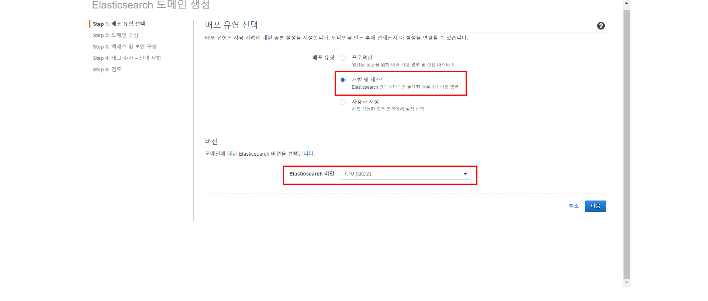
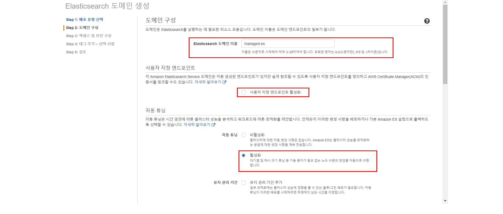
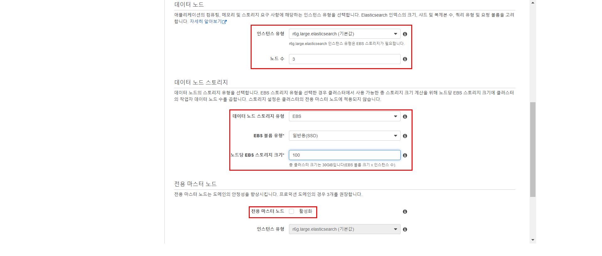
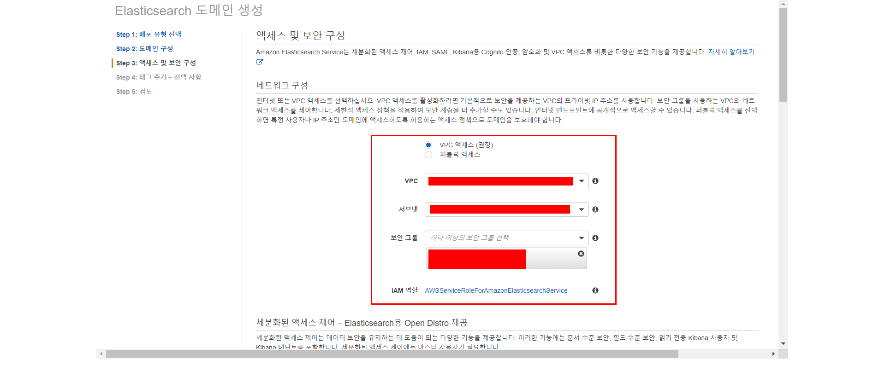
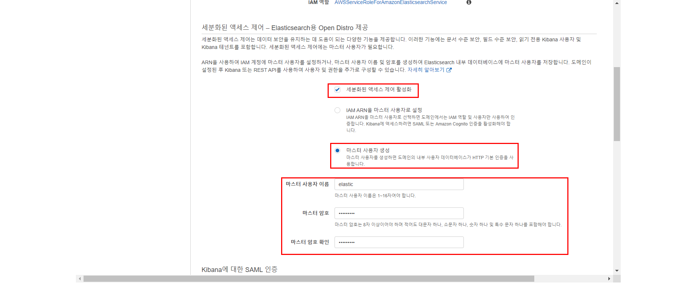
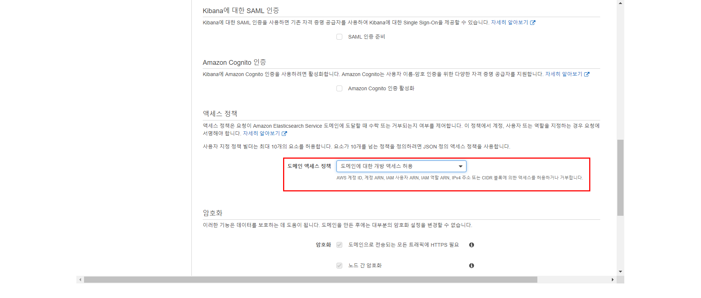

# AWS ElasticSearch 생성

**Amazon ES 도메인을 만들려면(콘솔)**

1. 배포 유형 선택 

   1. 배포 유형 : `개발 및 테스트`
   2. 버전 : `7.10 (latest)`
      

2. 도메인 구성

   1. Elasticsearch domain name : `managed-es`
   2. 사용자 지정 엔드포인트 : `비활성`
   3. 자동 튜닝 : `활성`
      
   4. 데이터 노드
      1. 인스턴스 유형 : `r6g.large.elasticsearch`
      2. 노드 수 : 3
   5. 데이터 노드 스토리지
      1. 데이터 노드 스토리지 유형 : `EBS`
      2. EBS 볼륨 유형 : `일반용(SSD)`
      3. 노드당 EBS 스토리지 크기 : 100
   6. 전용 마스터 노드 : `비활성`
      

3. 액세스 및 보안 구성

   1. 네트워크 구성 : `vpc 액세스`

      1. vpc, subnet, security group 설정

      

      

   2. 세분화된 액세스 제어

      1. 세분화된 액세스 제어 : `활성`
      2. 마스터 사용자 생성 : `활성`
         1. 마스터 사용자 이름 : `elastic`
         2. 마스터 암호 : `Bespin12!`

      
      
      
      

4. **Data nodes(데이터 노드)**에서 `c5.large.elasticsearch` 인스턴스 유형을 선택합니다. 기본값인 인스턴스 1개를 사용합니다.

5. **Data nodes storage(데이터 노드 스토리지)**에서 기본값을 사용합니다.

[참고 자료](https://docs.aws.amazon.com/ko_kr/elasticsearch-service/latest/developerguide/es-gsg.html)
