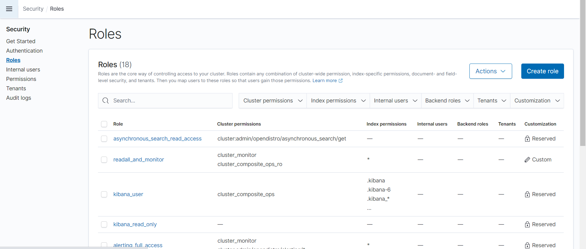
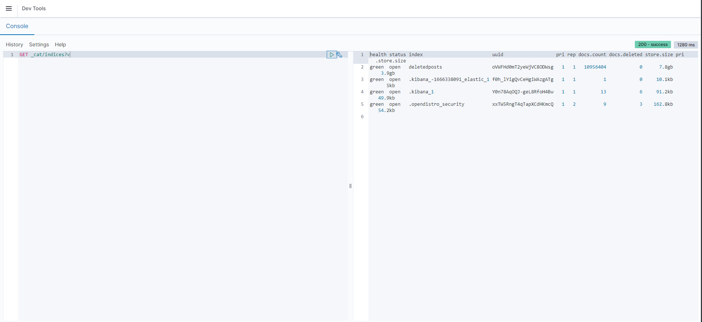
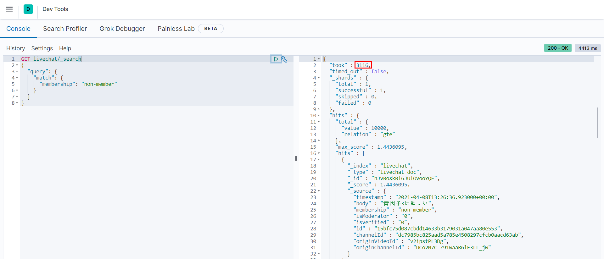

# Elasticsearch Migration

1. [공유 File Storage에 Respository 구성](#1. 공유 File Storage에 Respository 구성)
2. [S3에 Respository 구성](#2. S3에 Respository 구성)
3. [Elasticdump](#3. Elasticdump)
4. [Migration 결과](#4. Migration 결과)

## 1. 공유 File Storage에 Respository 구성

1. Data 노드에서 공유 storage mount

   ```sh
   # 공유 storage 생성
   sudo mkdir /mnt/snapshots
   # 소유권 변경
   sudo chown root:Elasticsearch /mnt/snapshots
   # mount
   sudo mount {master private ip}:/mnt/snapshots /mnt/snapshots
   ```

2. 모든 노드에서 `elasticsearch.yml`에 `path.repo` 설정을 추가

   ```sh
   # yml 파일 수정
   sudo vim /etc/elasticsearch/elasticsearch.yml
   ```

   ```yaml
   # 맨 하단에 추가 합니다.
   path.repo: ["/mnt/snapshots"]
   ```

3. 각 노드를 다시 시작합니다.

   ```sh
   sudo systemctl restart elasticsearch.service
   ```

4. 스냅샷 리포지토리 등록

   ```sh
   curl -XPUT 'http://{master private ip}:9200/_snapshot/{repository_name}' -d'
   {
     "type": "fs",
     "settings": {
       "location": "/mnt/snapshots"
     }
   }'
   ```

5. 설치[AWS CLI](http://aws.amazon.com/cli/)를 실행하고`aws configure`를 클릭하여 자격 증명을 추가합니다.

   ```sh
   cd ~
   curl "https://awscli.amazonaws.com/awscli-exe-linux-x86_64.zip" -o "awscliv2.zip"
   unzip awscliv2.zip
   sudo ./aws/install
   ```

6. 스냅샷 디렉터리로 이동합니다. 다음 명령을 실행하여 새 S3 버킷을 생성하고 스냅샷 디렉터리의 콘텐츠를 해당 버킷에 업로드합니다.

   ```sh
   cd /mnt/snapshots
   aws s3 sync . s3://{migration-bucket}/{path} --sse AES256
   ```

## 2. S3에 Respository 구성

1. 플러그인 설치(마스터 노드에서만 이미 마운트 되어있음)

   ```sh
   sudo /usr/share/elasticsearch/bin/elasticsearch-plugin install repository-s3
   ```

2. 플러그인 list 확인

   ```sh
   sudo /usr/share/elasticsearch/bin/elasticsearch-plugin list
   ```

3. 모든 node 설정 후 재시작

   ```sh
   sudo vim /etc/elasticsearch/jvm.options
   
   # 맨 밑에 아래 줄을 추가하십시오
   -Des.allow_insecure_settings=true
   ```

4. 클러스터의 각 노드를 다시 시작

   ```sh
   sudo systemctl restart elasticsearch.service
   ```

5. 보안 클러스터 설정을 다시 로드

   ```sh
   curl -u elastic:Bespin12 -XPOST 'http://{master_private_ip}:9200/_nodes/reload_secure_settings'
   ```

6. Repository 지정 : S3 (source)

   ```sh
   curl -u USER:PASS -H 'Content-Type: application/json' -XPUT 'http://{master_private_ip}:9200/_snapshot/{repository_name}?pretty=true' -d'
   {
     "type": "s3",
     "settings": {
       "bucket": "{migration-bucket}",
       "region": "region_name",
       "base_path": "{path}",
       "access_key": "{access_key}",
       "secret_key": "{secret_key}"
     }
   }'
   ```

7. S3 백업하기

   ```sh
      curl -u USER:PASS -H "content-type: application/JSON" -XPUT 'http://{master_private_ip}:9200/_snapshot/{repository_name}/{backup_key}?pretty=true&wait_for_completion=true' -d '
      {
        "indices": "{index}",
        "ignore_unavailable": true,
        "include_global_state": false
      }'
      
      
      # ======================= snapshot 결과 =======================
      {
        "snapshot" : {
          "snapshot" : "{backup_key}",
          "uuid" : "Gb-RHkORSkeSYs4bFs88qw",
          "version_id" : 7120199,
          "version" : "7.12.1",
          "indices" : [
            "posts"
          ],
          "data_streams" : [ ],
          "include_global_state" : false,
          "state" : "SUCCESS",
          "start_time" : "2021-05-26T07:58:55.585Z",
          "start_time_in_millis" : 1622015935585,
          "end_time" : "2021-05-26T08:15:05.736Z",
          "end_time_in_millis" : 1622016905736,
          "duration_in_millis" : 970151,
          "failures" : [ ],
          "shards" : {
            "total" : 1,
            "failed" : 0,
            "successful" : 1
          },
          "feature_states" : [ ]
        }
      }
   ```

   

8. S3 백업 확인하기

   ```sh
   # S3 백업 확인하기
   curl -u USER:PASS -XGET 'http://{master_private_ip}:9200/_snapshot?pretty'
   
   # 특정 백업 키 확인
   curl -u USER:PASS -XGET 'http://{master_private_ip}:9200/_snapshot/{repository_name}/{backup_key}?pretty'
   
   
   # ======================= 특정 백업 키 확인 결과 =======================
   {
     "snapshots" : [
       {
         "snapshot" : "{backup_key}",
         "uuid" : "Gb-RHkORSkeSYs4bFs88qw",
         "version_id" : 7120199,
         "version" : "7.12.1",
         "indices" : [
           "posts"
         ],
         "data_streams" : [ ],
         "include_global_state" : false,
         "state" : "SUCCESS",
         "start_time" : "2021-05-26T07:58:55.585Z",
         "start_time_in_millis" : 1622015935585,
         "end_time" : "2021-05-26T08:15:05.736Z",
         "end_time_in_millis" : 1622016905736,
         "duration_in_millis" : 970151,
         "failures" : [ ],
         "shards" : {
           "total" : 1,
           "failed" : 0,
           "successful" : 1
         },
         "feature_states" : [ ]
       }
     ]
   }
   ```

9. Amazon ES에 권한을 위임할 IAM 역할을 생성
   역할을 `TheSnapshotRole`이라고 지칭

   1. EC2 Instance profile 용 role 생성 : `TheSnapshotRole`
      

   2. `TheSnapshotRole` 에 신뢰 관계 추가

      ```json
      {
        "Version": "2012-10-17",
        "Statement": [
          {
            "Effect": "Allow",
            "Principal": {
              "Service": [
                "ec2.amazonaws.com",
                "es.amazonaws.com"
              ]
            },
            "Action": "sts:AssumeRole"
          }
        ]
      }
      ```

      

   3. 정책 연결( S3, Elasticsearch )

      ```json
      // S3 policy
      {
        "Version": "2012-10-17",
        "Statement": [{
            "Action": [
              "s3:*"
            ],
            "Effect": "Allow",
            "Resource": [
              "arn:aws:s3:::{s3_bucket_name}"
            ]
          },
          {
            "Action": [
              "s3:*"
            ],
            "Effect": "Allow",
            "Resource": [
              "arn:aws:s3:::{s3_bucket_name}/*"
            ]
          }
        ]
      }
      ```

      ```json
      // Elasticsearch policy
      {
        "Version": "2012-10-17",
        "Statement": [
          {
            "Effect": "Allow",
            "Action": "iam:PassRole",
            "Resource": "{TheSnapshotRole ARN}"
          },
          {
            "Effect": "Allow",
            "Action": "es:*",
            "Resource": "arn:aws:es:{region_name}:{account_id}:{domain}/{domain_name}/*"
          }
        ]
      }
      ```

      

10. Manage_스냅샷 역할을 매핑

    1. Amazon ES 도메인의 Kibana 플러그인으로 이동
       
    2. 기본 메뉴에서 **Security**의 **Roles** 선택.
       
    3. `manage_snapshots`역할을 검색 및 선택합니다.
       
    4. **Mapped users** 탭의 **Manage mapping** 선택.
    5. **Backend_role**에 전달할 권한이 있는 역할의 도메인 ARN 추가합니다.`TheSnapshotRole`. 이 ARN 의 형식은 다음과 같습니다.
       

11. `TheSnapshotRole`에 모든 권한 부여

    기본 메뉴에서 **Security > Roles > all_access** 선택

    **Mapped users** 에 `TheSnapshotRole ARN` 추가
    

12. Repository 지정 : S3 (target)
    스냅샷 리포지토리를 등록하려면 Amazon ES 도메인 엔드포인트에 PUT 요청을 보냅니다. `curl`이 작업은 AWS 요청 서명을 지원하지 않기 때문에 사용할 수 없습니다. 대신 [샘플 Python 클라이언트](https://docs.aws.amazon.com/ko_kr/elasticsearch-service/latest/developerguide/es-managedomains-snapshots.html#es-managedomains-snapshot-client-python), [Postman 등의 다른 방법으로 [서명 요청](https://docs.aws.amazon.com/ko_kr/elasticsearch-service/latest/developerguide/es-request-signing.html)을 전송해 스냅샷 리포지토리를 등록해야 합니다.

    ```python
    import boto3
    import requests
    from requests_aws4auth import AWS4Auth
    
    host = '{aws Elasticsearch Domain}:443'
    region = '{region_name}' # e.g. us-west-2
    service = 'es'
    credentials = boto3.Session().get_credentials()
    awsauth = AWS4Auth(credentials.access_key, credentials.secret_key, region, service, session_token=credentials.token)
    
    # Register repository
    
    path = '_snapshot/{repository_name}' # the Elasticsearch API endpoint
    url = host + path
    
    payload = {
      "type": "s3",
      "settings": {
        "bucket": "{migration-bucket}",
        "region": "us-west-2",
        "base_path": "{region_name}",
        "role_arn": "{TheSnapshotRole ARN}"
      }
    }
    
    headers = {"Content-Type": "application/json"}
    
    r = requests.put(url, auth=awsauth, json=payload, headers=headers)
    
    print(r.status_code)
    print(r.text)
    ```

13. Snapshot 확인

    ```python
    import boto3
    import requests
    from pprint import pprint
    from requests_aws4auth import AWS4Auth
    
    host = '{aws Elasticsearch Domain}:443'
    region = '{region_name}' # e.g. us-west-2
    service = 'es'
    credentials = boto3.Session().get_credentials()
    awsauth = AWS4Auth(credentials.access_key, credentials.secret_key, region, service, session_token=credentials.token)
    
    # Take snapshot
    path = '_snapshot/{repository_name}/{backup_key}'
    url = host + path
    
    r = requests.put(url, auth=awsauth)
    
    pprint(r.status_code)
    pprint(r.text)
    ```

14. Snapshot 복구

    ```python
    import boto3
    import requests
    from pprint import pprint
    from requests_aws4auth import AWS4Auth
    
    host = '{aws Elasticsearch Domain}:443'
    region = '{region_name}' # e.g. us-west-2
    service = 'es'
    credentials = boto3.Session().get_credentials()
    awsauth = AWS4Auth(credentials.access_key, credentials.secret_key, region, service, session_token=credentials.token)
    
    # Restore snapshot (one index)
    path = '_snapshot/{repository_name}/{backup_key}/_restore'
    url = host + path
    payload = {
        "indices": "{index}",
        "ignore_unavailable" : "true",
    	"include_global_state" : "false"
    }
    headers = {"Content-Type": "application/json"}
    r = requests.post(url, auth=awsauth, json=payload, headers=headers)
    pprint(r.text)
    ```

15. Index 확인

    ```sh
    curl -u USER:PASS -H "content-type: application/JSON" -XPUT 'http://{aws Elasticsearch Domain}:443/_cat/indices?v?pretty' 
    ```

    
    
    

## 3. Elasticdump

1. Node Js 설치

   [AMAZON Linux 기준 설치](https://docs.aws.amazon.com/ko_kr/sdk-for-javascript/v2/developer-guide/setting-up-node-on-ec2-instance.html)

   ```sh
   sudo yum update -y
   
   # npm 설치
   https://docs.aws.amazon.com/ko_kr/sdk-for-javascript/v2/developer-guide/setting-up-node-on-ec2-instance.html
   
   curl -o- https://raw.githubusercontent.com/nvm-sh/nvm/v0.34.0/install.sh | bash
   
   . ~/.nvm/nvm.sh
   
   nvm install node
   
   node -e "console.log('Running Node.js ' + process.version)"
   ```

2. Elasticdump 설치

   ```sh
   npm install elasticdump
   
   # Home 디렉토리에 Elasticdump 설치
   ```

3. Elasticsearch httpauth용 파일 작성

   ```sh
   vi httpAuthFile.txt
   
   # 하단 내용 추가
   # ================================
   user={username}
   password={password}
   ```

4. Dump 작업용 Shell script 작성
   참고 URL : 
   https://github.com/elasticsearch-dump/elasticsearch-dump

   ```sh
   vi json_export.sh
   ```

   하단 내용 입력

   ```sh
   #! /bin/sh
   
   /home/ec2-user/node_modules/elasticdump/bin/elasticdump\
     --s3AccessKeyId "{ACCESS_KEY}" \
     --s3SecretAccessKey "{SECRET_KEY}" \
     --input=http://{Master_Private_IP}:9200/{Index_Name}\
     --output "s3://{Bucket_Name}/{Path}/{Target_File_Name}"\
     --limit=10000 \
     --httpAuthFile=/home/ec2-user/httpAuthFile.txt
   ```

5. Daemon으로 Shell Script 수행

   ```sh
   nohup /home/ec2-user/json_export.sh > dump_json.log &
   ```

   

   

   

## 4. Migration 결과

1. Self Hosted Elasticsearch

   | 유형     | 상세 내영     |
   | -------- | ------------- |
   | AMI      | Amazon Linux2 |
   | Type     | t2.large      |
   | vCPU     | 2             |
   | 메모리   | 8             |
   | 스토리지 | EBS 전용      |

2. Managed Elasticsearch

   | 유형     | 상세 내영               |
   | -------- | ----------------------- |
   | Type     | r6g.large.elasticsearch |
   | vCPU     | 2                       |
   | 메모리   | 16                      |
   | 스토리지 | EBS 전용                |

3. 3천만 건의 데이터 조회 시간

   1. Self Hosted Elasticsearch 건수

      

   2. Self Hosted Elasticsearch 시간
      

   3. Managed Elasticsearch 건수
      

   4. Managed Elasticsearch 시간
      

4. 결과
   상단에 제공된 내용대로 cpu는 동일하게 memory는 2배 정도 높게 설정했을 때, 약 6천만 건의 Data에서 3천만 건의 Data를 조회하는 데 약 3초로 비슷한 시간이 소요.

- [참고 자료1](https://docs.aws.amazon.com/ko_kr/elasticsearch-service/latest/developerguide/migration.html)
- [참고 자료2](https://opendistro.github.io/for-elasticsearch-docs/docs/elasticsearch/snapshot-restore/#shared-file-system)
- [참고 자료3](https://jsongsong.tistory.com/37)
