# 모니터링 방안

1. [Self hosted ES](#1-self-hosted-es)
   1. [ELK Stack Monitoring](#1-elk-stack-monitoring)
   2. [Elasticsearch Monitoring](#2-elasticsearch-monitoring)
2. [Managed ES](#2-managed-es)
   1. [Managed ES Graph](#1-managed-es-graph)
   2. [Graph 들로 CloudWatch DashBoard 구성](#2-graph-들로-cloudWatch-dashboard-구성)
   3. [Alert 구성](#3-alert-구성)

## 1.  Self hosted ES

### 1. ELK Stack Monitoring
전체 Service들에 대한 Monitoring 가능

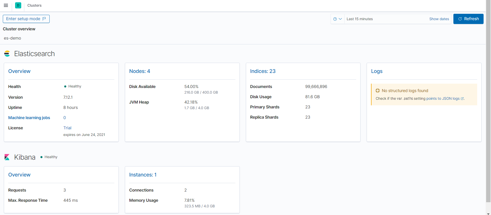


### 2. Elasticsearch Monitoring
Tab에 따라 Elasticsearch Cluster에 대한 Monitoring이 가능합니다.

1. Summary

   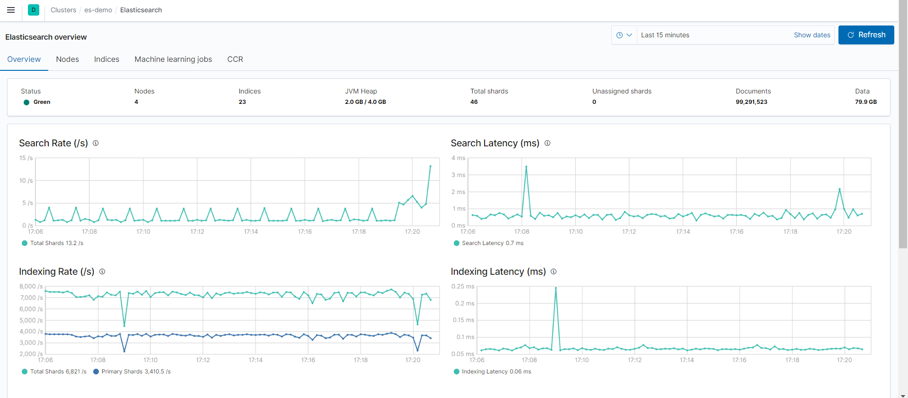

   

2. Nodes Status

   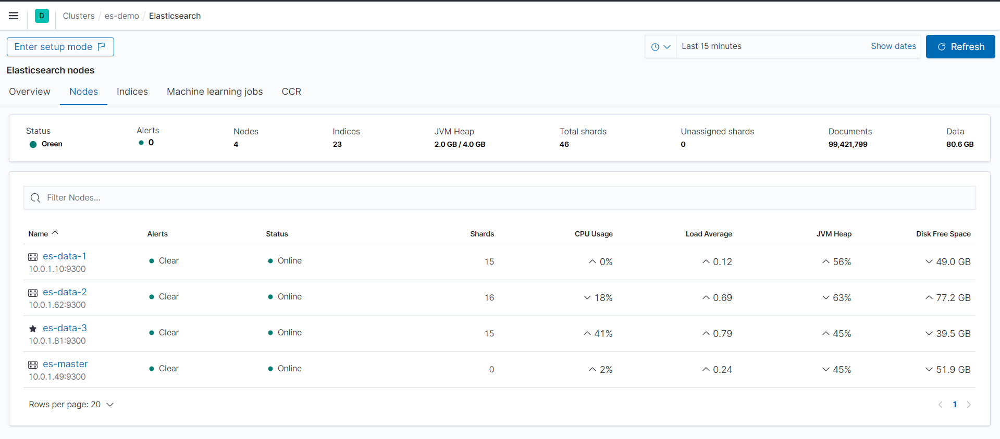

   

3. Index Monitoring

   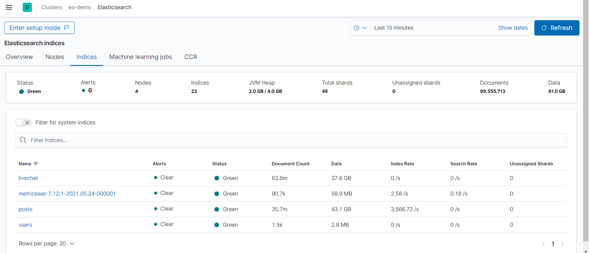


## 2. Managed ES

### 1. Managed ES Graph

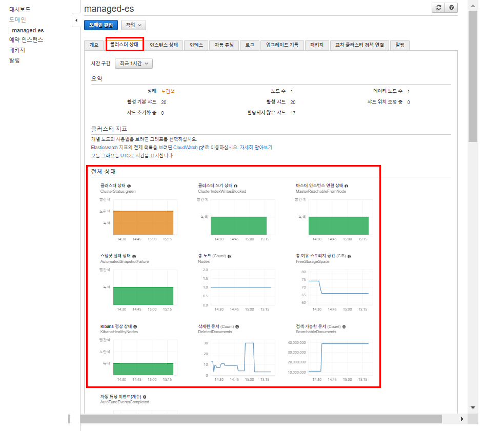


### 2. Graph 들로 CloudWatch DashBoard 구성
aws_sdk로 구성
[소스 코드](./cw-dashboard/README.html)

1. app.py : cdk 실행 파일

   ```python
   #!/usr/bin/env python3
   
   from aws_cdk import core
   from cw_dashboard.cw_dashboard_stack import CwDashboardStack
   import boto3
   
   session = boto3.Session(profile_name='default')
   account_id = session.resource('iam').CurrentUser().arn.split(':')[4]
   env_US = core.Environment(account=account_id,region="us-west-2")
   app = core.App()
   CwDashboardStack(app, "es-dashboard-stack", env=env_US)
   
   app.synth()
   
   ```

   

2. cw_dashboard_es.py : Dashboard 구성 파일

   ```python
   from aws_cdk import core
   from aws_cdk import aws_cloudwatch as cw
   from aws_cdk.aws_cloudwatch import GraphWidget
   import boto3
   
   session = boto3.Session(profile_name='default')
   account_id = session.resource('iam').CurrentUser().arn.split(':')[4]
   
   # Returns CloudWatch Metrics on each functions
   def get_metrics(_metricName, _statistic):
       metrics = []
       metrics.append(
           cw.Metric(
               metric_name = _metricName,
               namespace = 'AWS/ES',
               dimensions={
                   "DomainName" :'{Elasticsearch Domain Name}',
                   "ClientId" : account_id
               },
               statistic = _statistic,
           )
       )
   
       return metrics
   
   # Returns GraphicWidget
   def get_GrapthWidget(_title, _metricName, _statistic, _width, _height):
       return GraphWidget(
                   title=_title,
                   left=get_metrics(_metricName, _statistic),
                   width=_width,
                   height=_height
               )
   
   
   
   class Elasticsearch(core.Construct):
       
       def __init__(self, scope: core.Construct, id: str, **kwargs):
           super().__init__(scope, id, **kwargs)
   
           dashboard = cw.Dashboard(self, id, dashboard_name=id) # 3rd Arg is the name of dashboard.
           dashboard.add_widgets(
               GraphWidget(title='ClusterStatus',
               left=[
                   cw.Metric(metric_name='ClusterStatus.green', namespace='AWS/ES', color='#2ca02c', dimensions={"DomainName":'managed-es', "ClientId":account_id}, statistic='Sum'),
                   cw.Metric(metric_name='ClusterStatus.yellow', namespace='AWS/ES', color='#FFFF33', dimensions={"DomainName":'managed-es', "ClientId":account_id}, statistic='Sum'),
                   cw.Metric(metric_name='ClusterStatus.red', namespace='AWS/ES', color='#FF0000', dimensions={"DomainName": 'managed-es', "ClientId": account_id}, statistic='Sum')
               ],
               width=6,
               height=6),
               get_GrapthWidget('ClusterIndexWritesBlocked','ClusterIndexWritesBlocked','Maximum',6,6),
               get_GrapthWidget('Nodes','Nodes','Maximum',6,6),
               get_GrapthWidget('FreeStorageSpace','FreeStorageSpace','Sum',6,6),
               get_GrapthWidget('AutomatedSnapshotFailure','AutomatedSnapshotFailure','Maximum',6,6),
               get_GrapthWidget('KibanaHealthyNodes','KibanaHealthyNodes','Average',6,6),
               get_GrapthWidget('SearchableDocuments','SearchableDocuments','Average',6,6),
               get_GrapthWidget('CPUUtilization','CPUUtilization','Maximum',6,6),
           )
   
   ```

   

3. cw_dashboard_stack.py : CloudFormaion Stack 구성

   ```python
   from aws_cdk import core
   from cw_dashboard.cw_dashboard_es import Elasticsearch
   
   class CwDashboardStack(core.Stack):
   
       def __init__(self, scope: core.Construct, id: str, **kwargs) -> None:
           super().__init__(scope, id, **kwargs)
   
           dashboard_es_creation = Elasticsearch(self, '{DashBoard Name}')  # 2nd Arg is the id of dashboard.
   
   ```

   

4. 결과
   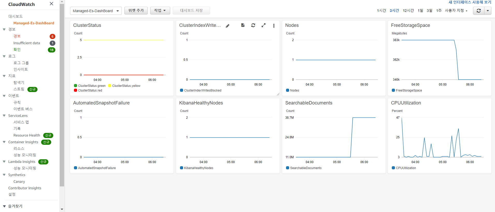

   

### 3. Alert 구성

1. Target이 될 SNS 생성
   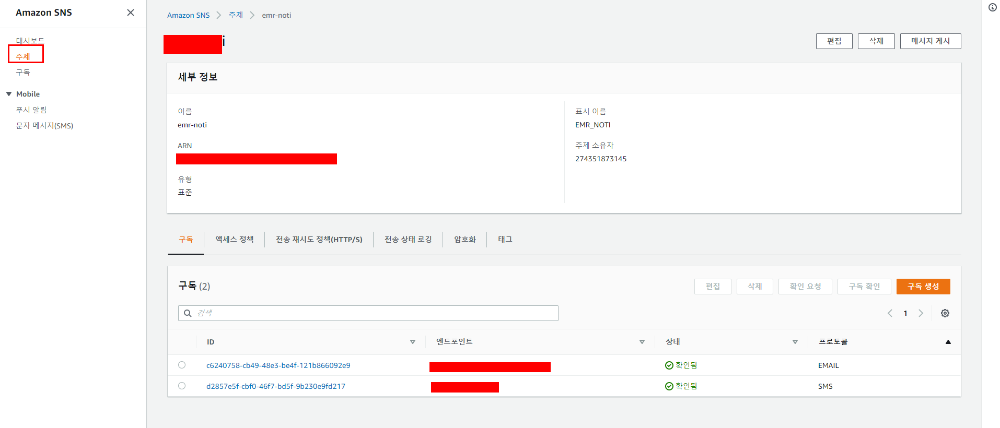

   

2. IAM Role 권한 부여
   기존 Role에 정책 추가

   ```json
   {
     "Version": "2012-10-17",
     "Statement": [{
       "Effect": "Allow",
       "Action": "sns:*",
       "Resource": "sns-topic-arn"
     }]
   }
   ```

   

3. Kibana Alerting 구성

   1. monitor 구성
      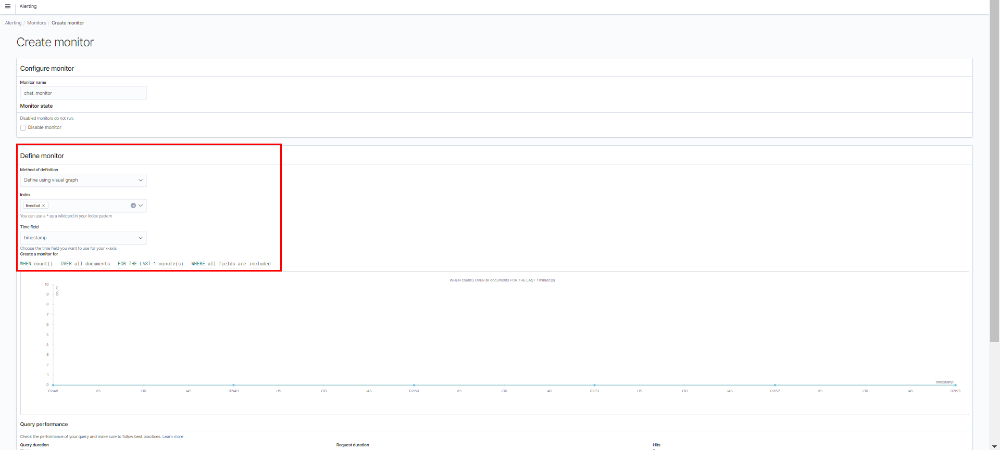

   2. Target 설정
      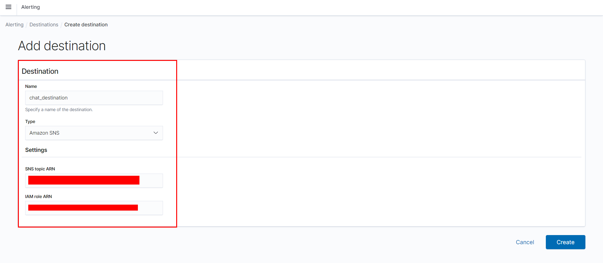

      

   3. Trigger 및 Action 설정
      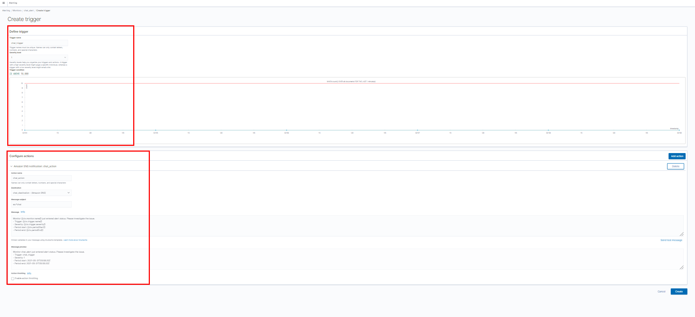

      

   4. Alerting 구성
      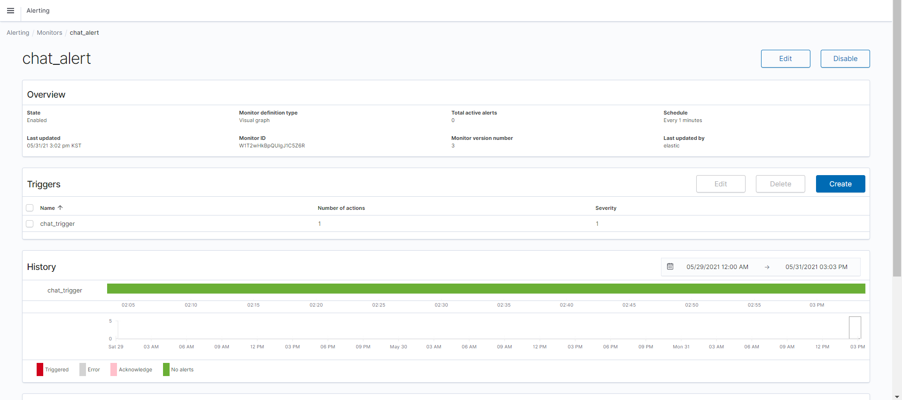

