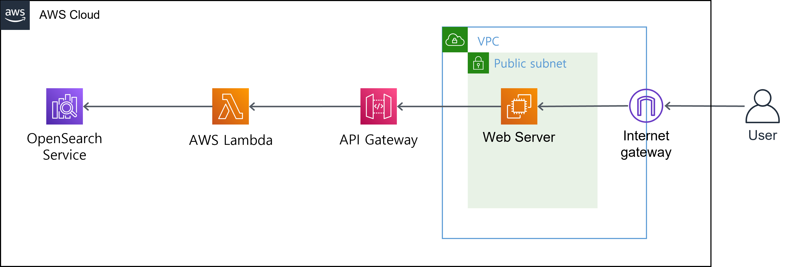

[AWS Docs Hands On 진행](https://docs.aws.amazon.com/opensearch-service/latest/developerguide/search-example.html)

# Amazon OpenSearch Service로 검색 애플리케이션 구축

## 사용된 Resource

1. EC2 : 1 개

   > OpenSearch에 Data 적재 및 검색 Web Server 용도

2. Security Group : 1 개

   > 상단 EC2의 SG 용도
   >
   > 로컬 피씨와 OpenSearch의 접근 허용

3. OpenSearch : 1 개

   > Sample Data 적재 및 조회 용도

4. Api Gateway : 1 개

   > Web Server에서 OpenSearch와의 통신을 위한 Gateway 용도

5. Lambda : 1 개

   > Web Server에서 Data 조회 시, 실제 OpenSearch에 GET 요청을 하고 결과물을 반환하는 용도
   > Web Server -> Api Gateway -> Lambda -> OpenSearch

6. IAM Role : 3 개

   > - Cloudformation 용 1 개
   > - EC2 Instance Profile 용 1 개
   > - Lambda 용 1 개

7. Cloudformation Stack : 1 개

   > Cloudformation 용 IAM Role 1 개를 제외한 모든 Resource 생성 용도
   >
   > 상단의 모든 Resource가 Nested Stack 형태로 생성

