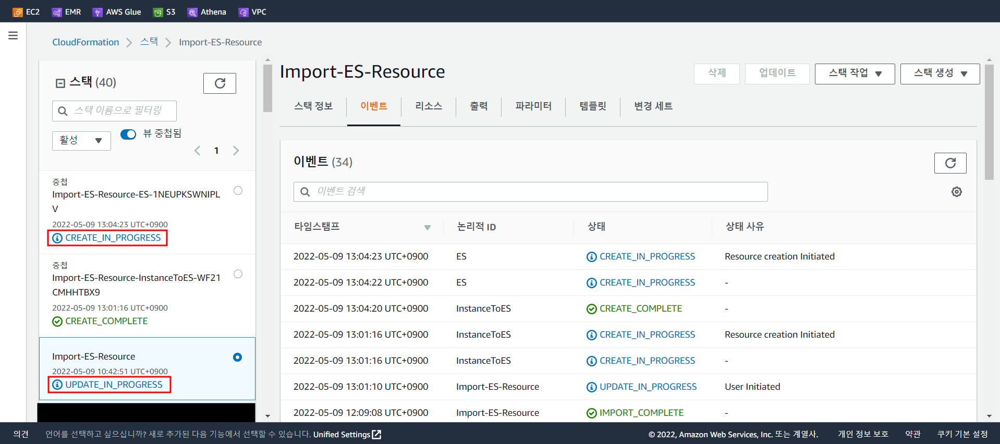

[AWS Docs Hands On 진행](https://docs.aws.amazon.com/opensearch-service/latest/developerguide/search-example.html)

# Amazon OpenSearch Service로 검색 애플리케이션 구축

## 개요

- AWS 에서 제공하는 Sample-Movie 데이터를 사용하여 AWS OpenSearch에 적재

- 적재된 Data를 Web Server에서 조회

- 로컬 PC에서 AWS CLI를 통해 Cloudformation Stack 생성 및 실행

- Stack에서 필요한 Resource

Data 크기 : 약 5,000 건

Data Sample

```json
{
    "directors": [
        "Joseph Gordon-Levitt"
    ],
    "release_date": "2013-01-18T00:00:00Z",
    "rating": 7.4,
    "genres": [
        "Comedy",
        "Drama"
    ],
    "image_url": "https://m.media-amazon.com/images/M/MV5BMTQxNTc3NDM2MF5BMl5BanBnXkFtZTcwNzQ5NTQ3OQ@@._V1_SX400_.jpg",
    "plot": "A New Jersey guy dedicated to his family, friends, and church, develops unrealistic expectations from watching porn and works to find happiness and intimacy with his potential true love.",
    "title": "Don Jon",
    "rank": 1,
    "running_time_secs": 5400,
    "actors": [
        "Joseph Gordon-Levitt",
        "Scarlett Johansson",
        "Julianne Moore"
    ],
    "year": 2013,
    "id": "tt2229499",
    "type": "add"
}
```

<div style="page-break-after: always; break-after: page;"></div>

## 사용된 Resource

1. EC2 : 1 개

   > OpenSearch에 Data 적재 및 검색 Web Server 용도

2. Security Group : 1 개

   > 상단 EC2의 SG 용도
   >
   > 로컬 피씨와 OpenSearch의 접근 허용

3. OpenSearch : 1 개

   > Sample Data 적재 및 조회 용도

4. Api Gateway : 1 개

   > Web Server에서 OpenSearch와의 통신을 위한 Gateway 용도

5. Lambda : 1 개

   > Web Server에서 Data 조회 시, 실제 OpenSearch에 GET 요청을 하고 결과물을 반환하는 용도
   > Web Server -> Api Gateway -> Lambda -> OpenSearch

6. IAM Role : 3 개

   > - Cloudformation 용 1 개
   > - EC2 Instance Profile 용 1 개
   > - Lambda 용 1 개

6. System Manager Parameter Store : 1 개

   > Api Gateway URL 저장소 용도
   
7. Cloudformation Stack : 1 개

   > Cloudformation 용 IAM Role 1 개를 제외한 모든 Resource 생성 용도
   >
   > 상단의 모든 Resource가 Nested Stack 형태로 생성


<div style="page-break-after: always; break-after: page;"></div>

## 사전 준비 사항

1. [로컬 PC에 AWS CLI 설치](https://docs.aws.amazon.com/ko_kr/cli/latest/userguide/getting-started-install.html)

2. `aws configure` 수행(Credential 정보)

3. 기 사용 중인 Resource 목록 확인

   - VPC, Subnet

     > EC2를 생성할 네트워크 Resource

   - Internet Gateway

     > Api Gateway 와 Web Server 통신 용도

   - S3

     > Template 및 각종 Source Code 저장소

   - IAM Role

     > Cloudformation 및 EC2에서 사용할 Role
     >
     > **Cloudformation Role**
     >
     > - 신뢰 관계 : `cloudformation.amazonaws.com`
     > - 권한 : `AdministratorAccess`
     >
     > **EC2 Role**
     >
     > - 신뢰 관계 : `ec2.amazonaws.com`
     > - 권한 : 
     >   - `AmazonEC2FullAccess`
     >   - `AmazonEC2RoleforSSM`
     >   - `AmazonS3FullAccess`
     >   - `AmazonOpenSearchServiceFullAccess`

<div style="page-break-after: always; break-after: page;"></div>

## 수행 방법

1. 기존 Resource들 Stack에 올리기
   사용된 Script : 

   - [network_resource.yaml](Code/template/network_resource.yaml)
   - [parameter.txt](Code/template/parameter.txt)

   상단 Script 들이 있는 Directory로 이동 후 하단 명령 수행
   ```sh
   # Template S3에 Upload (모든 Template Upload)
   aws s3 sync ./ s3://{YOUR_BUCKET}/{PATH}
   
   # Stack 생성 URL
   aws cloudformation create-change-set\
       --stack-name {STACK_NAME} --change-set-name {CHANGE_SET_NAME}\
       --change-set-type IMPORT\
       --resources-to-import file://parameter.txt\
       --capabilities CAPABILITY_IAM CAPABILITY_AUTO_EXPAND\
       --template-url {network_resource.yaml의 HTTP URL}
   ```

   

   > 상단의 명령은 Stack 생성 명령이 아닌 `기존 리소스 사용(리소스 가져오기)` 기능이므로 Stack 생성과 동시에 `변경 세트`가 생성됩니다.
   > 현재 상태는 변경 세트에 대한 `REVIEW` 상태이므로 생성한 변경 세트를 **실행**시키면 **IMPORT**가 완료 됩니다.

   ```sh
   # 변경 세트 수행
   aws cloudformation execute-change-set \
       --change-set-name {CHANGE_SET_NAME} \
       --stack-name {STACK_NAME}
   ```

   

   > 필요한 Resource 들이 Stack 에 IMPORT 되었음을 확인할 수 있습니다.

2. 모든 Resource 생성하기
   해당 작업으로 통해 모든 Resource 가 생성됩니다.

   사용된 Script : 

   - [main_es_diy.yaml](Code/template/main_es_diy.yaml)
     - [instance_to_es.yaml](Code/template/main_es_diy.yaml)
     - [es_cluster.yaml](Code/template/main_es_diy.yaml)
     - [ingest_to_es.yaml](Code/template/main_es_diy.yaml)
     - [lambda-api-cf_diy.yaml](Code/template/main_es_diy.yaml)

   ```sh
   # Resource 생성을 위한 변경 세트 생성
   aws cloudformation create-change-set \
       --stack-name {STACK_NAME} \
       --change-set-name {CHANGE_SET_NAME} \
       --role-arn {Cloudformation 용 Role ARN} \
       --capabilities CAPABILITY_IAM CAPABILITY_AUTO_EXPAND\
       --parameters ParameterKey=KeyName,ParameterValue={PEM_KEY_NAME} \
       ParameterKey=ExpiryDate,ParameterValue=$(date --date="2 days" +%Y-%m-%d) \
       ParameterKey=MyIp,ParameterValue=$(curl ipinfo.io/ip)/32 \
       --change-set-type UPDATE \
       --template-url {main_es_diy.yaml의 HTTP URL}
       
   # 변경 세트 수행
   aws cloudformation execute-change-set \
       --change-set-name {CHANGE_SET_NAME} \
       --stack-name {STACK_NAME}
   ```

   main_es_diy.yaml 파일을 통해 하위 yaml 파일들이 순서대로 중첩 stack 형태로 생성되며 각 yaml 파일에 명시된 Resource 들을 생성합니다.

   - instance_to_es
     

   - es_cluster

     

   - ingest_to_es

     

   - lambda-api-cf_diy

     

   ---

   **결과**

   - instance_to_es_result
     

   - es_cluster_result

     

   - ingest_to_es_result

     

   - lambda-api-cf_diy_result

     

   - Web Server

     

<div style="page-break-after: always; break-after: page;"></div>

## Code Description

- [network_resource.yaml](Code/template/network_resource.yaml)

  기존 Resource 들을 Cloudformation에 **IMPORT** 하는 역할

- [parameter.txt](Code/template/parameter.txt)

  network_resource.yaml에서 **IMPORT**하는 Resource들에 대한 Identifier를 정의한 파일

- [main_es_diy.yaml](Code/template/main_es_diy.yaml)

  기존 Stack을 **UPDATE**하는 역할

  하단의 각 yaml 파일을 참조하여 중첩 stack(nested stack)을 생성하는 역할
  각 중첩 stack에 필요한 Resource 정보를 `Parameters`로 전달

- [instance_to_es.yaml](Code/template/main_es_diy.yaml)

  Data 적재 및 Web Server 용 EC2 생성

  EC2 생성 시 user-data 기능으로 **sample-movie-data** download

- [es_cluster.yaml](Code/template/main_es_diy.yaml)

  Public OpenSearch 생성
  Lambda Function에 적용될 IAM Role 및 Policy 생성

- [ingest_to_es.yaml](Code/template/main_es_diy.yaml)

  SSM `Run Command` 기능으로 상단에 생성한 EC2에서 Shell Script 수행

  > Shell Script 내용
  >
  > - OpenSearch에 **sample-movie-data** 적재

- [lambda-api-cf_diy.yaml](Code/template/main_es_diy.yaml)

  Parameter Store, Lambda, Api Gateway 생성

  SSM `Run Command` 기능으로 상단에 생성한 EC2에서 Shell Script 수행

  > Shell Script 내용
  >
  > - Nginx Repo download
  > - Nginx 설치 (웹 서버용)
  > - Web Server 구성 download(html, css, javascript)
  > - JavaScript 내용에 Api Gateway URL 추가
  > - Web Server 시작

  
