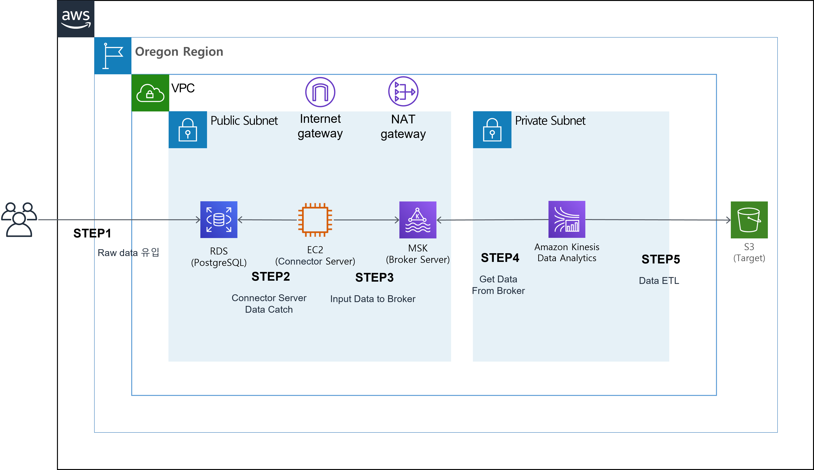
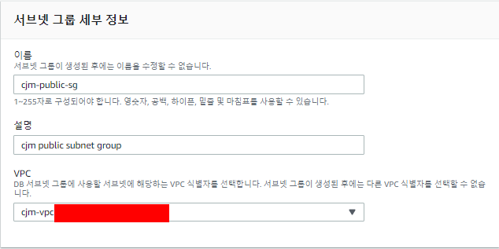
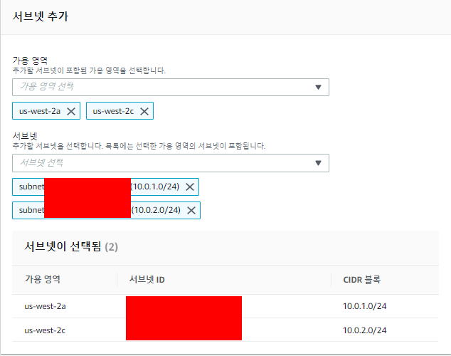
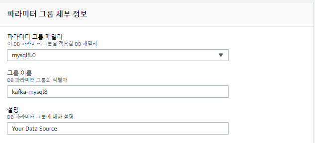
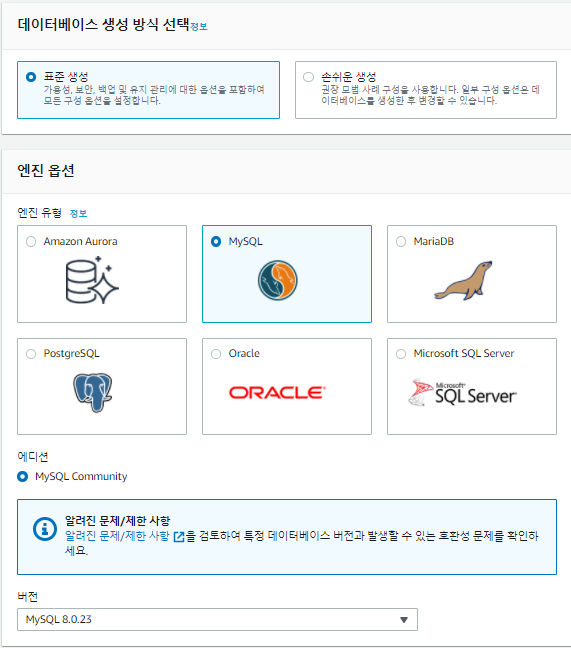
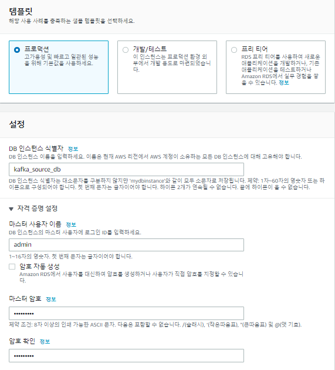
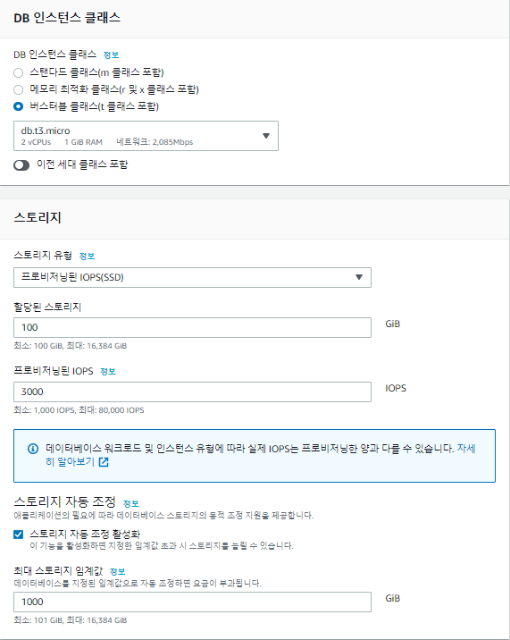
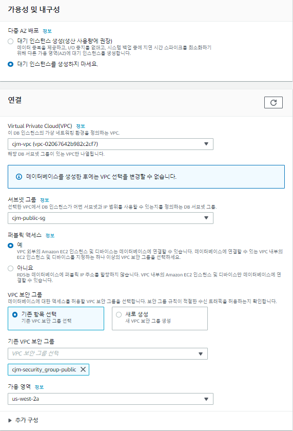
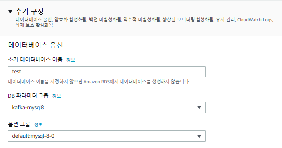

# AWS에서 Streaming Data를 ETL 작업 후 S3에 저장하기

DB에 실시간 들어오는 Data ( Row )를 Kafka Connector (debezium, jdbc ... etc)를 이용하여 MSK로 Ingest 및 KDA로 ETL 작업 후에 S3에 적재 시나리오

모든 구성은 oregon(us-west-2)에서 구성하였습니다. 

Resource : 

- RDS(MySQL)
- MSK
- Kinesis Data Analytics
- S3
- 네트워크 구성 (VPC, Public Subnet , Private Subnet, Routing Table , IGW, NATGW, Security Group)
- EC2
- Iam role

## 1. 네트워크 구성

1. VPC

   1. 이름 : {VPC_NME}
   2. IPv4 CIDR 블록 : `10.0.0.0/16`

   

2. Subnet

   1. Public Subnet1

      1. IPv4 CIDR 블록 : `10.0.1.0/24`
      2. 가용 영역 : `us-west-2a`

   2. Public Subnet2

      1. IPv4 CIDR 블록 : `10.0.2.0/24`
      2. 가용 영역 : `us-west-2c`

   3. Private Subnet1

      1. IPv4 CIDR 블록 : `10.0.3.0/24`
      2. 가용 영역 : `us-west-2a`

   4. Private Subnet1

      1. IPv4 CIDR 블록 : `10.0.4.0/24`
      2. 가용 영역 : `us-west-2c`

      

3. Internet Gateway (IGW)

   1. VPC : 상단에서 생성한 VPC_ID

   

4. Elastic IP (EIP)

   1. 네트워크 경계 그룹 : `us-west-2`
   2. 퍼블릭 IPv4 주소 풀 : `Amazon IPv4 주소 풀`

   

5. NAT Gateway (NATG)

   1. 서브넷 : {Public Subnet1_ID}
   2. 연결 유형 : `퍼블릭`
   3. 탄력적 IP 주소 : 상단에서 생성한 EIP_ID

   

6. Routing Table

   1. Public RT

      1. VPC : 상단에서 생성한 VPC_ID

      2. 라우팅

         | **대상**               | **대상** | **상태** | **전파됨** |
         | ---------------------- | -------- | -------- | ---------- |
         | VPC_CIDR (10.0.0.0/16) | local    | 활성     | 아니요     |
         | 0.0.0.0/0              | IGW_ID   | 활성     | 아니요     |

      3. 서브넷 연결

         | **서브넷 ID**     | **IPv4 CIDR**                     | **IPv6 CIDR** |
         | ----------------- | --------------------------------- | ------------- |
         | Public Subnet1_ID | Public Subnet1_CIDR (10.0.1.0/24) | –             |
         | Public Subnet2_ID | Public Subnet2_CIDR (10.0.2.0/24) | –             |

   2. Private RT

      1. VPC : 상단에서 생성한 VPC_ID

      2. 라우팅

         | **대상**  | **대상** | **상태** | **전파됨** |
         | --------- | -------- | -------- | ---------- |
         | VPC_CIDR  | local    | 활성     | 아니요     |
         | 0.0.0.0/0 | NATG_ID  | 활성     | 아니요     |

      3. 서브넷 연결

         | **서브넷 ID**      | **IPv4 CIDR**                      | **IPv6 CIDR** |
         | ------------------ | ---------------------------------- | ------------- |
         | Private Subnet1_ID | Private Subnet1_CIDR (10.0.3.0/24) | –             |
         | Private Subnet2_ID | Private Subnet2_CIDR (10.0.4.0/24) | –             |

   

7. Security Group (SG)

   | **유형**    | **프로토콜** | **포트 범위** | **소스**               | **설명 - 선택 사항**  |
   | ----------- | ------------ | ------------- | ---------------------- | --------------------- |
   | 모든 트래픽 | 전체         | 전체          | 10.0.0.0/16 (VPC CIDR) | VPC CIDR BLOCK        |
   | 모든 트래픽 | 전체         | 전체          | 해당 {SG-ID}           | refer to self for msk |

   

## 2. Source 구성 ( RDS MySQL )

1. Subnet Group 생성

   1. 이름 : `{YOUR_Subnet_Group_Name}`

   2. 설명 : `Subnet Group for Data Source`

   3. VPC : `{Your_VPC}`

      

   4. 가용 영역 : `us-west-2a`, `us-west-2c`

   5. 서브넷 : `{Your_Subnet_A}`, `{Your_Subnet_C}`

   

   

2. 파라미터 그룹 생성

   > RDS의 기본 파라미터 그룹은  bin log을 읽을 수 없도록 설정이 되어 있습니다. 
   > 따라서 bin log를 읽을 수 있도록 파라미터 그룹을 생성하고 RDS에 적용해야 합니다.
   > 최초 파라미터 그룹을 생성 후 수정 진행합니다.

   1. 파라미터 그룹 패밀리 : `mysql8.0`
   2. 그룹 이름 : `{Your_Parameter_Group_Name}`
   3. 설명 : `Your Data Source`

   

   [Binlog configuration properties](https://debezium.io/documentation/reference/1.3/connectors/mysql.html#binlog-configuration-properties-mysql-connector) 다음 링크를 통해 설정값을 확인 및 수정합니다.
   생성 된 파라미터 그룹을 변경합니다.

   | 이름             | 변경 전 값            | 변경 후 값 |
   | ---------------- | --------------------- | ---------- |
   | binlog_format    | MIXED                 | ROW        |
   | binlog_row_image | full, minimal, noblob | full       |

3. RDS 생성

   1. 데이터베이스 생성 방식 선택 : `표준 생성`

   2. 엔진 옵션 : `MySQL`

   3. 버전 : `MySQL.8.0.23`

      

   4. 템플릿 : `프로덕션`

   5. DB 인스턴스 식별자 : `{Your_DB_ID}`

   6. 마스터 사용자 이름 : `admin`

   7. 암호 : `Bespin12!`

      

   8. DB 인스턴스 클래스 : `버스터블 클래스(t 클래스 포함)/db.t3.micro2 (최소 사양)`

      

   9. 가용성 및 내구성 : `대기 인스턴스를 생성하지 마세요.`

   10. VPC : {Subnet_Group 과 동일한 VPC}

   11. 서브넷 그룹 : `{위에서 생성한 Subnet_Group}

   12. 퍼블릭 액세스 : `예`

   13. VPC 보안 그룹 : `{Your_Security_Group}`

   14. 가용 영역 : `us-west-2a`

       

   15. 데이터베이스 인증 : `암호 인증`

       

   16. 초기 데이터베이스 : test 

   17. 파라미터 그룹 : `{위에서 생성한 파라미터 그룹}`

       

