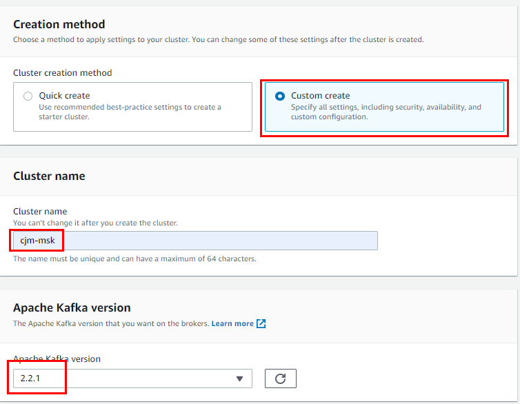
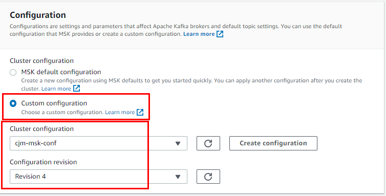
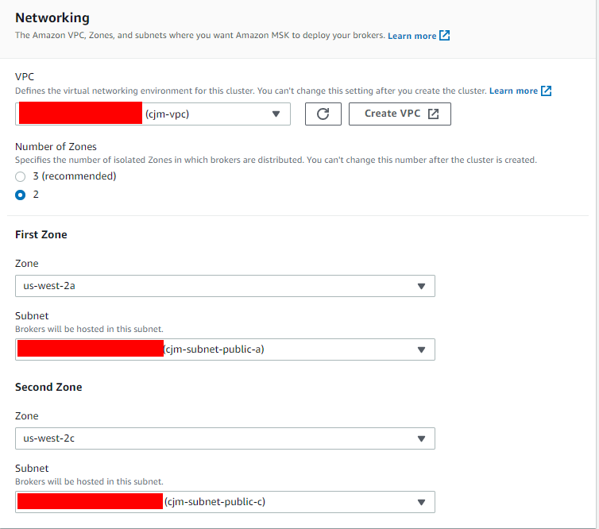
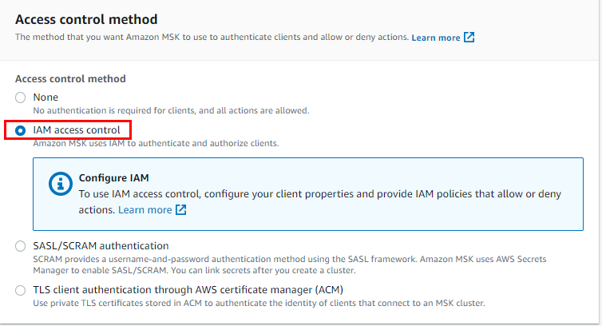
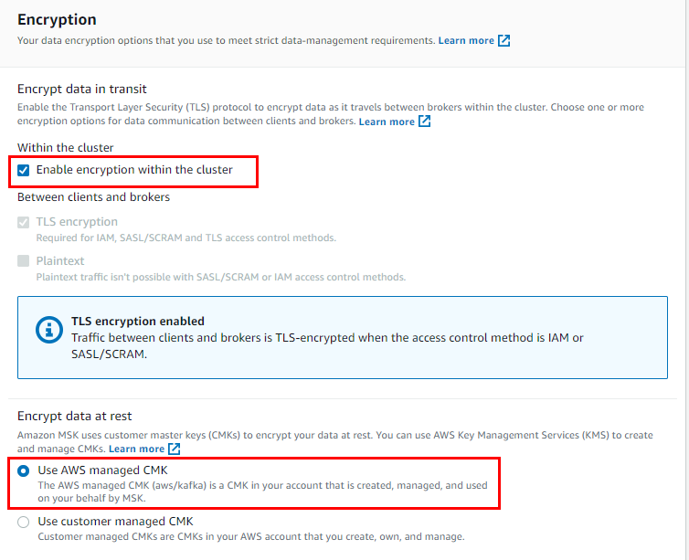
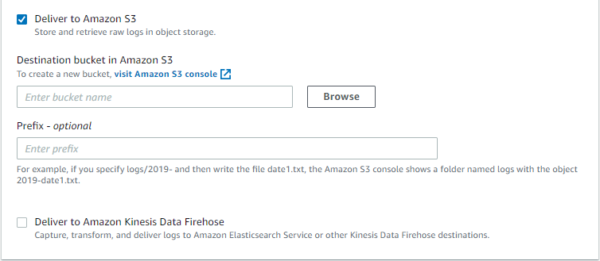

# AWS에서 Streaming Data를 ETL 작업 후 S3에 저장하기


DB에 실시간 들어오는 Data ( Row )를 Kafka Connector (debezium, jdbc ... etc)를 이용하여 MSK로 Ingest 및 KDA로 ETL 작업 후에 S3에 적재 시나리오

모든 구성은 oregon(us-west-2)에서 구성하였습니다. 

Resource : 

- RDS(MySQL)
- MSK
- Kinesis Data Analytics
- S3
- 네트워크 구성 (VPC, Public Subnet , Private Subnet, Routing Table , IGW, NATGW, Security Group)
- EC2
- Iam role

## 1. 네트워크 구성

1. VPC

   1. 이름 : {VPC_NME}
   2. IPv4 CIDR 블록 : `10.0.0.0/16`

   

2. Subnet

   1. Public Subnet1

      1. IPv4 CIDR 블록 : `10.0.1.0/24`
      2. 가용 영역 : `us-west-2a`

   2. Public Subnet2

      1. IPv4 CIDR 블록 : `10.0.2.0/24`
      2. 가용 영역 : `us-west-2c`

   3. Private Subnet1

      1. IPv4 CIDR 블록 : `10.0.3.0/24`
      2. 가용 영역 : `us-west-2a`

   4. Private Subnet1

      1. IPv4 CIDR 블록 : `10.0.4.0/24`
      2. 가용 영역 : `us-west-2c`

      

3. Internet Gateway (IGW)

   1. VPC : 상단에서 생성한 VPC_ID

   

4. Elastic IP (EIP)

   1. 네트워크 경계 그룹 : `us-west-2`
   2. 퍼블릭 IPv4 주소 풀 : `Amazon IPv4 주소 풀`

   

5. NAT Gateway (NATG)

   1. 서브넷 : {Public Subnet1_ID}
   2. 연결 유형 : `퍼블릭`
   3. 탄력적 IP 주소 : 상단에서 생성한 EIP_ID

   

6. Routing Table

   1. Public RT

      1. VPC : 상단에서 생성한 VPC_ID

      2. 라우팅

         | **대상**               | **대상** | **상태** | **전파됨** |
         | ---------------------- | -------- | -------- | ---------- |
         | VPC_CIDR (10.0.0.0/16) | local    | 활성     | 아니요     |
         | 0.0.0.0/0              | IGW_ID   | 활성     | 아니요     |

      3. 서브넷 연결

         | **서브넷 ID**     | **IPv4 CIDR**                     | **IPv6 CIDR** |
         | ----------------- | --------------------------------- | ------------- |
         | Public Subnet1_ID | Public Subnet1_CIDR (10.0.1.0/24) | –             |
         | Public Subnet2_ID | Public Subnet2_CIDR (10.0.2.0/24) | –             |

   2. Private RT

      1. VPC : 상단에서 생성한 VPC_ID

      2. 라우팅

         | **대상**  | **대상** | **상태** | **전파됨** |
         | --------- | -------- | -------- | ---------- |
         | VPC_CIDR  | local    | 활성     | 아니요     |
         | 0.0.0.0/0 | NATG_ID  | 활성     | 아니요     |

      3. 서브넷 연결

         | **서브넷 ID**      | **IPv4 CIDR**                      | **IPv6 CIDR** |
         | ------------------ | ---------------------------------- | ------------- |
         | Private Subnet1_ID | Private Subnet1_CIDR (10.0.3.0/24) | –             |
         | Private Subnet2_ID | Private Subnet2_CIDR (10.0.4.0/24) | –             |

   

7. Security Group (SG)

   | **유형**    | **프로토콜** | **포트 범위** | **소스**               | **설명 - 선택 사항**  |
   | ----------- | ------------ | ------------- | ---------------------- | --------------------- |
   | 모든 트래픽 | 전체         | 전체          | 10.0.0.0/16 (VPC CIDR) | VPC CIDR BLOCK        |
   | 모든 트래픽 | 전체         | 전체          | 해당 {SG-ID}           | refer to self for msk |

   

## 2. Source 구성 ( RDS MySQL )

1. Subnet Group 생성

   1. 이름 : `{YOUR_Subnet_Group_Name}`

   2. 설명 : `Subnet Group for Data Source`

   3. VPC : `{Your_VPC}`
      
      

      
      
      

   4. 가용 영역 : `us-west-2a`, `us-west-2c`

   5. 서브넷 : `{Your_Subnet_A}`, `{Your_Subnet_C}`
      
      

   
   
   

   

2. 파라미터 그룹 생성

   > RDS의 기본 파라미터 그룹은  bin log을 읽을 수 없도록 설정이 되어 있습니다. 
   > 따라서 bin log를 읽을 수 있도록 파라미터 그룹을 생성하고 RDS에 적용해야 합니다.
   > 최초 파라미터 그룹을 생성 후 수정 진행합니다.

   1. 파라미터 그룹 패밀리 : `mysql8.0`
   2. 그룹 이름 : `{Your_Parameter_Group_Name}`
   3. 설명 : `Your Data Source`
      
      

   
   
   

   [Binlog configuration properties](https://debezium.io/documentation/reference/1.3/connectors/mysql.html#binlog-configuration-properties-mysql-connector) 다음 링크를 통해 설정값을 확인 및 수정합니다.
   생성 된 파라미터 그룹을 변경합니다.

   | 이름             | 변경 전 값            | 변경 후 값 |
   | ---------------- | --------------------- | ---------- |
   | binlog_format    | MIXED                 | ROW        |
   | binlog_row_image | full, minimal, noblob | full       |

3. RDS 생성

   1. 데이터베이스 생성 방식 선택 : `표준 생성`

   2. 엔진 옵션 : `MySQL`

   3. 버전 : `MySQL.8.0.23`
      
      

      
      
      

   4. 템플릿 : `프로덕션`

   5. DB 인스턴스 식별자 : `{Your_DB_ID}`

   6. 마스터 사용자 이름 : `admin`

   7. 암호 : `Bespin12!`
      
      

      
      
      

   8. DB 인스턴스 클래스 : `버스터블 클래스(t 클래스 포함)/db.t3.micro2 (최소 사양)`
      
      

      
      
      

   9. 가용성 및 내구성 : `대기 인스턴스를 생성하지 마세요.`

   10. VPC : {Subnet_Group 과 동일한 VPC}

   11. 서브넷 그룹 : `{위에서 생성한 Subnet_Group}

   12. 퍼블릭 액세스 : `예`

   13. VPC 보안 그룹 : `{Your_Security_Group}`

   14. 가용 영역 : `us-west-2a`
       
       

       
       
       

   15. 데이터베이스 인증 : `암호 인증`
       
       

       
       
       

   16. 초기 데이터베이스 : test 

   17. 파라미터 그룹 : `{위에서 생성한 파라미터 그룹}`
       
       

       
       
       

## 3. MSK

> MSK는 Apache Kafka를 토대로 구현된 서비스이나 Apache Kafka에 비해 제약 사항이 많습니다. 하지만 Cloud Native한 workflow 구현을 위해 MSK로 Kafka cluster를 구성하였습니다.

1. MSK Configuration 생성

   [msk config 생성](https://us-west-2.console.aws.amazon.com/msk/home?region=us-west-2#configurations) 해당 링크로 이동하여 `create cluster configuration`을 누릅니다. 

   
   
   

   config 구성은 다음과 같습니다.

   1. Configuration name : `{Config_Name}`

   2. Kafka version : `{To-Be_Kafka_Version`}

   3. code :

      ```
      auto.create.topics.enable=true
      default.replication.factor=3
      min.insync.replicas=2
      num.io.threads=8
      num.network.threads=5
      num.partitions=1
      num.replica.fetchers=2
      replica.lag.time.max.ms=30000
      socket.receive.buffer.bytes=102400
      socket.request.max.bytes=104857600
      socket.send.buffer.bytes=102400
      unclean.leader.election.enable=true
      zookeeper.session.timeout.ms=18000
      delete.topic.enable=true
      ```

      
      
      

2. MSK Cluster 생성

   1. Creation method : `Custom create`

   2. Cluster name : `{Your_Kafka_Cluster_Name}`

   3. Apache Kafka version : `{Same_With_Your_Configuration}`

      
      
      

   4. Cluster configuration : `Custom configuration`

      > 이미 Custom하게 생성을 해놨으므로 Custom 생성이 없다면 `MSK default configuration` 사용

   5. Cluster configuration : `{Your_MSK_Configuration}`

   6. Configuration revision : `Revision 1`

      > Configuration 업데이트 이력이 없다면 1을 선택하고, 이력이 있다면 최신 버전을 선택합니다
      >
      > 최신일수록 숫자가 높습니다.

      
      
      

   7. VPC : `{Your_VPC}`

   8. Number of Zones : `2`

      > 2 이상 가능하면 3을 권장 합니다.
      >
      > 설정한 숫자만큼 HA 구성이 가능합니다.

   9. Zone : `{Available_Zone_Name}`

   10. Subnet : `{Your_Subnet}`

       
       
       

   11. Security groups : `{Your_SG}`

   12. Broker type : `{Type_Your_Broker}`

   13. Number of brokers per Zone : `1`

       > zone 생성할 갯수를 설정하는 것이므로 zone을 2로 설정하고 broker number르 1로 설정하면
       >
       > 총 2개가 생성됩니다.

       
       
       

   14. EBS storage volume per broker : `1000`

       > broker당 설정할 Storage 입니다.
       >
       > MSK를 생성한 이후에 Storage에 대한 Auto Scaling을 적용할 수 있습니다.

   15. Access control method : `IAM access control`

       

   16. Encrypt data in transit : `Enable encryption within the cluster`

   17. Encrypt data at rest : `Use AWS managed CMK`

       
       
       

   18. Amazon CloudWatch metrics for this cluster : `Basic monitoring`

   19. Open monitoring with Prometheus : `enable`

   20. Broker log delivery : `Deliver to Amazon CloudWatch Logs` , `Deliver to Amazon S3`, `Deliver to Amazon Kinesis Data Firehose`

       > 용도에 따라 Cloudwatch S3에 Log를 남길 수 있고
       > 추가 Service에 연결하려면 Firehose를 통해 연결 가능합니다.

       
       

생성 완료되는 데 약 15분 정도 소요됩니다.

## 4. Kafka Connector 서버 구성

Connector Server를 위한 별도의 EC2가 필요하면 현 작업을 통해 구성되는 Connector로 Data Source를 가져와 Kafka Cluster에 전달 합니다.

[Kafka Tutorial](https://kafka.apache.org/quickstart) 해당 링크에 따라 Kafka를 설치합니다.

```sh
# Install Java: 
sudo yum install -y java-1.8.0

# Create Kafka dir:
mkdir kafka

# Move dir
cd kafka

# Get Kafka: Version에 맞는 Kafka를 Download 합니다.
wget https://archive.apache.org/dist/kafka/2.2.1/kafka_2.12-2.2.1.tgz

# Extract Kafka: 
tar -xzf kafka_2.12-2.2.1.tgz

# 카프카 설치 완료
# ===

# Topic 생성
# msk 정보를 불러옵니다 zookeeper 및 broker ip 획득
aws kafka describe-cluster --cluster-arn "{ClusterArn}" --region

# mytest라는 topic을 생성합니다.
../bin/kafka-topics.sh --create --zookeeper "{ZookeeperConnectString}" --replication-factor 2 --partitions 1 --topic mytest

# 그 외에 알아두면 좋은 command
# Delete Topic:
../bin/kafka-topics.sh --delete --zookeeper "{ZookeeperConnectString}" --replication-factor 2 --partitions 1 --topic mytest

# Show Topic List:
../bin/kafka-topics.sh --list --zookeeper "{ZookeeperConnectString}" --replication-factor 2 --partitions 1 --topic AWSKafkaTutorialTopic

# cousumer 그룹 확인    
../bin/kafka-consumer-groups.sh --bootstrap-server {Bootstrap servers} --list 

# cousumer 상태와 오프셋  
../bin/kafka-consumer-groups.sh --bootstrap-server {Bootstrap servers} --group {consumer group id} --describe 

# counsumer group 삭제    
../bin/kafka-consumer-groups.sh --bootstrap-server {Bootstrap servers} --delete --group {consumer group id}


# ===
# 카프카 connector 다운 및 설정
# 용도에 맞게 connector를 다운 로드 합니다.
# connector는 archive라는 이름으로 저장됩니다.

# s3-source 다운
wget https://api.hub.confluent.io/api/plugins/confluentinc/kafka-connect-s3-source/versions/1.3.2/archive
# s3-sink 다운
wget https://api.hub.confluent.io/api/plugins/confluentinc/kafka-connect-s3/versions/5.5.2/archive
# debezium 다운
wget https://api.hub.confluent.io/api/plugins/debezium/debezium-connector-mysql/versions/1.3.1/archive
# jdbc sink&source 다운
wget https://api.hub.confluent.io/api/plugins/confluentinc/kafka-connect-jdbc/versions/10.0.1/archive
# avro convter connector 다운
wget https://api.hub.confluent.io/api/plugins/confluentinc/kafka-connect-avro-converter/versions/5.5.2/archive


# 압축해제
unzip archive

# plugin path dir 생성
mkdir -p plugins/kafka-connect-s3-sink
mkdir -p plugins/kafka-connect-s3-source
mkdir -p plugins/debezium 
mkdir -p plugins/jdbc 

# 각 connector를 plugin path로 이동
cp confluentinc-kafka-connect-s3-5.5.2/lib/* plugins/kafka-connect-s3-sink/
cp confluentinc-kafka-connect-s3-source-1.3.2/lib/* plugins/kafka-connect-s3-source/
cp debezium-debezium-connector-mysql-1.3.1/lib/* plugins/debezium/
cp confluentinc-kafka-connect-jdbc-10.0.1/lib/* plugins/jdbc/
cp confluentinc-kafka-connect-avro-converter-5.5.2/lib/* plugins/jdbc/

# connector 다운 완료

cd kafka_2.12-2.2.1/config
```

[**connect 설정**](codes/connect.properties)

```sh
vi connect.properties
```

```sh
# Kafka broker IP addresses to connect to
bootstrap.servers={MSK broker IP}

# Path to directory containing the connector jar and dependencies
plugin.path=/home/ec2-user/kafka/plugins/

# Converters to use to convert keys and values
key.converter=org.apache.kafka.connect.json.JsonConverter
value.converter=org.apache.kafka.connect.json.JsonConverter
key.converter.schemas.enable=false
value.converter.schemas.enable=false

# The internal converters Kafka Connect uses for storing offset and configuration data
internal.key.converter=org.apache.kafka.connect.json.JsonConverter
internal.value.converter=org.apache.kafka.connect.json.JsonConverter
internal.key.converter.schemas.enable=false
internal.value.converter.schemas.enable=false
offset.storage.file.filename=/tmp/connect.offsets

# connect internal topic names, auto-created if not exists
config.storage.topic=connect-configs
offset.storage.topic=connect-offsets
status.storage.topic=connect-status

# internal topic replication factors - auto 3x replication in Azure Storage
config.storage.replication.factor=2
offset.storage.replication.factor=2
status.storage.replication.factor=2

group.id=connect-cluster-group
```

[**debezium connector 설정**](codes/debezium.json)

```sh
vi debezium.json
```

```json
{
    "name": "debezium",
    "config": {
        "connector.class": "io.debezium.connector.mysql.MySqlConnector",
        "tasks.max": "1",
        "database.hostname": "{RDS URL}",
        "database.port": "3306",
        "database.user": "admin",
        "database.password": "Bespin12!",
        "database.server.id": "1509343511",
        "database.server.name": "mytest",
        "database.whitelist": "test",
        "database.history.kafka.topic": "dbhistory.test",
        "database.history.kafka.bootstrap.servers": "{MSK broker IP}",
        "snapshot.mode":"schema_only_recovery",
        "transforms": "route",
        "transforms.route.type": "org.apache.kafka.connect.transforms.RegexRouter",
        "transforms.route.regex": "([^.]+)\\.([^.]+)\\.([^.]+)",
        "transforms.route.replacement": "$3"
    }
}
```

[**jdbc source connector 설정**](codes/jdbc-source.json) : JDBC Connect 대상에서 Source를 받아옵니다

```sh
vi jdbc-source.json
```

```json
{
    "name": "jdbc-source",
    "config": {
      "connector.class": "io.confluent.connect.jdbc.JdbcSourceConnector",
      "tasks.max": "1",
      "connection.url": "jdbc:mysql://{RDS URL}:3306/test",
      "mode": "timestamp",
      "connection.user" : "admin",
      "connection.password" : "Bespin12!",
      "table.whitelist" : "test.todo",
      "timestamp.column.name":"EVENT_TIME",
      "topic.prefix": "mytest."
    }
}
```

[**jdbc sink connector 설정**](codes/jdbc-sink.json) : Target을 JDBC Connect 대상으로 연결합니다

```sh
vi jdbc-sink.json
```

```json
{
    "name": "jdbc-sink",
    "config": {
        "connector.class": "io.confluent.connect.jdbc.JdbcSinkConnector",
        "tasks.max": "1",
        "topics": "mytest",
        "connection.url": "jdbc:mysql://{RDS URL}:3306/{target DB}?user=admin&password=Bespin12!",
        "transforms.unwrap.type": "io.debezium.transforms.UnwrapFromEnvelope",
        "auto.create": "true",
        "insert.mode": "upsert",
        "transforms": "unwrap",
        "pk.fields": "id",
        "pk.mode": "record_value"
    }
}
```

[**s3 sink connector 설정**](codes/s3-sink.json) : Target이 S3가 됩니다

```sh
vi s3-sink.json
```

```json
{
    "name": "s3-sink",
    "config": {
        "connector.class": "io.confluent.connect.s3.S3SinkConnector",
        "tasks.max": "1",
        "topics": "mytest.todo",
        "s3.region": "us-west-2",
        "s3.bucket.name": "{Bucket_Name}",
        "s3.compression.type": "gzip",
        "s3.part.siz": "5242880",
        "flush.size": "1",
        "storage.class": "io.confluent.connect.s3.storage.S3Storage",
        "format.class": "io.confluent.connect.s3.format.json.JsonFormat",
        "schema.generator.class": "io.confluent.connect.storage.hive.schema.DefaultSchemaGenerator",
        "partitioner.class": "io.confluent.connect.storage.partitioner.TimeBasedPartitioner",
        "partition.duration.ms":"3600000",
        "path.format":"YYYY-MM-dd",
        "locale":"KR",
        "timezone":"UTC",
        "schema.compatibility":"NONE"
    }
}
```

**Connect와 Connector 설정**이 모두 완료 되었습니다. 이제 Connect를 실행시켜보겠습니다.

```sh
# Connect 정보가 있는 dir로 이동
cd ~/kafka/kafka_2.12-2.2.1/config/

# Connect 실행
../bin/connect-distributed.sh connect.properties 
```

새 터미널을 실행 시킵니다. 방금 실행시킨 Connect에 Connector를 실행 시킬겁니다.

```sh
# Connector 정보가 있는 dir로 이동
cd ~/kafka/kafka_2.12-2.2.1/config/

# jdbc source connector를 등록할 예정입니다.
# jdbc source connector는 source db를 토픽으로 만들어 해당 토픽으로 생성하고 해당 토픽에 데이터를 넘깁니다.
# 토픽 이름 : {topic.prefix}{Table}
# 예 : mytest.todo
# 따라서 위의 jdbc-source.json 기준으로 mytest.todo 라는 토픽에 데이터가 전송됩니다.
# 하지만 msk는 topic을 자동으로 생성해주지 않습니다.(config를 변경해도 생성 X)
# 따라서 해당 토픽을 미리 생성합니다.
# 생성하지 않을 시 다음과 같은 에러 메시지가 발생합니다.
# [2020-12-15 04:23:02,187] WARN [Producer clientId=producer-4] Error while fetching metadata with correlation id 142 : {mytest.todo=INVALID_REPLICATION_FACTOR} (org.apache.kafka.clients.NetworkClient:1031)

# 토픽 생성
../bin/kafka-topics.sh --create --zookeeper "z-1.cjm-cluster.kht7sx.c7.kafka.us-west-2.amazonaws.com:2181,z-3.cjm-cluster.kht7sx.c7.kafka.us-west-2.amazonaws.com:2181,z-2.cjm-cluster.kht7sx.c7.kafka.us-west-2.amazonaws.com:2181" --replication-factor 2 --partitions 1 --topic mytest.todo

# connector 등록 (jdbc source)
curl -i -X POST -H "Accept:application/json" -H  "Content-Type:application/json" http://localhost:8083/connectors/ -d @jdbc-source.json

# connector가 등록되고 Table 정보가 전송됩니다.

# 그 외에 알면 좋은 command
# ===
# connector 삭제
curl -X DELETE localhost:8083/connectors/{connector name}

# connecotr list
curl http://localhost:8083/connector-plugins | python -m json.tool

# 등록된 connector list
curl http:/localhost:8083/connectors | python -m json.tool
```


## 5. Application jar

다른 EC2 서버에 접속합니다. [aws에서 제공하는 코드](https://github.com/aws-samples/amazon-kinesis-data-analytics-java-examples)를 살짝 수정하여 jar 로 build할 예정입니다.

### 사전 작업

```sh
# git 설치
sudo yum install -y git

# 소스 코드 다운
git clone https://github.com/aws-samples/amazon-kinesis-data-analytics-java-examples

# aws kinesis data analytics flink application을 만들기 위해서는 maven 및 java 11이 설치되어야 합니다.
# change the directory to /opt folder.
cd /opt

# install maven
wget https://downloads.apache.org/maven/maven-3/3.6.3/binaries/apache-maven-3.6.3-bin.tar.gz

# unzip tar
sudo tar -xvzf apache-maven-3.6.3-bin.tar.gz

# Edit the /etc/environment file and add the following environment variable:
sudo nano /etc/environment
M2_HOME="/opt/apache-maven-3.6.3"

# After the modification, press Ctrl + O to save the changes and Ctrl + X to exit nano.

# Update the mvn command:
sudo update-alternatives --install "/usr/bin/mvn" "mvn" "/opt/apache-maven-3.6.3/bin/mvn" 0
sudo update-alternatives --set mvn /opt/apache-maven-3.6.3/bin/mvn

# Add Bash completion to mvn so that you can complete complex Maven commands by hitting Tab multiple times.
sudo wget https://raw.github.com/dimaj/maven-bash-completion/master/bash_completion.bash --output-document /etc/bash_completion.d/mvn

# Logout and login to the computer and check the Maven version using the following command.
mvn --version

# Java install
cd ~/
sudo yum install -y java-11-openjdk-devel
```

### [application 생성 Jar](codes/KafkaConnectors/src/main/java/com/amazonaws/services/kinesisanalytics/KafkaGettingStartedJob.java)

```sh
# KafkaConnectors 프로젝트를 사용할 예정입니다.
cd ~/amazon-kinesis-data-analytics-java-examples/KafkaConnectors/src/main/java/com/amazonaws/services/kinesisanalytics/

# code 수정
vi KafkaGettingStartedJob.java
package com.amazonaws.services.kinesisanalytics;
```

```java
import com.amazonaws.services.kinesisanalytics.runtime.KinesisAnalyticsRuntime;
import org.apache.flink.api.common.serialization.SimpleStringSchema;
import org.apache.flink.streaming.api.datastream.DataStream;
import org.apache.flink.streaming.api.environment.StreamExecutionEnvironment;
import org.apache.flink.streaming.connectors.kafka.FlinkKafkaConsumer;
import org.apache.flink.streaming.connectors.kafka.FlinkKafkaProducer;
import org.apache.flink.streaming.connectors.kafka.internals.KeyedSerializationSchemaWrapper;
import org.apache.flink.streaming.util.serialization.KeyedSerializationSchema;
import org.apache.flink.streaming.api.functions.sink.filesystem.StreamingFileSink;
import org.apache.flink.api.common.serialization.SimpleStringEncoder;
import org.apache.flink.api.common.functions.FlatMapFunction;
import org.apache.flink.api.java.tuple.Tuple2;
import org.apache.flink.streaming.api.windowing.time.Time;
import org.apache.flink.core.fs.Path;
import org.apache.flink.util.Collector;
import java.util.Properties;
import java.io.IOException;
import java.util.Map;
import java.util.Properties;

public class KafkaGettingStartedJob {

    private static final String region = "{region-name}";
    private static final String s3SinkPath = "s3a://{bucket-name}/data/";
    private static DataStream<String> createKafkaSourceFromApplicationProperties(StreamExecutionEnvironment env) throws IOException {
        Map<String, Properties> applicationProperties = KinesisAnalyticsRuntime.getApplicationProperties();
        return env.addSource(new FlinkKafkaConsumer<>((String) applicationProperties.get("KafkaSource").get("topic"),
                new SimpleStringSchema(), applicationProperties.get("KafkaSource")));
    }

    private static StreamingFileSink<String> createS3SinkFromStaticConfig() {
        final StreamingFileSink<String> sink = StreamingFileSink
                .forRowFormat(new Path(s3SinkPath), new SimpleStringEncoder<String>("UTF-8"))
                .build();
        return sink;
    }


    public static void main(String[] args) throws Exception {
        // set up the streaming execution environment
        final StreamExecutionEnvironment env = StreamExecutionEnvironment.getExecutionEnvironment();
        DataStream<String> input = createKafkaSourceFromApplicationProperties(env);

        // Add sink
        input.flatMap(new Tokenizer()) // Tokenizer for generating words
                .keyBy(0) // Logically partition the stream for each word
                .timeWindow(Time.minutes(1)) // Tumbling window definition
                .sum(1) // Sum the number of words per partition
                .map(value -> value.f0 + " count: " + value.f1.toString() + "\n")
                .addSink(createS3SinkFromStaticConfig());

        env.execute("Flink S3 Streaming Sink Job");
    }
    
    public static final class Tokenizer
            implements FlatMapFunction<String, Tuple2<String, Integer>> {

        @Override
        public void flatMap(String value, Collector<Tuple2<String, Integer>> out) {
            String[] tokens = value.toLowerCase().split("\\W+");
            for (String token : tokens) {
                if (token.length() > 0) {
                    out.collect(new Tuple2<>(token, 1));
                }
            }
        }
    }
}
```

```sh
# code 수정 후 프로젝트 dir로 이동
cd ~/amazon-kinesis-data-analytics-java-examples/KafkaConnectors/

# build jar
mvn package -Dflink.version=1.11.1

# jar 파일 확인
cd ~/amazon-kinesis-data-analytics-java-examples/KafkaConnectors/target/

# KafkaGettingStartedJob-1.0.jar 가 생성됩니다.
# 해당 jar를 s3 bucket upload합니다.
aws s3 cp KafkaGettingStartedJob-1.0.jar s3://{bucket-name}
```

## 6. IAM Role

**역할 생성**

Iam에서 좌측 `역할` 탭을 클릭하여 `역할 만들기`를 합니다.

신뢰할 수 있는 유형의 개체 선택 : AWS 서비스

사용 사례 선택 : Kinesis > Kinesis Analytics

다음 : 권한

연결해야 하는 정책 리스트

- AmazonEC2FullAccess (vpc 접근 정책)
- AmazonS3FullAccess (s3 data put 정책)
- AmazonKinesisFullAccess (kinesis 접근 정책)
- CloudWatchLogsFullAccess (log 접근 정책)
- AmazonMSKFullAccess (msk 접근 정책)

역할 이름 : `analytics-role`

## 7. Kinesis Data Analytics

> KDA는 반드시 private subnet에 구성되어야 합니다.

MSK 콘솔에서 KDA Flink 생성


- 애플리케이션 이름 : `flink-msk`
- 액세스 권한 : Kinesis Data Analytics에서 위임할 수 있는 IAM 역할 중에서 선택 
- IAM 역할 : `{위에서 Role}`
- 템플릿 : `개발`

**애플리케이션 생성**

애플리케이션이 생성되면 `구성`을 선택합니다.

- Amazon S3 버킷 : 상단에서 생성한 bucket 

- Amazon S3 객체의 경로 : {jar file이 있는 경로 및 jar file 이름} 

- 속성 `그룹 추가` 

- 그룹 ID : KafkaSource 

- 키-값 페어:

  | 키                | 값                           |
  | ----------------- | ---------------------------- |
  | bootstrap.servers | {Broker - ip}                |
  | group.id          | {consumer group id}          |
  | topic             | {topic-name} ex) mytest.todo |

- vpc 연결 : 서브넷을 private으로 변경합니다. 

`업데이트` 후  `실행` 

실행 후에 생성 RDS에 데이터를 insert하면 S3에 {bucket}/data/에 저장됩니다.
