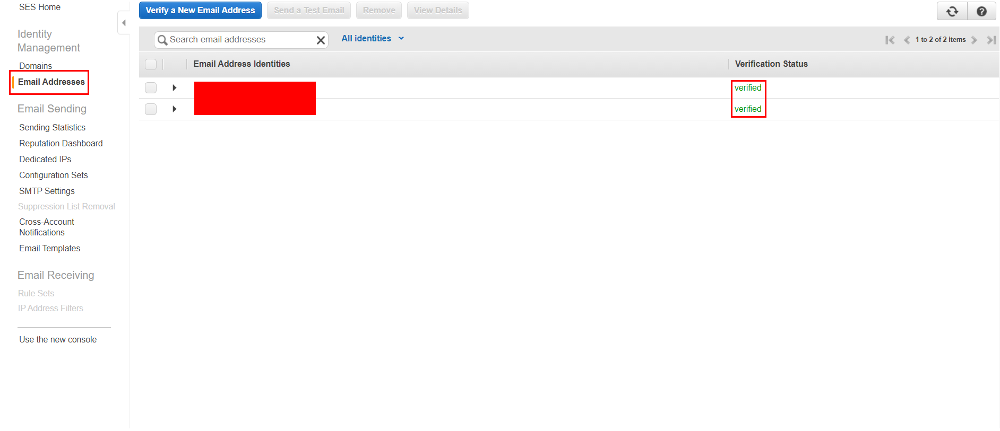
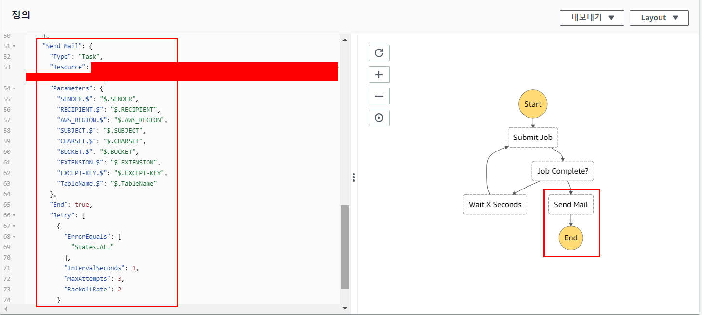
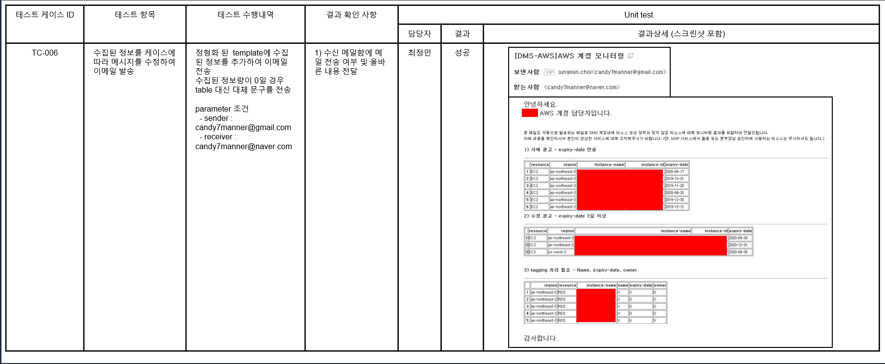

# Send E-mail Code & Unit test

1. [개발 언어 및 활용 라이브러리 선정](#1-개발-언어-및-활용-라이브러리-선정)
2. [Resource 생성](#2-resource-생성)
   - [IAM role 설정](#iam-role-설정)
   - [SES Email address verification](#ses-email-address-verification)
   - [Lambda function 생성](#lambda-function-생성)
   - [Step Function 수정](#step-function-수정)
3. [Monitoring Unit Test](#3-monitoring-unit-test)

   - [Send Email](#send-email)

     

## 1. 개발 언어 및 활용 라이브러리 선정

모니터링 및 삭제를 위한 개발 언어 및 활용 라이브러리 선정

개발 언어 : Python

|      | **Library** | **Description**                                              |
| ---- | ----------- | ------------------------------------------------------------ |
| 내부 | Boto3       | aws  resource에 대한 정보 획득                               |
|      | Datetime    | 현재 시간 및 expiry-date와  비교                             |
| 외부 | Pandas      | aws EC2 및 RDS Tag 정보를 저장 및 filtering하여 table 형태의 email로 전송 |

## 2. Resource 생성

### IAM role 설정

> 실제 운영에 사용될 Role이나 Policy를 생성할 때에는 필요 권한 만큼 제어해서 생성을 해야합니다.
> 하지만 편의상 필요한 Resource에 대해 **FullAccess**를 제공
> 실제 생성 시에는 `목록, 읽기, 태그 지정, 쓰기` 등의 권한 중 필요한 권한을 선택한 Policy를 생성하고 그 정책을 Role에 attach 해야합니다.

[Lambda function용 Role](../../Monitoring_delete/개발/README.md)을 변경해서 사용

추가 사항

- 권한 정책 연결

  - AmazonSESFullAccess
  

### SES Email address verification

SES API 활용 E-mail 발신자와 수신장 정보 등록

- 발신자 : {계정 관리자 Email address}

- 수신자 : {부서 Group Email address}

  

### Lambda function 생성

[Deletion Lambda function 생성 예시](../../Monitoring_delete/개발/README.md)를 참고하여 동일한 형태의 Lambda 생성

변경 사항

- 실행 역할 : 앞성 생성한 Role

- code : 

  - [lambda_function.py](#code/lambda_function.py)
  - [tagging.py](#code/tagging.py)
  

### Step Function 수정

- 코드로 워크르로 작성

- 유형 : `표준`

- 정의 : [step function code](#code/stepfunction.json)

  

## 3. Monitoring Unit Test

### Send Email

