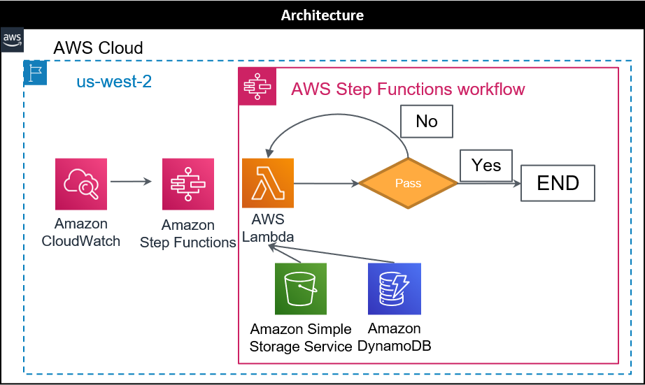
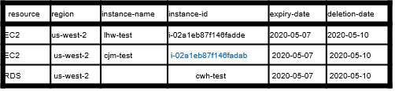
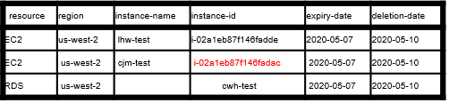
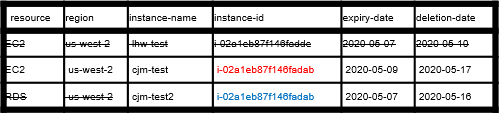
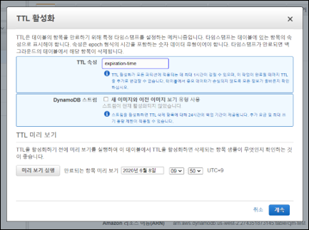
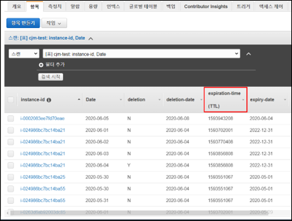

# Monitoring Deletion Architecture

1. [aws service 선정](#1-aws-service-선정)
2. [Architecture](#2-Architecture)
3. [Sequence Diagram](#3-Sequence-Diagram)
4. [세부 사항](#4-세부-사항)

## 1. aws service 선정

-  Amazon CloudWatch
  - Rule event trigger
  - Scheduling
  - Monitoring
-  AWS Lambda
  - EC2, RDS tag 수집
  - 삭제 대상 획득
  - 삭제 여부 확인 
  - 삭제 수행
  - 삭제 대상 목록 업데이트
-  Amazon Simple Storage Service
  - 예외 대상 목록 저장
-  Amazon DynamoDB
  - 삭제 및 수정 대상 목록 저장
  - TTL 설정
  - Key : 
    - Primary key : "instance-id"
    - Sort key : "Date"
-  Amazon Step Functions
  - Workflow Orchestration
  - Pending Logic For Instance/Cluster Starting

## 2. Architecture

대상 목록에서 삭제일 기준을 지난 Instance를 삭제 및 대상 목록 update

1. Service 수행 과정
   1. CloudWatch가 Step Functions에 trigger
   2. Step Functions에서 Deletion Lambda 실행
   3. Lambda가 S3에서 예외 대상 목록과 DynamoDB에서 작일 삭제 대상 목록 획득
   4. 삭제 수행
   5. 삭제 실패 시 15분 대기 후 다시 삭제
   6. 성공 시 종료
2. 고려사항
   1. 예외 대상 목록에 포함된 Instance는 삭제 대상에서 제외 됩니다.
   2. DynamoDB TTL로 삭제 대상 목록 저장 기간을 제한 합니다.
   3. 예외 대상 목록은 별도로 조사하여 csv 파일로 s3에 저장
   4. DB cluster가 중지 상태이면 실행시키고 다시 삭제 수행

## 3. Sequence Diagram

1. CloudWatch 규칙에서 Step functions로 trigger
2. Step Functions에서 Deletion Lambda 실행
3. Lambda에서 EC2와 RDS의 전체 Instance에서 tag 정보를 받아와 삭제 대상 목록 수정 대상 목록 획득
4. S3에서 예외 대상 목록 획득
5. DynamoDB에서 작일 삭제 대상 목록 획득
6. 삭제 여부 확인 및 삭제
7. 작일 삭제 대상 목록 update, 금일 삭제 대상 목록 및 수정 대상 목록 업로드

## 4. 세부 사항

1.  규칙

   1. 삭제 대상 목록 저장

      - **DynamoDB table 생성**
        - Columns : [instance-id, Date, deletion, deletion-date, expiration-time, expiry-date, instance-name, region, resource]
        - Key : 
          - 기본 파티션 키: instance-id (문자열)
          - 기본 정렬 키 : Date (문자열)
      - **예외 대상 목록 : Except-list.csv 형태로 저장**

   2. 고려 사항

      - 삭제 예상 일자는 모니터링 일자로부터 3일 뒤
      - 삭제 예상 일자가 존재하지 않는 경우  : 삭제 예상 일자를 등록
      - *삭제 예상 일자가 이미 존재하는 경우
        - 7일 동안 연속해서 삭제 대상 목록에 등록되어 있었던 경우 삭제
        - 7일이 안된 경우 삭제 예정일이 되지 않았으므로 금일 삭제 예정일 그대로 유지
      - 삭제 된 경우: 작일 삭제 대상 목록에서 expiration-time, deletion 항목 update
      - 월요일의 경우 작일 데이터가 없으므로 금요일 데이터를 기준으로 모니터링

      

   3. 예시(일자별 순서)

      1. 기존 resource 2020-05-08
         

      2. 최초 모니터링 2020-05-08
         

         > 모든 resource 연속되어 등록 되었으므로 예정일 유지

      3. 2020-05-09
         

         > "i-02a1eb87f146fadde", "cwh-test" : 연속되어 등록 되었으므로 예정일 유지
         >
         > " i-02a1eb87f146fadab" : 연속 되지 않았으므로 예정일 **:** 현재 일자 + 7

      4. 2020-05-10
         

         > " i-02a1eb87f146fadac" : 등록 이력이 있던 resource 이지만 update 되었으므로 예정일도 변경

      5. 2020-05-11
         

         > "i-02a1eb87f146fadde" : 예정일이 지났으므로 삭제

   

2. DynamoDB 규칙

   1. TTL

      만료일 : 객체 생성 후 30일 뒤

      

   2. 고려사항

      1. 삭제 시에 작일 삭제 대상 목록의 deletion에 “Y” 추가 default 값은 “N”

   

3. Lambda workflow

   1. 예외 대상 목록 수집 : S3에서 획득
   2. tag 목록 수집 : EC2와 RDS의 tag 수집
   3. DynamoDB로부터 작일 삭제 대상 목록 획득
   4. 금일 삭제 대상 목록에서 예외 대상 목록에 있는 Instance들 제거
   5. 작일 및 금일 삭제 대상 목록에 
      - 모두 등록되어 있는 Instance 중에서 
        - deletion-date가 지났으면 Instance 삭제
        - deletion-date가 안 지났으면 금일 삭제 대상 목록에 deletion-date 유지
      - 금일 삭제 대상 목록에만 등록되어 있으면 : 금일 삭제 대상 목록에 금일 일자 +7으로 deletion-date 추가
   6. 수집한 tag정보들 DynamoDB에 upload