# Local Spark 환경 구축 (+PySpark)

1. [Java 설치 (확인)](#1-java-설치-확인)
2. [Spark 설치](#2-spark-설치)
3. [winutils.exe 다운로드](#3-winutilsexe-다운로드)
4. [Jupyter Notebook(lab)설치](#4-jupyter-notebooklab설치)
5. [Spark 확인](#5-spark-확인)
6. [PySpark Kernel 생성](#6-pyspark-kernel-생성)

<div style="page-break-after: always; break-after: page;"></div>

## 1. Java 설치 (확인)

Spark는 scala로 구현되어 jvm 기반으로 동작하기 때문에 java가 설치되어 있어야 합니다.
[Spark Docs](https://spark.apache.org/docs/latest/#downloading) 를 확인해보면 Spark 3.2.1 version 기준으로 지원하는 JDK는 8 / 11 입니다.
따라서 **JDK는 8 / 11이 설치되어야하며** 17 / 18은 지원하지 않습니다.

1. ### Java 확인

   하단 명령어를 통해 Java가 설치와 환경변수 설정 여부를 확인할 수 있습니다.

   ```powershell
   java –version
   ```

   환경변수 적용된 이후의 새로운 PowerShell 창부터 환경변수는 적용됩니다.

   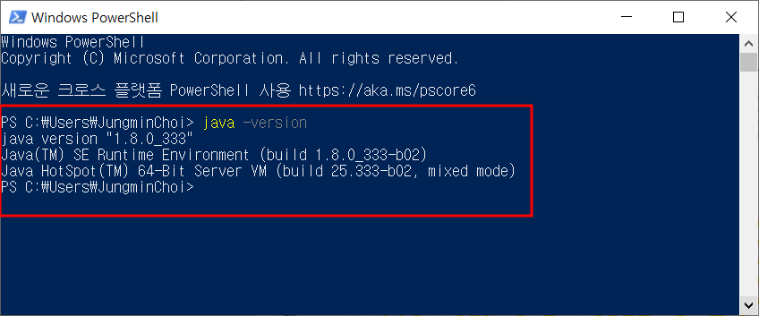

   상단과 같은 결과가 나온다면 [Spark 설치](#2-spark-설치)로 이동하시면 됩니다.

2. ### Java 설치

   Java가 설치되어 있지 않다면 [JDK 8 설치 링크](https://www.oracle.com/java/technologies/downloads/#java8-windows)로 이동하여 설치 합니다.
   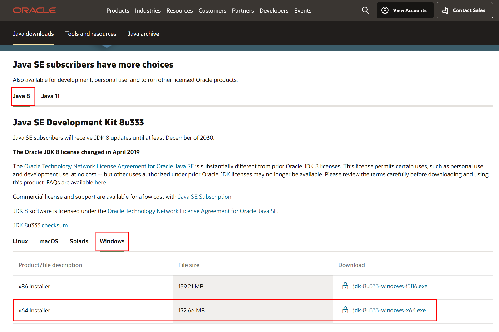

   원하는 Java Version이 맞는지 본인 OS가 맞는지 확인 후 Download 진행하면 됩니다.
   Download 과정에서 **Oracle 통합 계정이** 없다면 회원가입도 진행해주셔야 합니다.

   

   상단과 같이 Download가 완료되면 설치 진행하시면 됩니다.
   설치는 권장 사항(Recommend)로 진행하시면 됩니다.
   설치가 완료되었다면 대부분 이 경로에 (C:\Program Files\Java\) 설치가 됩니다.
   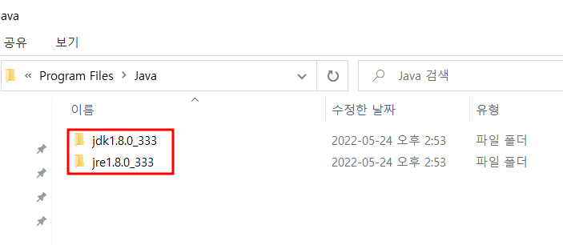

   설치가 완료되었다면 해당 경로에 대해 환경변수 설정을 진행합니다.

3. ### 환경변수 설정

   환경변수 설정 : 제어판 > 시스템 및 보안 > 시스템 > 고급 시스템 설정

   위의 방법이 복잡하시면 `Windows 키 + r`를 눌러 실행창을 여시고 `sysdm.cpl ,3`을 입력하시면 됩니다.

   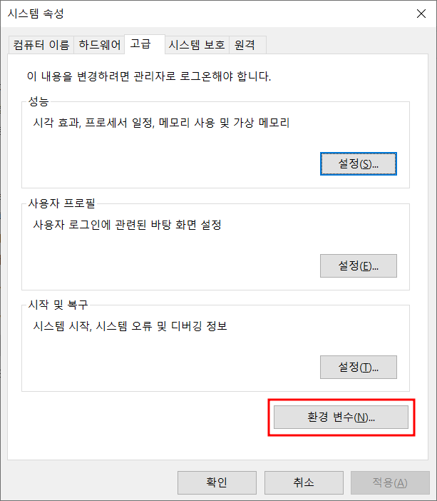

   실제로 변수를 지정할 항목은 `시스템 변수` 입니다.

   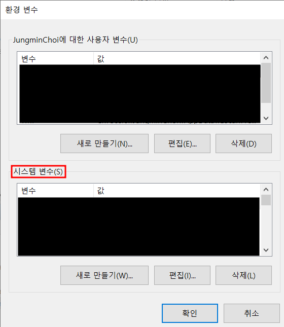

   `시스템 변수`에서 `새로 만들기`를 선택해서 Java에 대한 변수 설정을 합니다.

   - 변수 이름 : `JAVA_HOME`
   - 변수 값 : `C:\Program Files\Java\jdk1.8.0_333`

   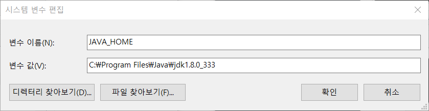

   추가로 `Path`도 설정합니다. `Path` 변수를 찾아 `편집` 을 선택합니다.
   환경 변수 편집 창이 뜨면 `새로 만들기`를 선택하여 경로를 추가합니다.

   - 변수 값 : `%JAVA_HOME%\bin`

   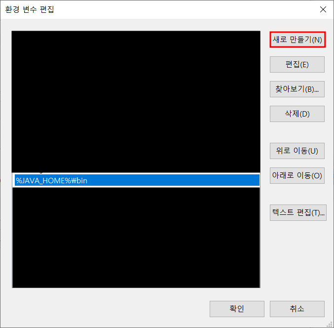

   해당 내용까지 완료가 되었다면 [1. Java 확인](#java-확인)으로 돌아가서 확인을 해봅니다.

<div style="page-break-after: always; break-after: page;"></div>

## 2. Spark 설치

Spark Version에 따라 호환되는 프로그래밍 언어의 Version이 있습니다.
Spark 3.2.1 version 기준으로 python 3.6+이어야 합니다. (단, [Spark Docs](https://spark.apache.org/docs/latest/#downloading) 를 확인해보면 3.9는 UDF에 대한 제약이 있다고 하니 제외하시는 편이 좋습니다.)

1. ### Spark 다운로드

   [Spark 설치 링크](http://spark.apache.org/downloads.html) 에서 Spark 3.2.1 Version 다운로드

   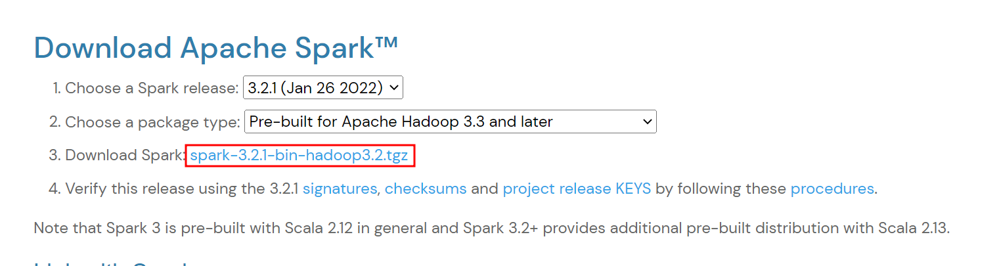

   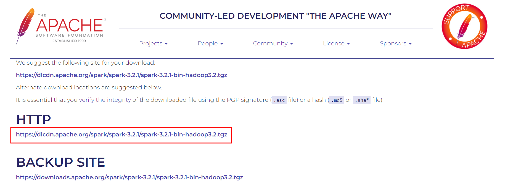

   하단과 같이 다운로드가 완료되면 해당 파일을 특정 디렉토리로 이동 후 압축해제를 진행합니다.

   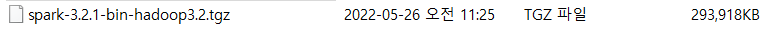

2. ### Spark 파일 압축해제

   다운로드 된 파일을 특정 경로(C:\) 이동 시킵니다.

   이동 후 PowerShell을 통해 압축해제를 진행합니다.

   ```powershell
   PS ~ > cd C:\
   PS C:\> tar xzf spark-3.2.1-bin-hadoop3.2.tgz
   ```

   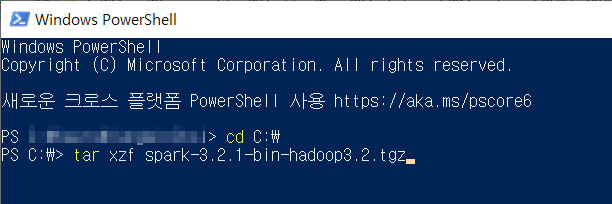

   Command가 아닌 `압축해제` 기능으로 수행하셔도 됩니다.

   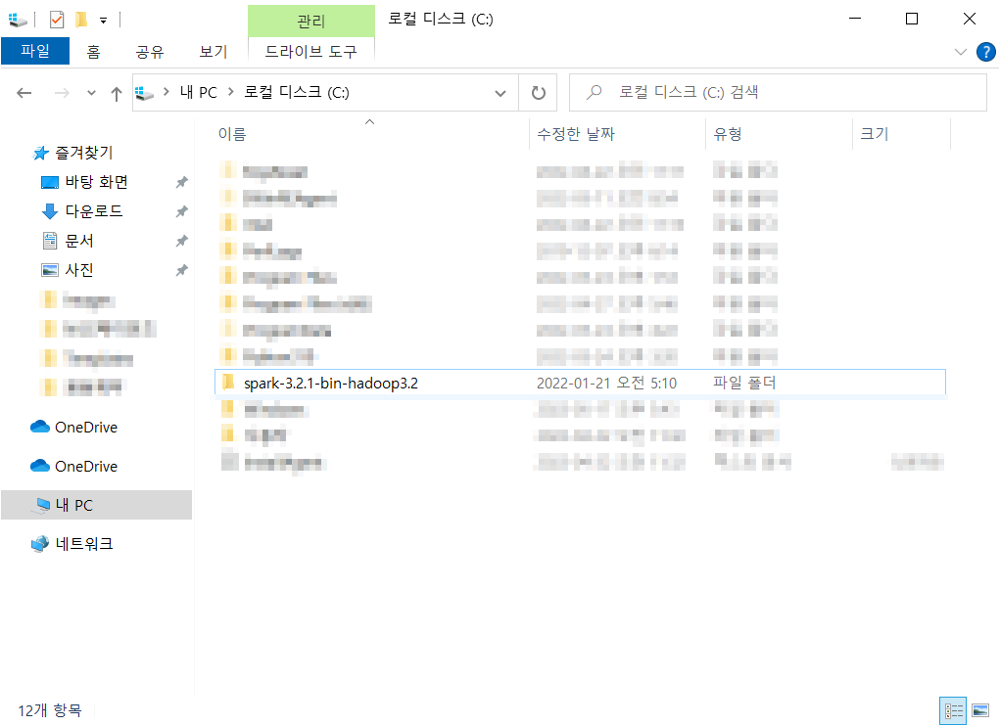

3. ### Spark 환경변수 설정

   환경변수 설정 창 이동 내용과 동일하게 `시스템 변수`에서 변수를 추가합니다.
   해당 내용이 기억이 안난다면 [환경변수 설정](#환경변수-설정)으로 이동하여 확인하고 돌아옵니다.
   2개의 환경 변수를 추가합니다. **SPARK_HOME** , **HADOOP_HOME** 

   1. SPARK_HOME

      - 변수 이름 : `SPARK_HOME`
      - 변수 값 : `C:\spark-3.2.1-bin-hadoop3.2`

      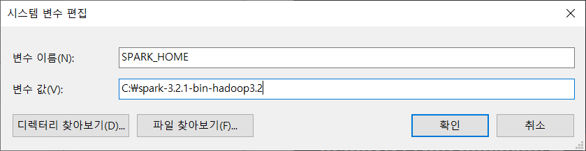

   2. HADOOP_HOME

      - 변수 이름 : `HADOOP_HOME`
      - 변수 값 : `C:\spark-3.2.1-bin-hadoop3.2`

      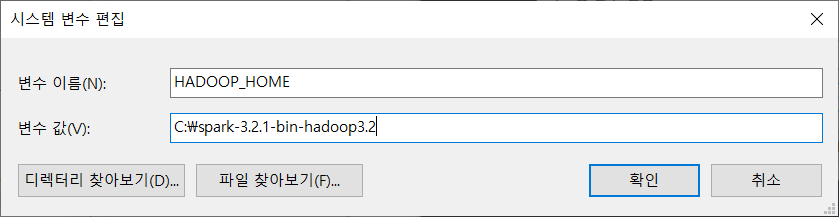

   3. Path

      추가로 `Path`도 설정합니다. `Path` 변수를 찾아 `편집` 을 선택합니다.
      환경 변수 편집 창이 뜨면 `새로 만들기`를 선택하여 경로를 추가합니다.

      - 변수 값 : `%SPARK_HOME%\bin`

      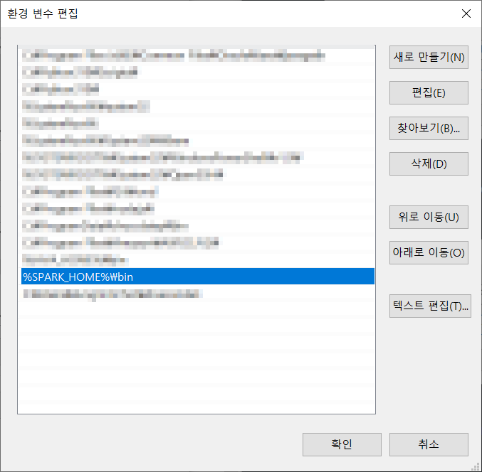

   

<div style="page-break-after: always; break-after: page;"></div>

## 3. winutils.exe 다운로드

[Spark에 WinUtils가 필요한 이유](https://pivotalbi.com/build-your-own-winutils-for-spark/)를 인용하면 

> Apache Spark를 로컬에서 실행하기 위해서는 'WinUtils'로 알려진 Hadoop 코드 베이스의 요소를 사용해야 합니다. 이를 통해 HDFS 파일 시스템이 로컬 파일 시스템에 대해 요구하는 POSIX 파일 시스템 권한을 관리할 수 있습니다. Spark가 필요한 서비스 실행 파일인 WinUtils.exe를 찾을 수 없으면 아래와 같은 경고가 발생하지만 Spark 셸을 계속 시도하고 실행합니다.

이에 대한 해결 방안으로 [winutils.exe를 설치해야 하는 것](https://cwiki.apache.org/confluence/display/HADOOP2/WindowsProblems)을 확인할 수 있습니다.

[winutils Git](https://github.com/steveloughran/winutils) 에서 zip 형태로 다운받습니다.

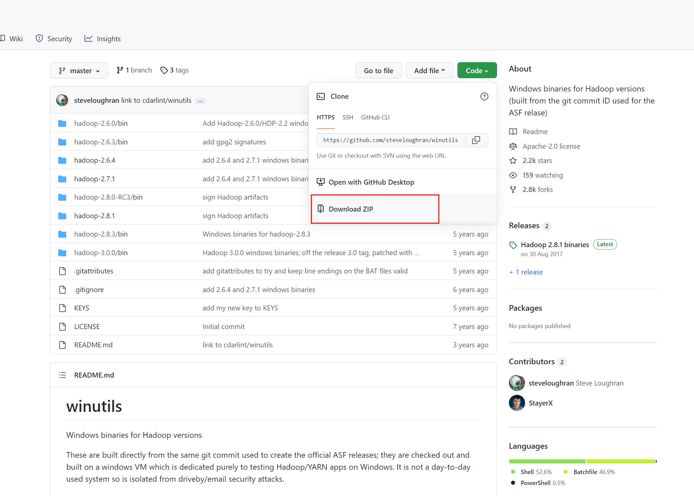

하단과 같이 다운로드가 완료되면 해당 파일의 압축해제를 진행합니다.


압축해제 후 폴더 내부를 확인해보시면 hadoop-3.0.0이 가장 최신 버전임을 확인할 수 있습니다.

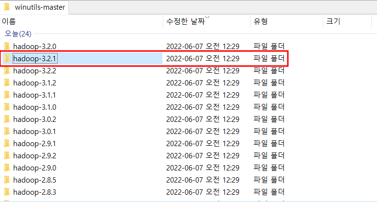

현재 설치된 Spark의 Hadoop 버전이 3.2 이므로 가장 최신 버전인 Hadoop-3.0.0을 사용합니다.
hadoop-3.0.0 > bin > winutils.exe 파일을 `C:\spark-3.2.1-bin-hadoop3.2\bin\` 로 복사합니다.

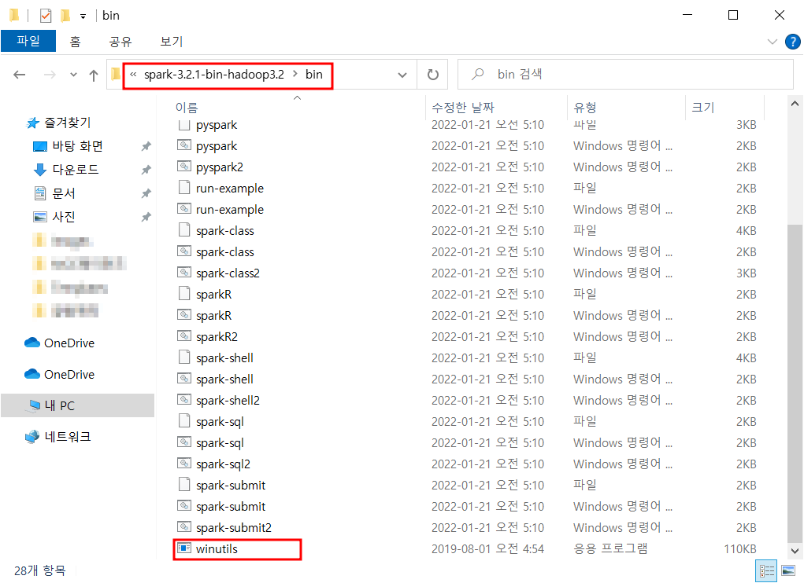

복사가 완료되면 winutils.exe 관련 foler 및 file은 삭제해도 됩니다.

<div style="page-break-after: always; break-after: page;"></div>

## 4. Jupyter Notebook(lab)설치

혹시 Jupyter Notebook 및 Lab 설정을 이미 했다면 [Spark 확인](#5-spark-확인)로 넘어가시면 됩니다.

1. ### anaconda 다운로드

   https://repo.anaconda.com/archive/ 해당 URL에서 [Anaconda3-5.2.0-Windows-x86_64.exe](https://repo.anaconda.com/archive/Anaconda3-5.2.0-Windows-x86_64.exe) 다운로드

   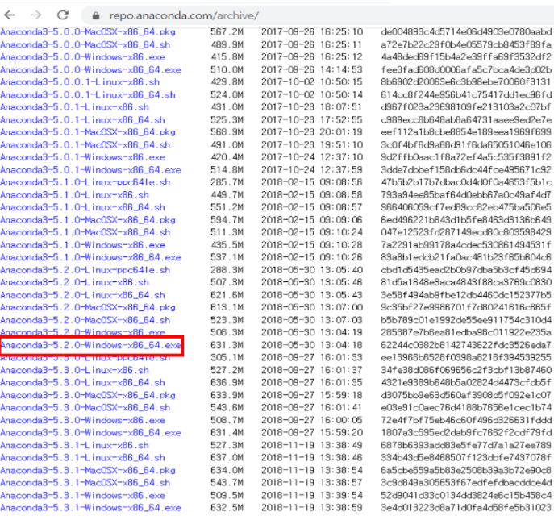

   하단과 같이 다운로드가 완료되면 설치를 진행합니다.

   

2. Jupyter Notebook Config 설정

   설치가 올바르게 됐다면 하단과 같이 탐색창에서 확인 가능합니다.

   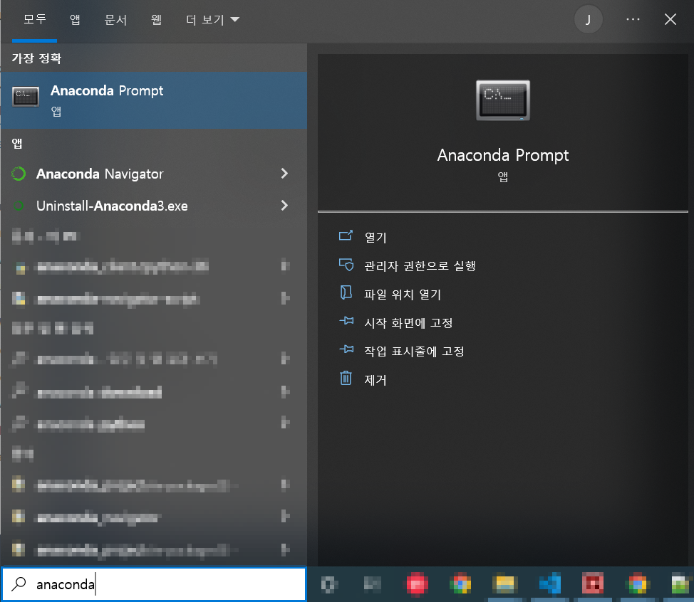

   1. ### Config 설정

      상단의 `Anaconda Prompt`를 실행하여 하단 명령을 수행합니다.

      ```
      jupyter notebook --generate-config
      ```

      위 명령이 정상적으로 실행되면 경로(C:\Users\{USER}\.jupyter)에 해당 설정 파일( **jupyter_notebook_config.py** ) 이 생성됩니다.

      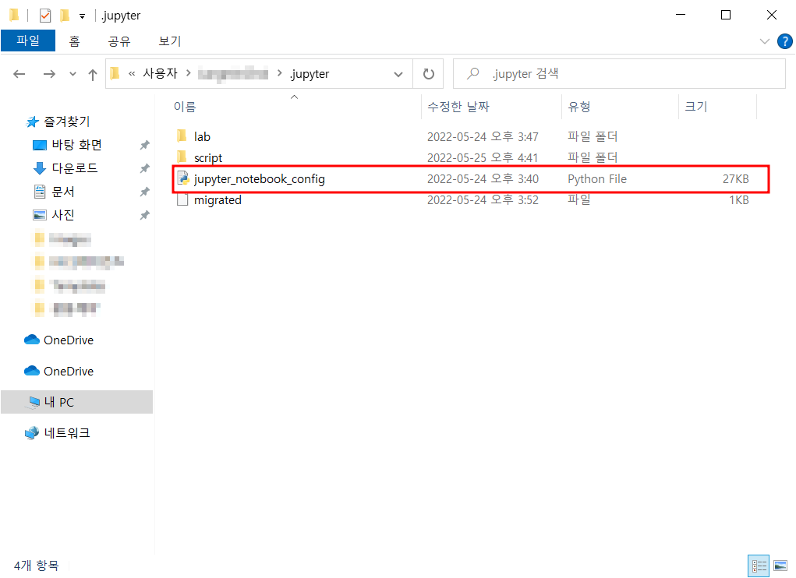

      저는 Jupyter 파일 저장소 용도로 `script` 라는 폴더를 생성했고 해당 폴더를 노트북 파일들이 저장되는 기본 Diretory로 변경할 겁니다.

      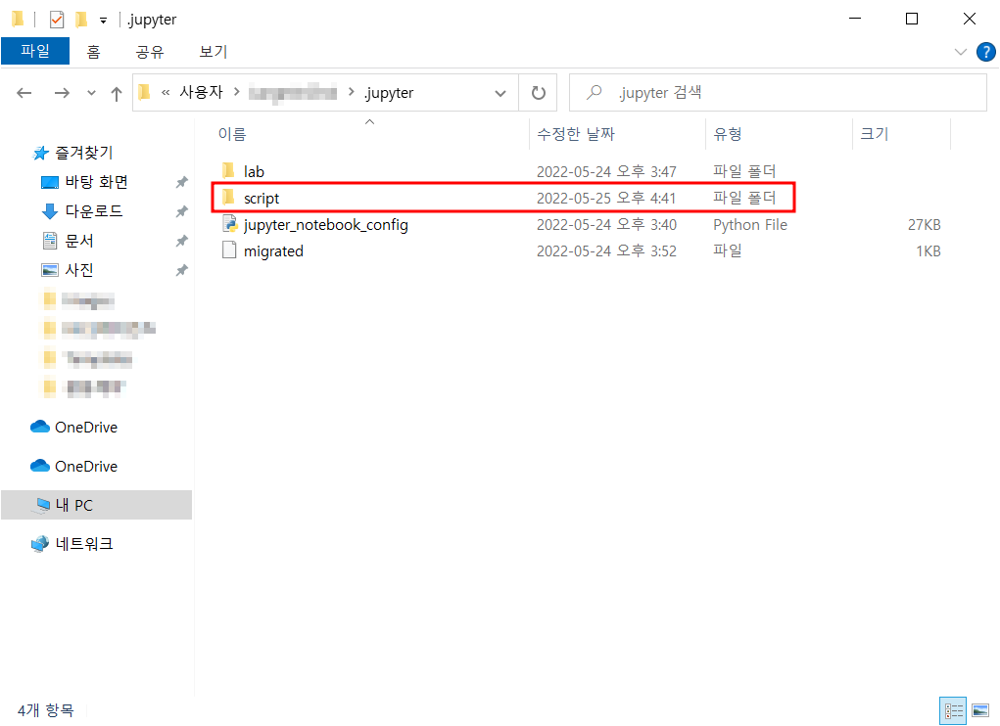

      해당 파일을 편집기에서 엽니다. (Notepad++, VS Code ... ETC)

      **line 214**를 주석해제 후 원하는 경로로 변경합니다.

      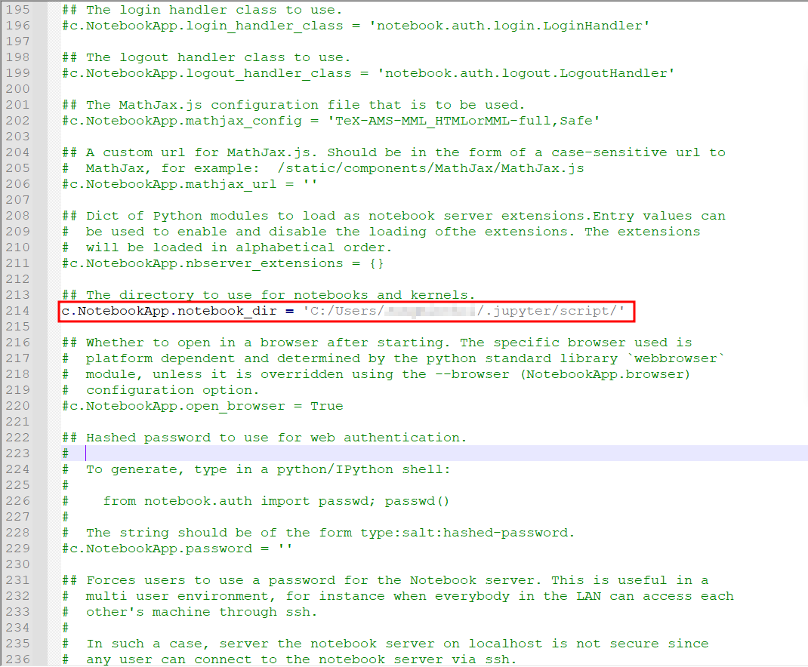

      그리고 기본 시작으로 Jupter Notebook이 아닌 JupyterLab으로 변경하겠습니다.

      **line 116**을 주석해제 후 `'/lab'`으로 변경합니다.

      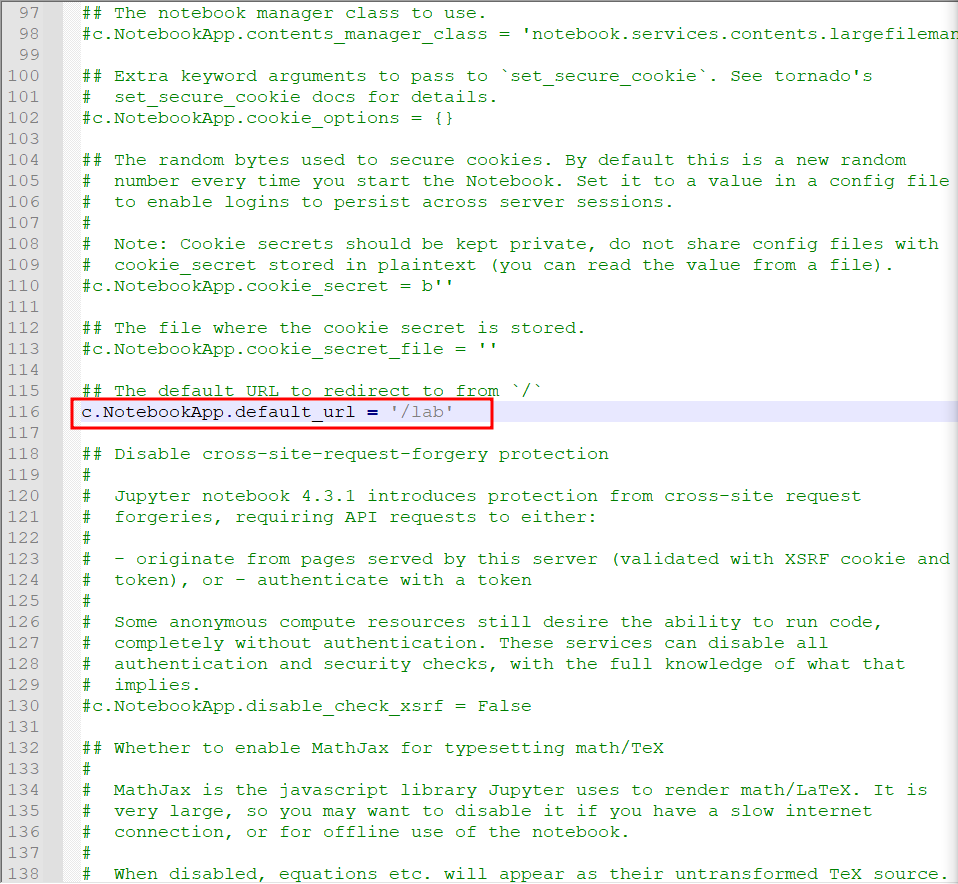

      여기까지 진행 후 Jupyter Notebook을 실행하면 JupyterLab으로 실행되지만 **Home Directory가 원하는 위치가 아닙니다!!!!**

      따라서 추가 작업이 필요합니다.

   2. Lab 설정

      Jupyter Notebook을 탐색 후 해당 파일이 위치한 폴더를 엽니다.

      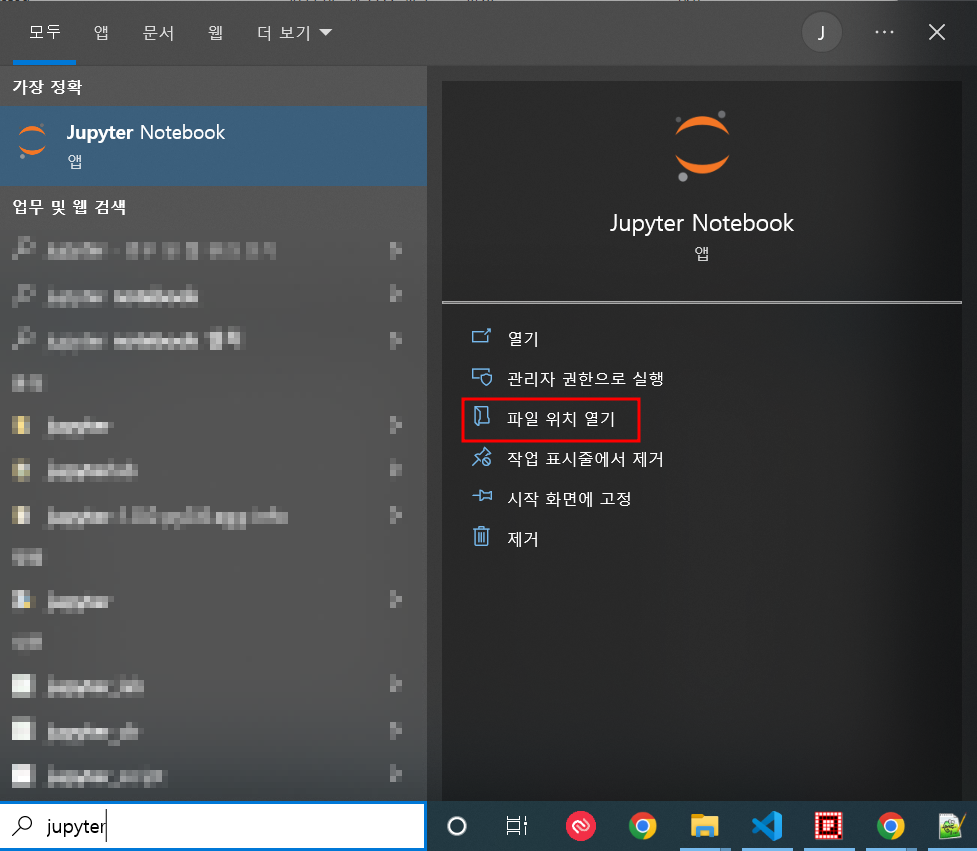

      해당 폴더의 Jupyter Notebook 파일의 `속성`을 선택합니다.

      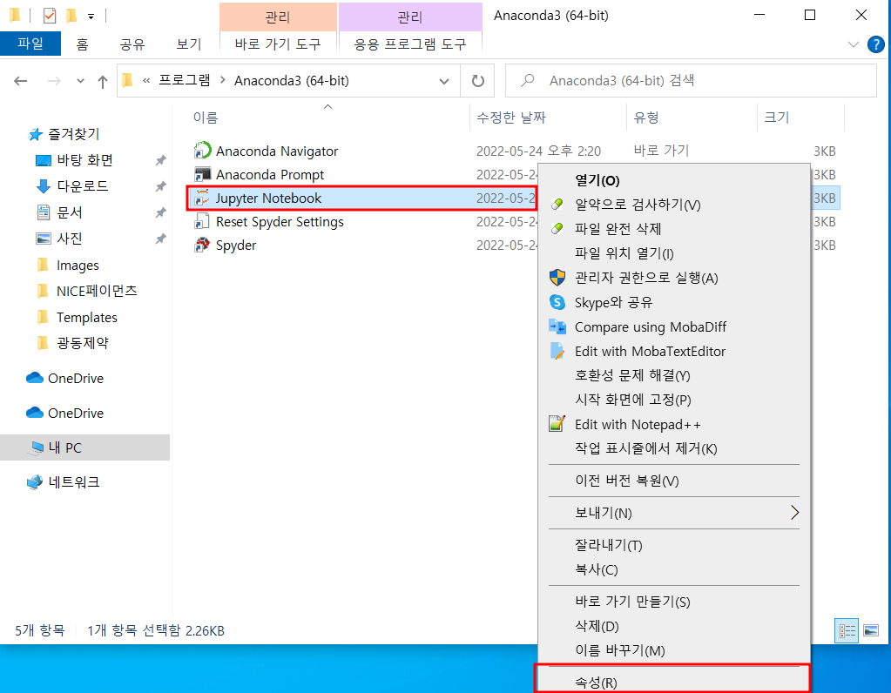

      속성의 `바로 가기` 탭을 선택 후 2가지를 변경합니다.

      1. 대상 : `%USERPROFILE%`을 본인 Directory 경로로 변경 `C:/Users/{USER}/.jupyter/script`
      2. 시작 위치 : `%USERPROFILE%`을 본인 Directory 경로로 변경 `C:/Users/{USER}/.jupyter/script`

      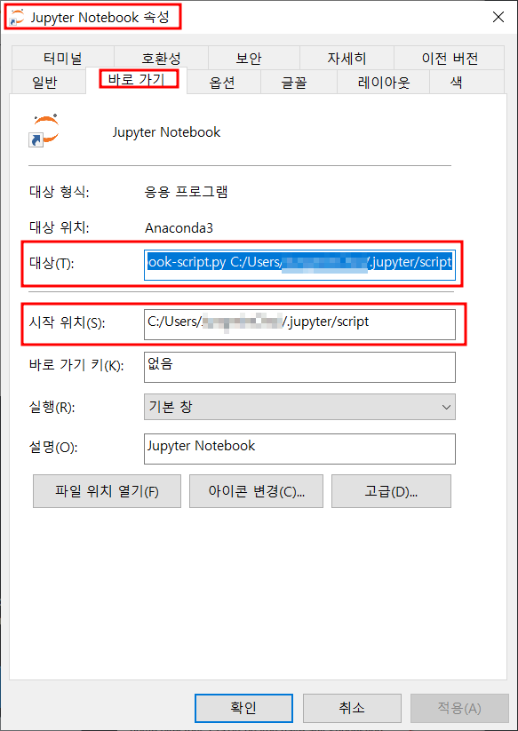

      변경 후 확인해보면 시작 위치도 변경되었음을 확인할 수 있습니다.
      해당 파일을 작업 표시줄에 고정시키면 보다 편리하게 사용할 수 있습니다.

<div style="page-break-after: always; break-after: page;"></div>

## 5. Spark 확인

이제 PC를 재부팅하여 환경 변수 적용시킵니다.
적용 후 PowerShell을 통해 확인합니다.

PySpark 확인 : 

```powershell
pyspark
```

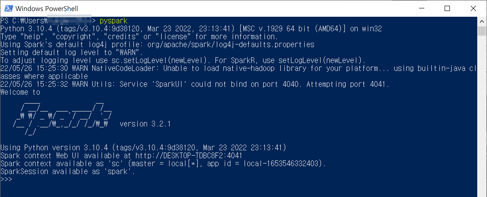

<div style="page-break-after: always; break-after: page;"></div>

## 6. PySpark Kernel 생성

JupyterLab 실행 후 `New Launcher`를 통해 Notebook을 보시면 `Pthon3`만 있는 것을 확인할 수 있습니다.

`Other`에서 `Terminal`을 선택해서 현재 보유하고 있는 Kernel list를 확인합니다.

```powershell
Jupyter kernelspec list
```

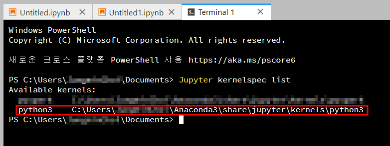

화면에 나온 Directory로 이동해봅니다. `C:\Users\{USER}\Anaconda3\share\jupyter\kernels\`

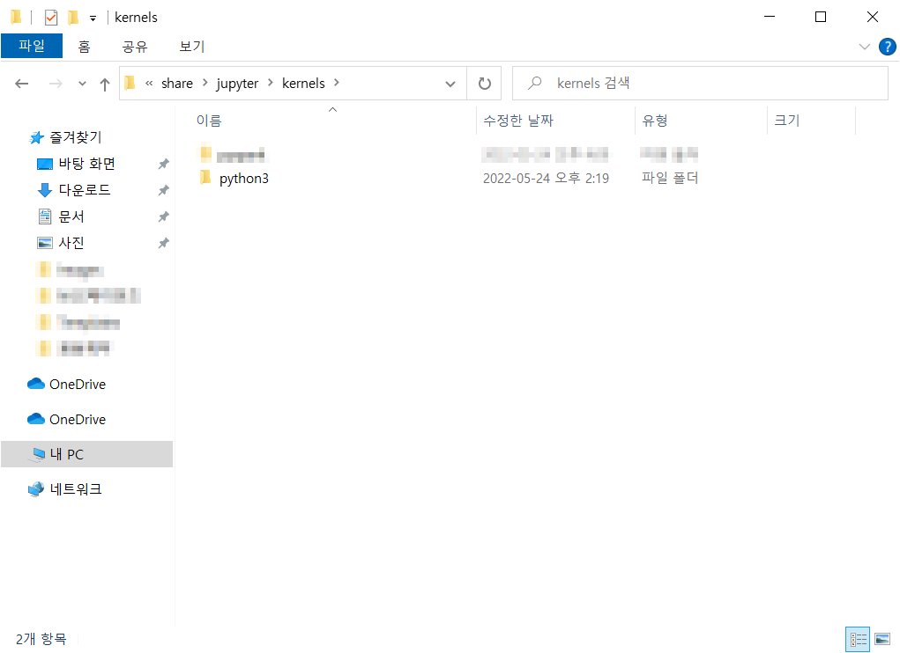

현재는 `pthon3` 단일 폴더 입니다. 해당 폴더를 복사한 뒤 `pyspark`으로 이름을 변경합니다.

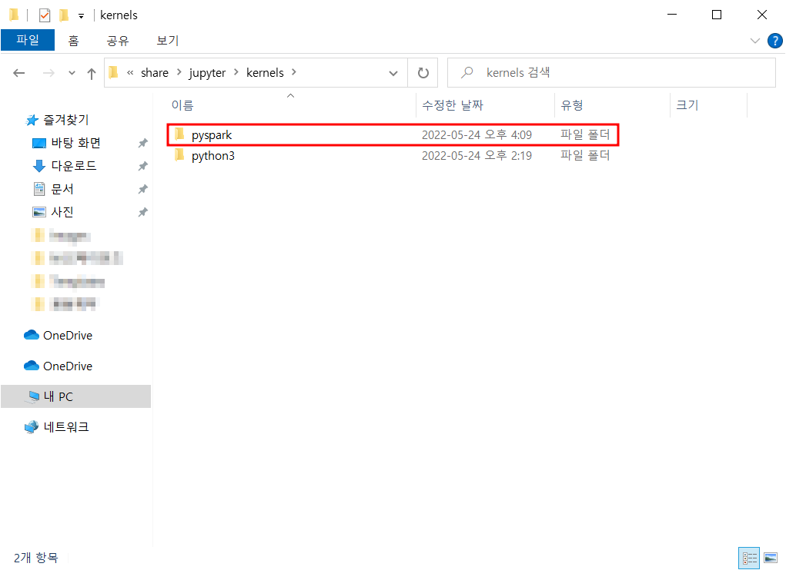

다시 Jupyter Notebook의 Terminal로 가보면 Kernel이 늘어난 것을 확인할 수 있습니다.

```powershell
Jupyter kernelspec list
```


이제 Kernel 선택 시 PySpark이 작동하도록 `kernel.json`을 변경합니다.
`kernel.json`은 해당 폴더 내에 존재합니다.

```json
{
    "argv": [
        "C:\\Users\\JungminChoi\\Anaconda3\\python.exe",
        "-m",
        "ipykernel_launcher",
        "-f",
        "{connection_file}"
    ],
    "env": {
        "SPARK_HOME": "C:\\spark-3.2.1-bin-hadoop3.2",
        "PYTHONPATH": "C:\\spark-3.2.1-bin-hadoop3.2\\python\\;C:\\spark-3.2.1-bin-hadoop3.2\\python\\pyspark\\;C:\\spark-3.2.1-bin-hadoop3.2\\python\\lib\\py4j-0.10.9.3-src.zip;C:\\spark-3.2.1-bin-hadoop3.2\\python\\lib\\pyspark.zip",
        "PYTHONSTARTUP": "C:\\spark-3.2.1-bin-hadoop3.2\\python\\pyspark\\shell.py",
        "PYSPARK_SUBMIT_ARGS": "--master local[*] pyspark-shell",
        "PYSPARK_DRIVER_PYTHON": "ipython"
    },
    "display_name": "PySpark",
    "language": "python"
}
```

상단 Json에서 실제 파일들이 다 존재하는 지 확인하시고 없다면 해당 경로 혹은 version에 맞게 수정하시면 됩니다.

> 주의 : PYTHONPATH 값에 띄어쓰기가 있으면 안됩니다.

수정 후 저장을 하고 Jupyter Notebook에서 `New Launcher`를 실행해보시면 PySpark Notebook이 생겼음을 확인할 수 있습니다.

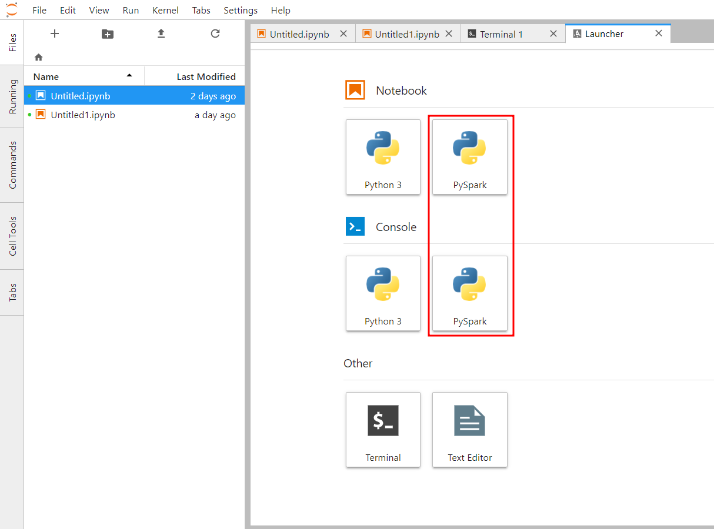

이제 실제로 잘 작동하는지 확인합니다.
Sample Code를 수행해봅니다.

```python
# Sample Code 1
from pyspark.sql import SparkSession
spark.conf.set("spark.sql.repl.eagerEval.enabled",True)
df= spark.range(500).toDF("number")
df.select(df["number"]+10).show()
```

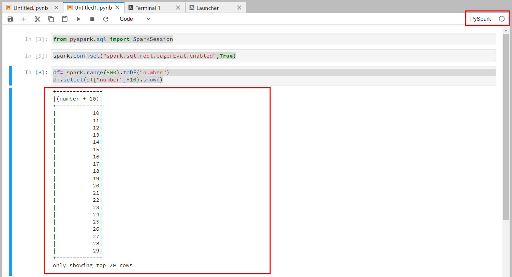

```python
# Sample Code 2
from pyspark.sql.functions import expr
expr("(((someCol + 5) * 200) - 6) < otherCol")
```

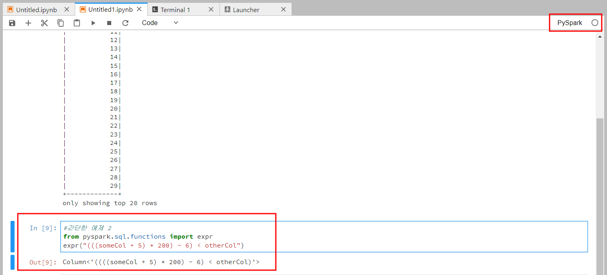

---

참조 링크

- [Spark 환경 설정 with Anaconda(Jupyter Notebook)](https://spidyweb.tistory.com/199)
- [Spark에 WinUtils가 필요한 이유는 무엇입니까?](https://pivotalbi.com/build-your-own-winutils-for-spark/)
- [Spark 소개 3부: Jupyter 노트북 커널 설치](https://adatis.co.uk/introduction-to-spark-part-3installing-jupyter-notebook-kernels/)

