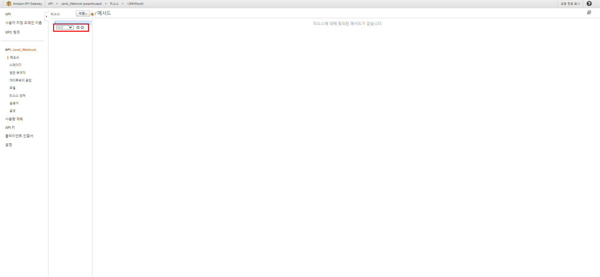

# 주간 보고 Bot

AWS, G-Suite, Jandi, Open Weather 활용 주간 보고 Bot 만들기

1. G-Suite Service 생성
2. AWS Service 생성
3. Open Weather 정보 활용
4. Jandi Connection

## 1. G-Suite Service 생성

1. Spread Sheet 생성

   팀 공유 Drive의 주간 보고를 등록할 Directory에 주간 보고 용 Spread Sheet를 생성합니다.

   
   

2. Form 생성

   실제 주간 보고 양식으로 사용할 Form을 생성합니다.
   Spread Sheet 내에서 생성하면 Form을 통해 등록 되는 내용이 Spread Sheet의 해당 Sheet에 등록 됩니다.
   따라서 Sheet FIle 이름과 Sheet 이름을 변경 후
   `도구 > 설문지 만들기`로 Form을 생성합니다.

   


   Form 예시
   


   Form 전송
   받는 사람 : 팀 Group Mail 주소

   

   

3. App Script 생성

   실제 모든 Process를 작업하는 Service 입니다.
   Google 관련 모든 Service와 AWS Api GateWay와 통신합니다.
   Form을 만들고 나면 Form 내용이 저장될 Sheet가 생성됩니다. 해당 Sheet의 이름을 변경합니다. 그리고 기존 Sheet는 삭제 합니다.
   `도구 > 스크립트 편집기`로 App Script를 open합니다.

   


   App Script의 이름과 실제 Script의 이름을 변경 후 실제 수행 Script를 작성합니다.
   App Script는 Google Script라는 언어를 사용합니다.
   [Report_Check](codes/Report_Check.gs)

   

   서비스에서 `Drive Api`를 추가합니다.
   Drive 내의 Docs를 조회할 때 필요합니다.
   


   Trigger를 추가 합니다.
   어떤 Event에 어떤 Method를 수행할 것인지 결정해야 합니다.
   

   - 시간 기반 : 매주 주간 보고 등록 현황 및 신규 인력 확인 용
   - 스프레드시트에서 - 양식 제출 시 : 주간 보고 등록 시, 주간 보고 등록 현황 업데이트


   주간 보고 양식 전달 용 Form 확인
   신규 인력이 발생하면 주간 보고 양식을 전달하기 위해 주간 보고 양식에 대한 HTML을 만들고 해당 HTML로 전달해야 합니다.
   주간 보고 양식을 전달한 G Mail에서 `F12` 로 HTML을 복사해 참조 파일로 입력합니다.
   

   

   

4. 주간 보고 기록 docs 생성

   주간 보고 현황에 대한 기록을 위한 json 파일 등록
   현재 Groups에 있는 Member들을 입력한 json으로 생성 합니다.

   ```json
   {
       "jungmin.choi@bespinglobal.com":"O",
       "candy7manner@gmail.com":"X"
   }
   ```

   


## 2. AWS Service 생성

1. Lambda 생성

   [Lambda](../Monitoring_EC2_RDS/Monitoring_stop)를 참조합니다.

   [Lambda Code](codes/lambda_handler.py)

2. API GateWay

   API GateWay를 생성합니다.

   

   REST API로 생성합니다.

   

   API 이름을 설정합니다.

   

   상단에서 생성한 Lambda ARN을 입력합니다.

   

   작업할 메서드를 정의합니다.

   

   POST로 생성합니다.

   

   

   

   Lambda와 App Script에 해당 URL을 이용합니다.

   


## 3. Open Weather 정보 활용

https://openweathermap.org/ 로 이동합니다.

1. 계정 생성

2. API key 생성

   

   

   

3. Open Weather 정보

   [Open_Weather_Guide](https://openweathermap.org/current) 해당 링크에서 기본 사용법 확인
   

   [Weather_Condition](https://openweathermap.org/weather-conditions) 해당 링크에서 날씨 정보에 대한 상세 정보 획득


## 4. Jandi Connection

Jandi 왼쪽 Side Bar에서 `잔디 커넥트`를 선택합니다.


`Incoming Webhook` 을 생성합니다.


URL은 Lambda Code 상에서 사용합니다.
알림을 적용할 Topic과 Connect 이름 및 이미지를 설정합니다.


결과


