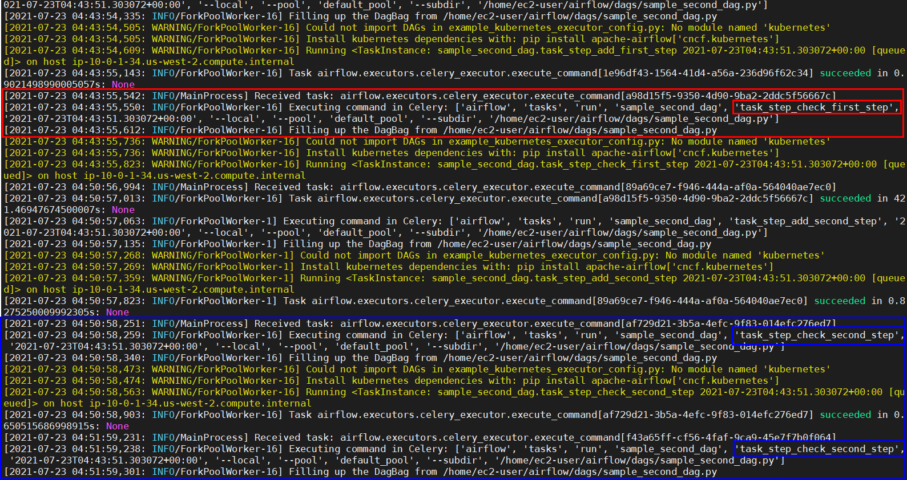
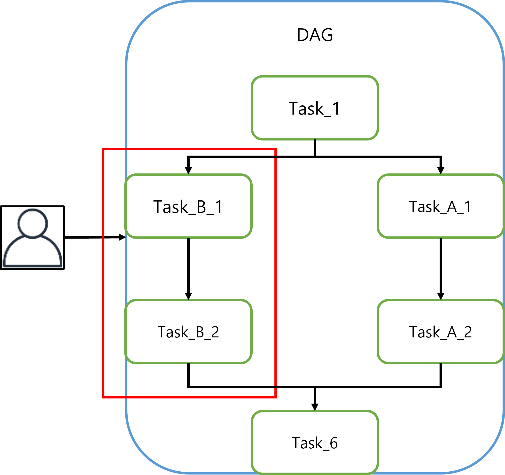
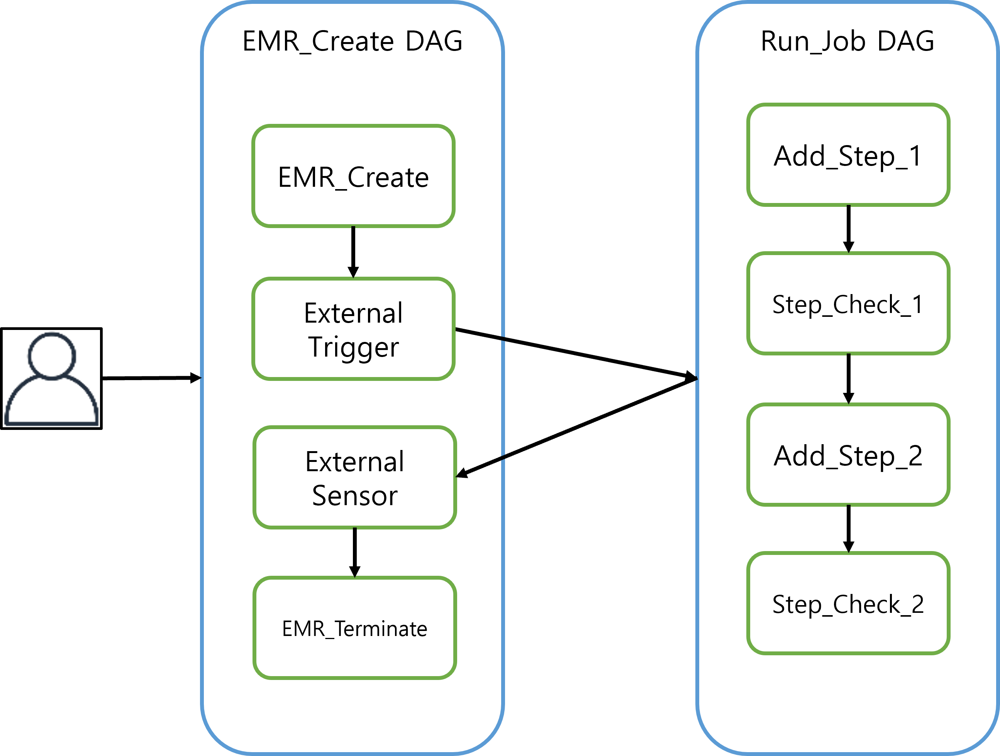

# Task, Operator, Sensor란?

## 1. Task

Task는 Airflow의 최소 실행 단위입니다. 
작업에는 세 가지 기본 종류가 있습니다.

- Operator : DAG의 대부분 task들을 구성하기 위해 빠르게 조합할 수 있는 사전 정의된 작업.
- Sensors : 외부 이벤트가 발생하기를 기다리고 감지하는 Operator의 특수 하위 클래스.
- TaskFlow : `@task`데코레이터를 사용하여 python 패키지화 된사용자 정의 operator 기능(Airflow 2.0.0 신규 기능).

<div style="page-break-after: always; break-after: page;"></div>

### 1. Task Instance

Airflow 내에서 Workflow는 DAG의 형태의 인스턴스가 되며, DAG 내에서 각각의 작업들도 Task로 정의 되며 각각이 인스턴스화 됩니다.
DAG는 내부적으로 각 Task Instance들의 상태를 분류 및 체크하여 Workflow를 진행합니다.

Task Instance Status

- `none`: Task에 아무 작업이 수행되지 않았습니다.
- `scheduled`: Scheduler에 의해 작업이 수행되는 것으로 결정
- `queued`: Scheduler에 의해 Executor에 할당되었고 Worker의 수행 대기
- `running`: Worker가 Task를 실행 중
- `success`: Task가 Issue 없이 정상적으로 완료됨
- `failed`: Task가 Issue가 발생하여 비정상적으로 완료됨
- `skipped`: Task가 어떠한 조건에 의해 skip 완료됨
- `upstream_failed`: Trigger Rule에 의해 상위 Task의 실패로 수행되지 않음
- `up_for_retry`: 작업이 실패했지만 재시도 횟수가 남아 재수행 예약
- `up_for_reschedule`: 작업이 실패했지만 재시도 횟수가 남아 재수행 예약 대기 (예약이 되지 않음)

(Image URL : https://airflow.apache.org/docs/apache-airflow/stable/_images/task_lifecycle_diagram.png)

<div style="page-break-after: always; break-after: page;"></div>

### 2. Relationship 

Task는 두 가지 유형의 Relationship이 있습니다.

1. 종속적인 관계

   ```python
   op1 >> op2 >> op3
   ```

   > 상단의 예시는 최상단 Task인 `op1`의 하위 Task로 `op2`
   > `op2`의 하위 Task로 `op3`을 design 한 것 입니다.

2. 병렬 관계

   ```python
   op1  
   op2 
   op3
   ```

   > 각 Task에 대한 Control Flow를 Design 없이 정의만 하게 되면 Task들은 Depth에 따라 병렬로 수행됩니다.
   > 상단의 예시는 모든 Task가 같은 Depth에 있으므로 동시 수행됩니다.

### 3. Timeout

각 Task는 `execution_timeout`속성을  최대 허용 런타임 값으로 설정할 수 있습니다. Task가 설정 값보다 오래 실행되면  시간 초과 예외와 함께 작업이 실패합니다.

```python
from airflow.sensors.external_task_sensor import ExternalTaskSensor
from datetime import datetime, timedelta

task_sensor = ExternalTaskSensor(
    task_id='task_sensor',
    external_dag_id='sample_dependency',
    external_task_id='wait_20_sec',
    start_date=datetime(2021,2,22),
    execution_timeout=timedelta(minutes=30)
)
```

<div style="page-break-after: always; break-after: page;"></div>

### 4. Exception

Airflow는 코드 내에서 Task 상태를 제어할 수 있는 Exception을 제공합니다.

- `AirflowSkipException` : 현재 작업의 상태를 Skipped로 변경합니다.

  ```python
  from airflow.operators.python_operator import PythonOperator
  from airflow.exceptions import AirflowSkipException
  
  def make_skip(**kwargs):
      raise AirflowSkipException("Skip this task and individual downstream tasks while respecting trigger rules.")
  
  task_skipped = PythonOperator(
      task_id='task_skipped',
      provide_context=True,
      python_callable=make_skip,
      dag=dag
  )
  ```

  

- `AirflowFailException` : 현재 작업의 상태를 Failed로 변경합니다. 남은 재시도는 무시합니다.

  ```python
  from airflow.operators.python_operator import PythonOperator
  from airflow.exceptions import AirflowFailException
  
  def make_fail(**kwargs):
      raise AirflowFailException('Make Error Force')
  
  task_failed = PythonOperator(
      task_id='task_failed',
      provide_context=True,
      python_callable=make_fail,
      dag=dag
  )
  ```

  예시 Code)

  [Exception](codes/sample_exception.py)

<div style="page-break-after: always; break-after: page;"></div>

## 2. Operator

Operator는Task를 정의하는 Airflow에서 제공하는 Template 입니다.
Operator로 정의된 Task는 실제 작업을 수행하는 Task라고 생각하시면 됩니다.

공식적으로 제공된 Operator의 종류는 하단과 같습니다.

- [`BashOperator`](https://airflow.apache.org/docs/apache-airflow/stable/_api/airflow/operators/bash/index.html#airflow.operators.bash.BashOperator) - bash 명령 실행
- [`PythonOperator`](https://airflow.apache.org/docs/apache-airflow/stable/_api/airflow/operators/python/index.html#airflow.operators.python.PythonOperator) - 임의의 Python 함수를 실행
- [`EmailOperator`](https://airflow.apache.org/docs/apache-airflow/stable/_api/airflow/operators/email/index.html#airflow.operators.email.EmailOperator) - 이메일 전송
- [`SimpleHttpOperator`](https://airflow.apache.org/docs/apache-airflow-providers-http/stable/_api/airflow/providers/http/operators/http/index.html#airflow.providers.http.operators.http.SimpleHttpOperator) - HTTP 요청
- [`SqliteOperator`](https://airflow.apache.org/docs/apache-airflow-providers-sqlite/stable/_api/airflow/providers/sqlite/operators/sqlite/index.html#airflow.providers.sqlite.operators.sqlite.SqliteOperator) - SQLite DB에서 SQL 코드를 실행
- [`MySqlOperator`](https://airflow.apache.org/docs/apache-airflow-providers-mysql/stable/_api/airflow/providers/mysql/operators/mysql/index.html#airflow.providers.mysql.operators.mysql.MySqlOperator) : MySQL 데이터베이스에서 SQL 코드를 실행
- [`PostgresOperator`](https://airflow.apache.org/docs/apache-airflow-providers-postgres/stable/_api/airflow/providers/postgres/operators/postgres/index.html#airflow.providers.postgres.operators.postgres.PostgresOperator) : Postgres 데이터베이스에서 SQL 코드를 실행
- [`JdbcOperator`](https://airflow.apache.org/docs/apache-airflow-providers-jdbc/stable/_api/airflow/providers/jdbc/operators/jdbc/index.html#airflow.providers.jdbc.operators.jdbc.JdbcOperator) : jdbc 드라이버를 사용하여 데이터베이스에서 sql 코드를 실행
- [`DockerOperator`](https://airflow.apache.org/docs/apache-airflow-providers-docker/stable/_api/airflow/providers/docker/operators/docker/index.html#airflow.providers.docker.operators.docker.DockerOperator) : 도커 컨테이너 내에서 명령을 실행
- [`HiveOperator`](https://airflow.apache.org/docs/apache-airflow-providers-apache-hive/stable/_api/airflow/providers/apache/hive/operators/hive/index.html#airflow.providers.apache.hive.operators.hive.HiveOperator) : Hive 데이터베이스에서 hql 코드 또는 hive 스크립트를 실행
- [`S3FileTransformOperator`](https://airflow.apache.org/docs/apache-airflow/stable/_api/airflow/operators/s3_file_transform_operator/index.html) : S3 위치의 Source 파일을 로컬 파일 시스템에 복사 후 변환 스크립트에 따라 파일 변환을 실행하고 Target S3 위치에 업로드
- [`S3ToHiveOperator`](https://airflow.apache.org/docs/apache-airflow/stable/_api/airflow/operators/s3_to_hive_operator/index.html) : S3의 Source 파일을 Hive로 복사
- [`RedshiftToS3Operator`](https://airflow.apache.org/docs/apache-airflow/stable/_api/airflow/operators/redshift_to_s3_operator/index.html) : RedShift Data를 헤더가 있는 CSV로 s3에 복사

상단의 Operator 이외에도 Provider에 따라 제공되는 Operator들이 패키지 화 되어 있습니다.
AWS 기준으로 하단과 같습니다.

- [AWS DataSync Operator](https://airflow.apache.org/docs/apache-airflow-providers-amazon/stable/operators/datasync.html)
- [AWS Database Migration Service Operators](https://airflow.apache.org/docs/apache-airflow-providers-amazon/stable/operators/dms.html)
- [ECS Operator](https://airflow.apache.org/docs/apache-airflow-providers-amazon/stable/operators/ecs.html)
- [Amazon EMR Operators](https://airflow.apache.org/docs/apache-airflow-providers-amazon/stable/operators/emr.html)
- [Amazon Glacier Operator](https://airflow.apache.org/docs/apache-airflow-providers-amazon/stable/operators/glacier.html)
- [Google API To S3 Transfer](https://airflow.apache.org/docs/apache-airflow-providers-amazon/stable/operators/google_api_to_s3_transfer.html)
- [Imap Attachment To S3 Operator](https://airflow.apache.org/docs/apache-airflow-providers-amazon/stable/operators/imap_attachment_to_s3.html)
- [Amazon S3 Operators](https://airflow.apache.org/docs/apache-airflow-providers-amazon/stable/operators/s3.html)
- [S3 To Redshift Transfer Operator](https://airflow.apache.org/docs/apache-airflow-providers-amazon/stable/operators/s3_to_redshift.html)
- [Amazon Transfer Operators](https://airflow.apache.org/docs/apache-airflow-providers-amazon/stable/operators/transfer/index.html)

사용하는 AWS 각 Service에 따라 사용되는 Operator 들이며 이러한 Operator들은 AWS의 Python SDK 인 boto3로 구성되었으므로 제공이 안된 Service들에 대해서 직접 boto3를 사용하여 Operator를 구성할 수 있습니다.

예시 Code) 하단의 2개의 code는 EMR을 생성하는 code 입니다. Operator를 사용한 Code와 Boto3를 사용한 code를 비교하면 유사한 것을 확인할 수 있습니다.

[AWS_Resource](codes/sample_emr_create.py)

[Boto3](codes/sample_boto3_emr.py)

<div style="page-break-after: always; break-after: page;"></div>

### 1. Jinja Template

Airflow는 [Jinja 템플릿](http://jinja.pocoo.org/docs/dev/)을 사용하고 [매크로](https://airflow.apache.org/docs/apache-airflow/stable/macros-ref.html)를 제공합니다. 이는 Operator 구성 시에도 사용될 수 있습니다.

- [Jinja Template](https://jinja.palletsprojects.com/en/2.10.x/templates/) :  실재하는 파일에 제공된 변수들을 html로 만들어주는 엔진
- [Macro](https://airflow.apache.org/docs/apache-airflow/stable/macros-ref.html) : 각 Task Instance의 Template에 전달되기 자동으로 수행되는 명령

`BashOperator`를 사용하여 해당 Task의 ID를 출력하는 Task

```
task_id = "{{ task_instance.task_id }}"

task_print_id = BashOperator(
    task_id='task_print_id',
    bash_command='echo $TASK_ID',
    dag=dag,
    env={'TASK_ID': task_id}
)
```

[Macro](https://airflow.apache.org/docs/apache-airflow/stable/macros-ref.html) 를 확인해 보면 `{{ task_instance }}`는 task_instance 를 반환합니다. task_instance 의 attribute로 `task_id`가 있습니다. 
따라서 `{{ task_instance.task_id }}`는 매크로입니다. 
BashOperator의 env 매개변수는 Jinja로 템플릿화되어 있기 때문에 TASK_ID라는 환경 변수로 사용할 수 있습니다.

예시 Code)

[Jinja&Macro](codes/sample_jinja_macro.py)

<div style="page-break-after: always; break-after: page;"></div>

### 2. Python 객체로 렌더링하기

기본적으로 모두 `template_fields`문자열로 렌더링됩니다.
예를 들어 다음과 같은 Dict type을 `{"key1": 1, "key2": 2, "key3": 3}` 반환하면 String type의 문자열이 반환됩니다.
`render_template_as_native_obj=True` 옵션을 적용하면 Dict type을 유지한체 반환 가능합니다.

상단의 옵션은 DAG를 선언할 때 설정해주면 됩니다.

```
args = {
    'owner': 'Jungmin',
    'start_date': datetime(2021,2,22)
}

dag = DAG(
    dag_id='sample_render_true',
    default_args=args,
    schedule_interval=None,
    render_template_as_native_obj=True,
    tags=['Jungmin']
)

def return_dict():
    data_string = '{"key1": 1, "key2": 2, "key3": 3}'
    return json.loads(data_string)

task_delivery = PythonOperator(
    task_id="task_delivery",
    provide_context=True,
    python_callable=return_dict,
    dag=dag
)

def print_type(order_data):
    print(type(order_data))

task_print = PythonOperator(
    task_id="task_print", 
    op_kwargs={"order_data": "{{ti.xcom_pull('task_delivery')}}"},
    provide_context=True,
    python_callable=print_type,
    dag=dag
)

task_delivery >> task_print
```

예시 Code)

[Rendering_True](codes/sample_render_true.py)

[Rendering_False](codes/sample_render_false.py)

<div style="page-break-after: always; break-after: page;"></div>

## 3. Sensor

Sensor는 정확히 한 가지 작업을 수행하도록 설계된 특수한 유형의 Operator라고 생각할 수 있습니다. 대상 Task에 대한 상태체크를 시간 또는 이벤트를 기반으로 수행하고 대상 Task가 성공할 경우 하위 작업이 실행될 수 있도록 한다.

Sensor의 작동방식 mode는 2가지가 있습니다.

- `poke` (기본값): 완료될 때까지 Worker를 할당받아 작업합니다.
- `reschedule`: 검사 후 다음 검사 때까지 Worker 할당이 해제 됩니다.



`poke`와 `reschedule`당신이 센서를 인스턴스화 할 때 모드를 직접 구성 할 수 있습니다. 
1초마다 확인하는 것은 `poke`모드로 , 1분마다 확인하는 것은 `reschedule`모드로 설정하는 것이 합리적이다.

예시 Code)

[Sensor](codes/sample_sensor.py)

## 4. DAG 간의 종속성 예시

1. 이미 작성된 DAG들 간의 종속성

   

   > 상단의 이미지는 이전 Operator 예시와 Sensor 예시 입니다.
   >
   > EMR 생성 DAG를 미리 실행 후 실행이 종료됨을 직접 확인하고 작업 DAG를 실행 시켰습니다.
   >
   > 두 DAG는 선 후 관계가 분명하므로 종속성을 부여하면 User의 작업이 감소하는 이점이 있습니다.

2. DAG가 분리 되어야 할 때

   

   > 상단의 이미지는 1번 예시와 달리 1개의 DAG에 Workflow가 구성된 예 입니다.
   >
   > 이러한 경우에는 User에 대한 작업은 최소 이므로 DAG를 분리할 필요가 없습니다.
   >
   > 하지만 빨간 네모 박스인 Task들에 대해서만 작업해야하는 수요가 생긴 다면?
   >
   > 해당 Task들만 별도의 DAG로 구분하고 종속성을 부여하면 전체 Workflow, 부분 Workflow를 수요에 따라 사용할 수 있습니다.

예시) 



예시 Code)

[First_Dag](codes/sample_first_dag.py)

[Second_Dag](codes/sample_second_dag.py)

---

## 과제

[Data](Mall_Customers.csv) :

| Column                 | Description                                                  |
| ---------------------- | ------------------------------------------------------------ |
| CustomerID             | Unique ID assigned to the customer                           |
| Gender                 | Gender of the customer                                       |
| Age                    | Age of the customer                                          |
| Annual Income (k$)     | Annual Income of the customee                                |
| Spending Score (1-100) | Score assigned by the mall based on customer behavior and spending nature |

(Data 출처 : https://www.kaggle.com/vjchoudhary7/customer-segmentation-tutorial-in-python)

**모든 AWS 관련 작업은 boto3를 사용할 것, Console 작업 금지**

### 주제 1

상단의 Data가 S3에 위치해 있을 때 (s3://cjm-oregon/champion/data/Mall_Customers.csv)

#### DAG_1

1. S3로부터 Data Download
2. DAG_2 호출 (External Trigger)
3. DAG_2 완료 시까지 상태 체크 (External Sensor)
4. DAG_2에서 생성한 CSV 파일 S3에 Upload (s3://cjm-oregon/champion/data/, `topic_1.csv` 라는 이름으로 수행)

#### DAG_2

1. DynamoDB Table 생성
2. DAG_1 에서 Download 받은 Data를 DynamoDB Table 적재
3. Table 에서 `Spending Score (1-100)`을 오름차순으로 하는 데이터 추출 & 추출한 Data를 Local File System에 CSV 형태로 저장


### 주제 2

상단의 Data가 S3에 위치해 있을 때 (s3://cjm-oregon/champion/data/Mall_Customers.csv)

#### DAG_1

2. Glue Crawler 생성 및 실행 (S3 Data File)
3. DAG_2 호출 (External Trigger)
4. DAG_2 완료 시까지 상태 체크 (External Sensor)
5. DAG_2에서 생성한 CSV 파일 S3에 Upload (s3://cjm-oregon/champion/data/, `topic_2.csv` 라는 이름으로 수행)

#### DAG_2

1. DAG_1에서 생성한 Glue_Catalog_Table 을 glue job으로 `Spending Score (1-100)`을 오름차순으로 하는 데이터 추출
2. 추출한 Data를 Local File System에 CSV 형태로 저장