# XCOM, Variable, Role, Connection 이란?

## 1. XCOM

Task는 논리적으로 분리되어 각 Task는 Instance화 됩니다. 하지만 Workflow에서는 이전 Task의 Output이 다음 Task에 전달이 되어야 하거나 영향을 줄 경우가 있습니다. 이처럼 Task 간의 통신 매개체를  `XComs` 이라고 합니다.

XCOM은 `{key:value}` 형태로 전달되며 `task_id`,  `dag_id`를 포함합니다. 기본적으로 XCOM을 이용하게 되면 Return 값은 String이나 `render_template_as_native_obj=True` 옵션을 설정하면 Int나 Dict 같은 Python의 원형을 그대로 전달할 수 있습니다.

예시 Code)

[Native_OBJ](../chapter_3/codes/sample_render_true.py)

XCom은 `xcom_push`및 `xcom_pull`메서드를 사용하여 Task에서 다른 Task로 통신 가능합니다.

- `xcom_push`

  ```python
  def push_xcom(**kwargs):
      data_string = {"key1": 1, "key2": 2, "key3": 3}
      kwargs['task_instance'].xcom_push(key='pushed_value', value=data_string)
  
  task_push = PythonOperator(
      task_id="task_push",
      provide_context=True,
      python_callable=push_xcom,
      dag=dag
  )
  ```

- `xcom_pull`

  ```python
  def pull_xcom(**kwargs):
      order_data = kwargs['task_instance'].xcom_pull("task_push", key='pushed_value')
      pprint(order_data)
  
  task_pull = PythonOperator(
      task_id="task_pull", 
      provide_context=True,
      python_callable=pull_xcom,
      dag=dag
  )
  ```

`jinja template`과 `macro`를 사용하여 표현 가능합니다.

```python
def pull_xcom_template(order_data):
    pprint(order_data)


task_pull_template = PythonOperator(
    task_id="task_pull_template", 
    op_kwargs={"order_data": "{{ti.xcom_pull('task_push', key='pushed_value')}}"},
    provide_context=True,
    python_callable=pull_xcom_template,
    dag=dag
)
```

예시 Code)

[Xcom](codes/sample_xcom.py)

<div style="page-break-after: always; break-after: page;"></div>

## 2. Variable

`Variable`은 Airflow에서 제공하는 Global 변수입니다. `Variable`사용은 Web UI에서 설정하는 방법과 DAG에서 Code 상으로 설정하는 방법 2가지가 있습니다.

1. Web UI에서 설정
   상단 메뉴에서 `Admin` > `Variables`로 접근

   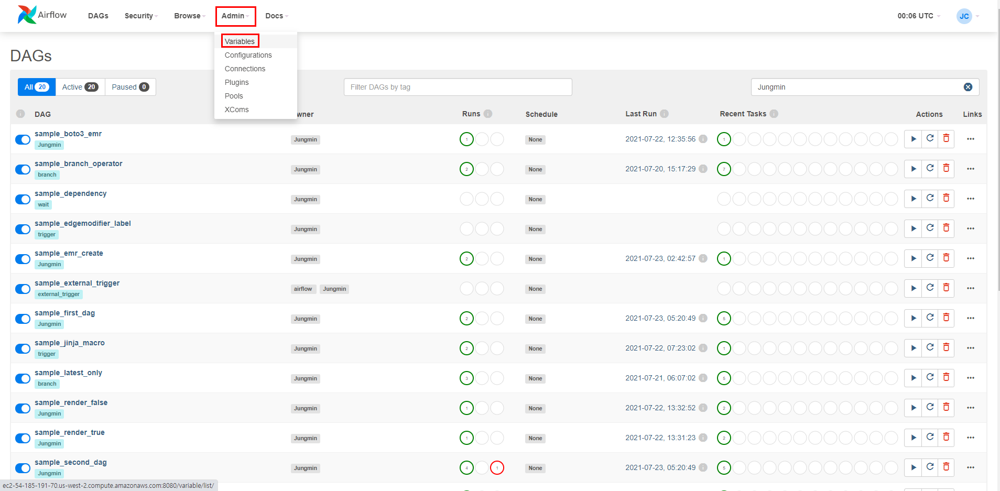

   하단과 같이 등록됩니다.

   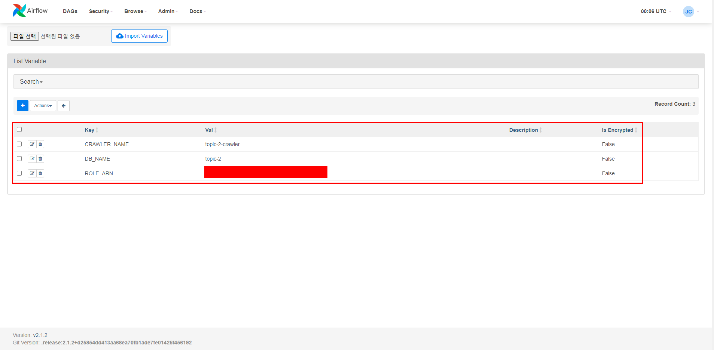

   

2. Code로 등록

   ```python
   from airflow.models import Variable
   
   def set_var(**kwargs):
       # Normal call style
       Variable.set("TEST", "set_var")
   
   def get_var(**kwargs):
       get_var = Variable.get("TEST")
       print(get_var)
       get_var = {"new_var":"var_changed"}
       Variable.set("TEST", get_var)
   
   def new_var(**kwargs):
       # Auto-deserializes a JSON value
       get_var = Variable.get("TEST", deserialize_json=True)
       print(type(get_var))
       # Returns the value of default_var (None) if the variable is not set
       new_var = Variable.get("TEST", default_var=None)
       print(type(new_var))
   ```

- `jinja template`을 사용할 수도 있습니다 .

  ```python
  from airflow.operators.bash_operator import BashOperator
  
  # Raw value
  print_set_var = BashOperator(
      task_id="print_set_var",
      bash_command="echo {{ var.value.TEST }}",
      dag=dag
  )
  
  # Auto-deserialize JSON value
  print_get_var = BashOperator(
      task_id="print_get_var",
      bash_command="echo {{ var.json.TEST }}",
      dag=dag
  )
  ```

이 `Variable`은 DAG 내부뿐만 DAG끼리 통신도 매개로 사용할 수 있습니다.

예시 Code)

[Variable](codes/sample_variable.py)

<div style="page-break-after: always; break-after: page;"></div>

## 3. Role

Airflow는 기본적으로 RBAC(Role Base Access Control)을 제공합니다. AWS에서 IAM User는 제공 받은 권한만 수행할 수 있듯이 Airflow도 계정을 생성 시 각 계정에 대한 권한, Role을 부여하고 Role에 따라 접근 제어를 합니다.

Airflow는 기본적으로 제공하는 Role이 있습니다.`Admin`, `User`, `Op`, `Viewer`, `Public`
이러한 사전 정의된 역할에 권한을 제거하거나 추가하는 것은 권장되지 않습니다 .

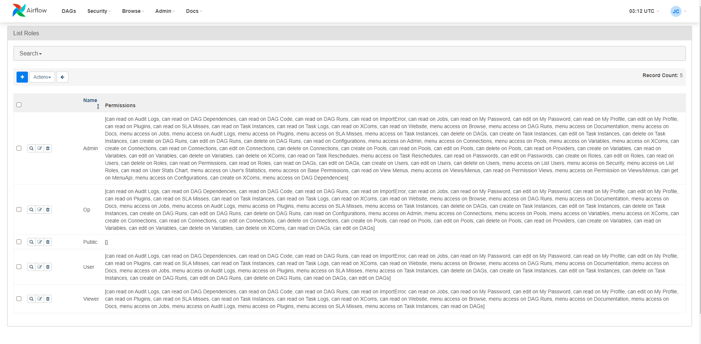

### 1. Admin

`Admin`은 AWS에서 `AdminFullAcccess`와 동일하게 모든 권한을 가진 Role 입니다. 다른 Role에 권한을 부여할 수도 있고 모든 작업이 가능합니다.

```sh
airflow users create -r Admin  -u admin  -p admin12! -e admin@gmail.com -f admin -l choi
```

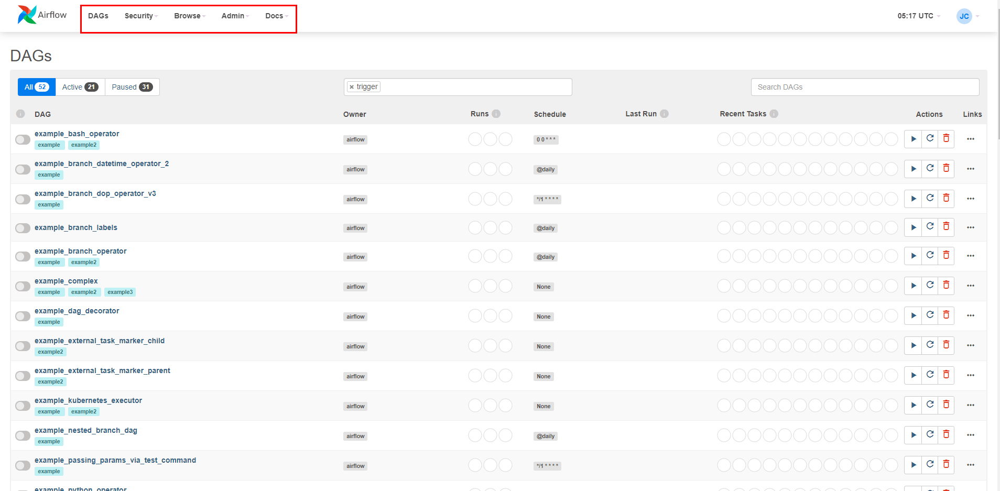

Admin은 모든 권한이 있습니다.

### 2. User

`User`는 `Viewer`가 가지고 있는 권한에 DAG와 Task를 실행 시킬 수 있는 권한이 추가로 있습니다.

```sh
airflow users create -r User  -u user  -p user12! -e user@gmail.com -f user -l choi
```

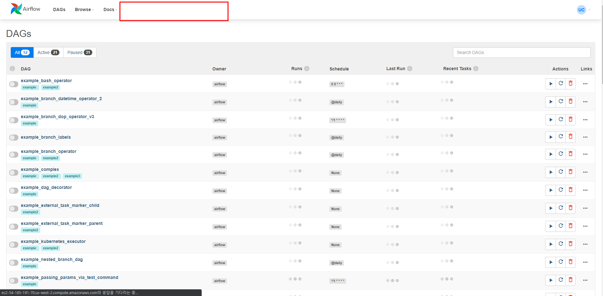

상단 이미지와 같이 Resource및 권한 관리에 대한 접근 제어를 하고 있습니다.

### 3. OP

`Op`는 `User`권한에 Variable이나 Xcom과 같은 Resource 설정에 대한 권한이 추가로 있습니다.

```sh
airflow users create -r Op  -u op  -p admin12! -e op@gmail.com -f op -l choi
```


상단 이미지와 같이 `Op` Role을 가진 User는 Resource 관리나 DAG, Task 관리는 문제 없지만 권한 관리에 대한 접근 제어를 하고 있습니다.

### 4. Viewer

`Viewer` DAG나 Task에 대한 접근 권한만 있습니다.

```sh
airflow users create -r Viewer  -u viewer  -p admin12! -e viewer@gmail.com -f viewer -l choi
```

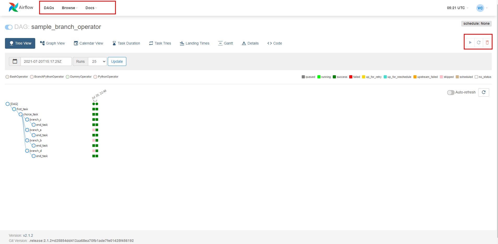

`Viewer`는 `User`와 메뉴 탭은 동일하지만 각 DAG나 Task에 대해 View 기능만 가능하고 Edit 기능은 불가능합니다.
Edit이란 DAG나 Task에 대하 실행, 상태 변경 등을 의미합니다

### 5. Public

`Public` 은 권한이 없습니다.

```sh
airflow users create -r Public  -u public  -p admin12! -e public@gmail.com -f public -l choi
```

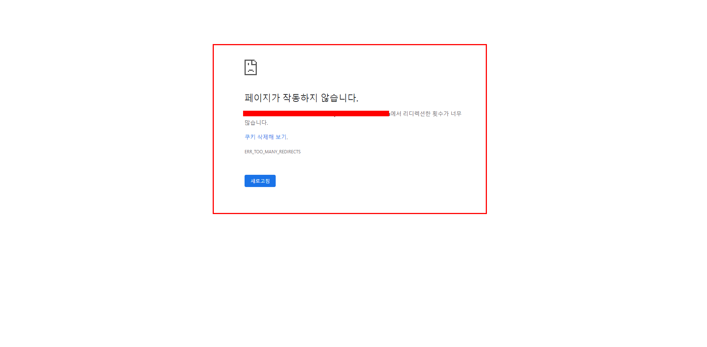

아무 권한이 없습니다.

<div style="page-break-after: always; break-after: page;"></div>

### 6. Custom Role

AWS에서 특정 권한을 가지 Role을 만들어 서비스에 부여할 수 있듯 Airflow에서도 `Custom Role`을 지원합니다.
특정 DAG만 접근하거나 특정 DAG만 실행할 수 있도록 Role을 생성 후 계정에 권한 부여할 수 있습니다.

`Custom Role`을 만드는 방법은 2 가지가 있습니다.

1. Web UI에서 생성

   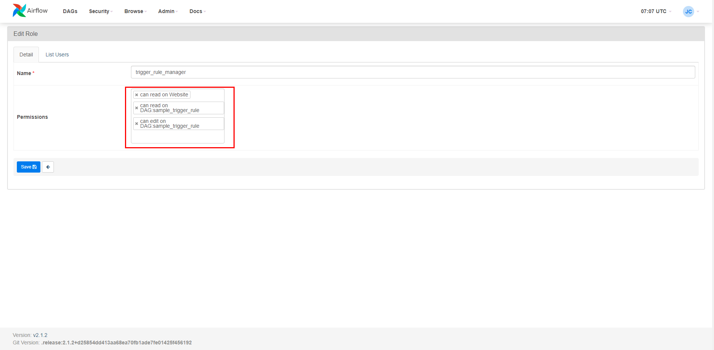

   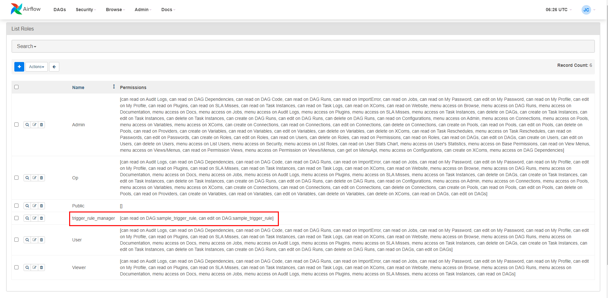

   

2. Airflow CLI로 생성

   ```sh
   airflow roles create trigger_rule_manager
   ```

   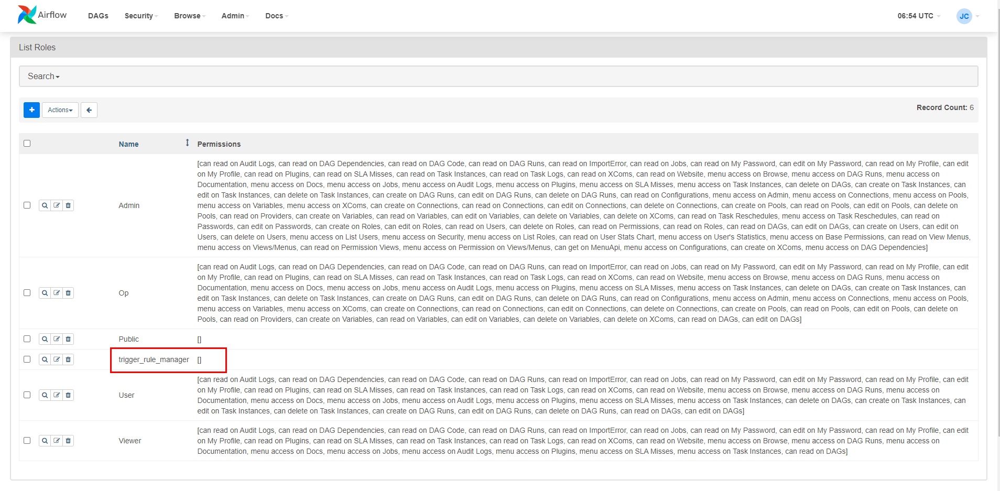

   하지만 말그대로 Role 만 생성하고 권한은 부여되지 않습니다.

   <div style="page-break-after: always; break-after: page;"></div>

생성한 Role을 이용하여 계정을 생성합니다.

계정 생성 방법도 2가지가 있습니다.

1. Web UI에서 생성

   상단 메뉴에서 `Security` > `List Users`로 접근

   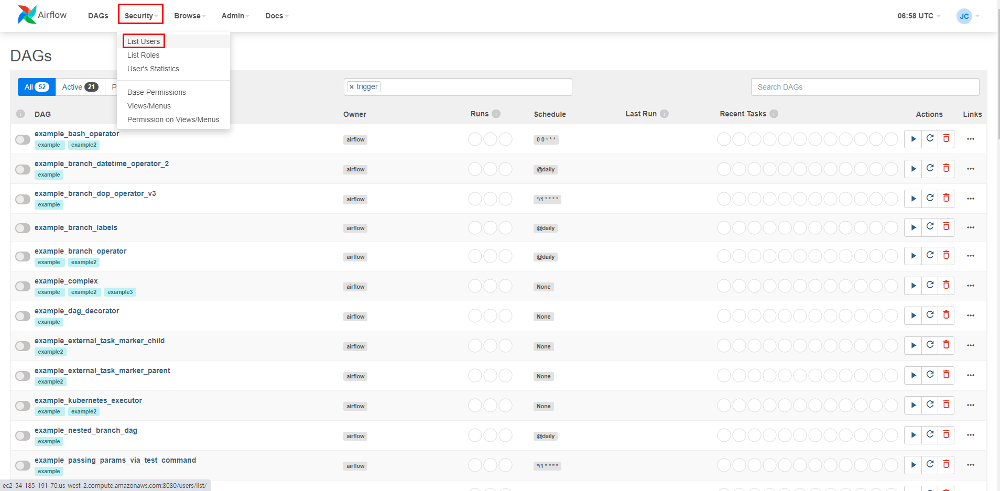

   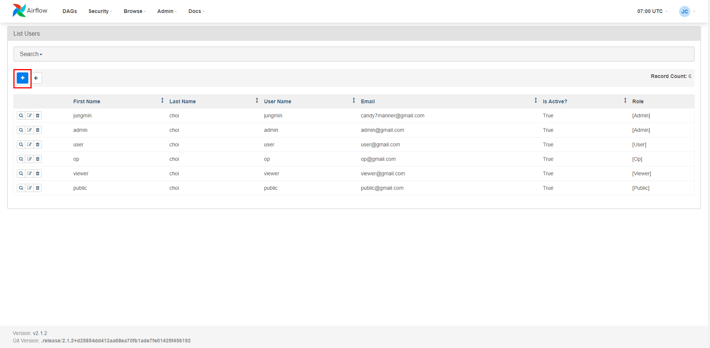

   위에서 생성한 Role을 Mapping해줍니다

   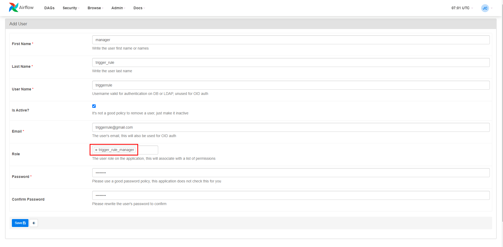

   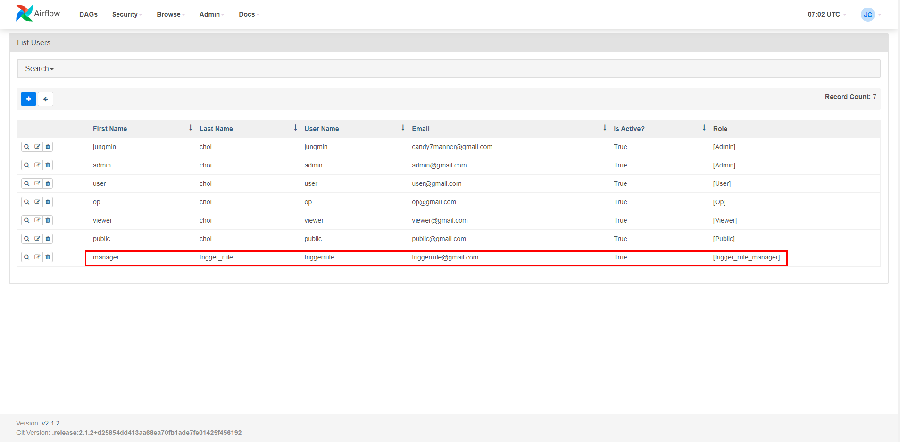

   생성한 계정으로 로그인 합니다.

   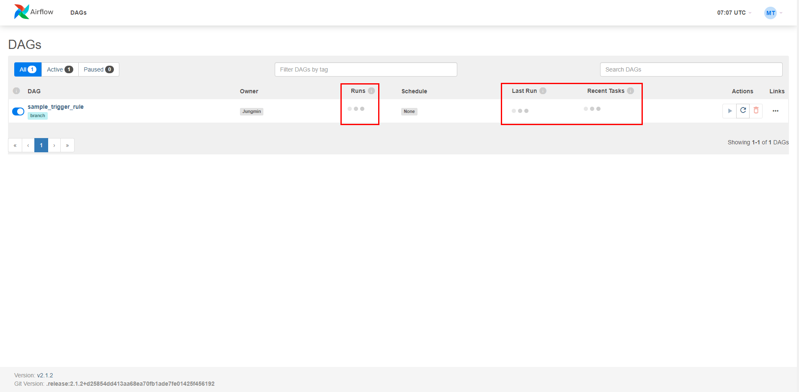

   말 그대로 DAG에 대한 Code 정보 외에 DAG 실행 이력 등 그 어떤 것도 확인할 수 없습니다.

   

2. Airflow CLI로 생성

   ```sh
   airflow users create -r trigger_rule_manager  -u triggerrule  -p admin12! -e triggerrule@gmail.com -f manager -l trigger_rule
   ```

**최초 매핑한 Role 외에도 추가로 Role을 Mapping 시킬 수도 Role을 변경할 수도 있습니다.**

[추가 사항](https://airflow.apache.org/docs/apache-airflow/stable/cli-and-env-variables-ref.html)은 해당 링크에서 더 볼 수 있습니다.

<div style="page-break-after: always; break-after: page;"></div>

## 4. Connections

Airflow는 외부 시스템과의 통신을 위해서 Connection을 맺어야 합니다. ( AWS, AZURE, GCP, DBMS etc...)
이러한 Connection 정보를 등록할 수 있는 기능입니다.

Connection을 설정 및 생성 하는 방법은 2가지가 있습니다.

1. Web UI에서 생성
   상단 메뉴에서 `Admin` > `Connections`로 접근

   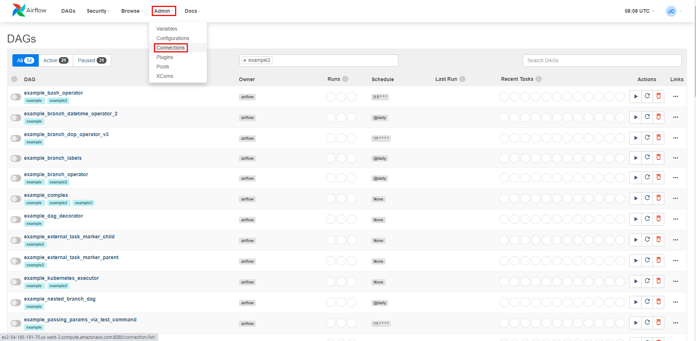

   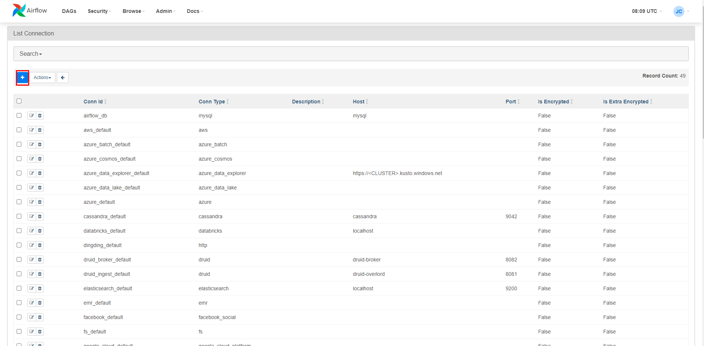

   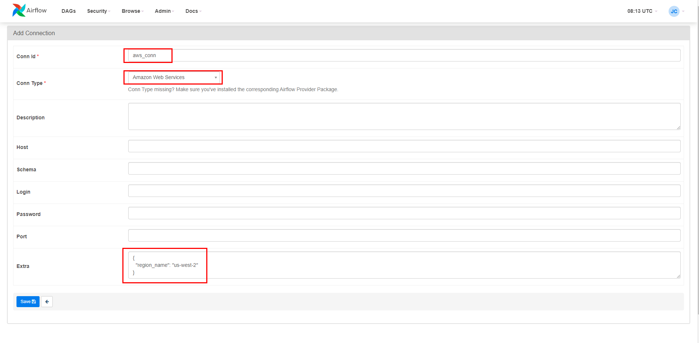

   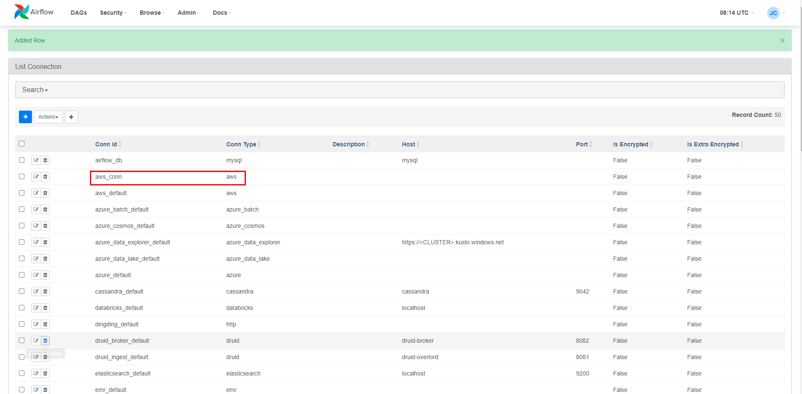

   > 현재 이 Airflow는 EC2 위에 구성이 되었으며 EC2의 Instance Profile에 IAM Role을 Mapping 시켜 놨기 때문에 Extras에
   >
   > ```json
   > {
   >     "region_name": "us-west-2"
   > }
   > ```
   >
   > 이 내용만 작성해도 Connection 이 맺어집니다.
   >
   > 개인 Accesskey로 Connection을 설정할 경우 하단과 같은 형태로 작성해주어야 Connection 이 맺어집니다.
   >
   > ```json
   > {
   >     "aws_access_key_id":"{your_aws_access_key_id}", 
   >     "aws_secret_access_key": "{your_aws_secret_access_key}"
   >     "region_name": "{your_aws_region_name}",
   >     "output": "{output_format}"
   > }
   > ```

   

2. Airflow CLI로 생성

   ```shell
   airflow connections add aws_conn --conn-description "AWS Connection On Airflow" --conn-extra '{"region_name": "us-west-2"}' --conn-type aws
   ```

   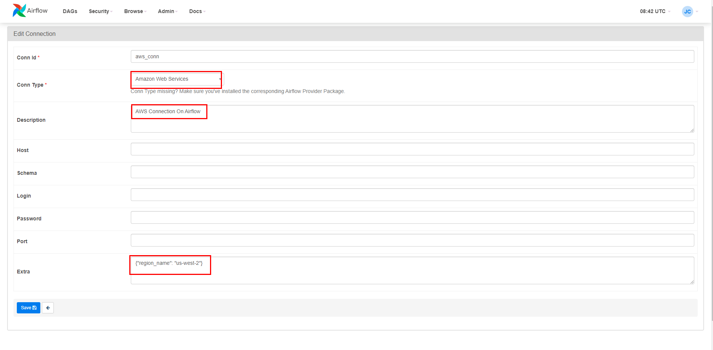

<div style="page-break-after: always; break-after: page;"></div>

## 과제

### 주제 1

지난 과제에서 S3 + DynamoDB DAG 구성한 팀 

1. AWS Connection 생성  
2. S3에서 Data File을 Download 받고 Upload하는 내용을 `S3Hook`으로 변경
3. 해당 DAG에만 `Read` 및 `Edit`할 수 있는 Role 생성
4. 기존 Champion 확인 용 계정을 `3`번에서 생성한 Role로 바꿀 것

상단의 내용을 정리한 문서와 Code 제출

### 주제 2

지난 과제에서 S3 + Glue DAG 구성한 팀 

1. AWS Connection 생성  
2. Glue Job을 생성 및 실행, 상태체크하는 내용을 `AwsGlueJobOperator`, `AwsGlueJobSensor`로 변경
3. 해당 DAG에만 `Read` 및 `Edit`할 수 있는 Role 생성
4. 기존 Champion 확인 용 계정을 `3`번에서 생성한 Role로 바꿀 것

상단의 내용을 정리한 문서와 Code 제출