# Executor, Scheduler 란

## 1. Executor

Scheduler로부터 전달 받은 작업의 처리를 위해 자원 활용과 작업을 가장 잘 분배하는 중개자 역할

`Executor`는 Airflow Config 파일에 작성함으로써 설정 가능합니다.

- Config File Location : `{AIRFLOW_HOME}/airflow.cfg`

- 설정값

  ```sh
  # core section에서 설정
  [core]
  executor = CeleryExecutor
  ```

`Executor` 의 유형

### 1. 내부 Executor

- SequentialExector (default)

  > Airflow 설치 시 기본으로 설정된 값
  >
  > 동시 수행을 지원하지 않습니다.
  > 따라서 동시 Connection을 맺지 않는 MetaData Database인 sqlite를 이용시 유일하게 사용할 수 있는 Executor 입니다.

- LocalExecutor

  > Airlofw에 내장된 Executor
  > SequentialExector와 달리 병렬처리가 가능합니다.

- DebugExecutor

  > Airlofw에 내장된 Executor
  > 표현 그대로 DAG에 대한 Debugging 용도로 사용되며 단일 프로세스 처리기이기 때문에 sqlit와 같이 사용가능합니다.

### 2. 외부 Executor

- CeleryExecutor

  > Airflow가 Cluster 형태로 구성이 되어있을 때 분산 처리를 위한 Executor
  > Queue Server(RabbitMQ , Redis)에 Task에 대한 대기열을 구성 후 처리
  >
  > 해당 Executor를 사용하기 위해서는 `celery`가 사전에 설치되어야 합니다.
  >
  > ```sh
  > sudo pip3 install 'apache-airflow[celery]'
  > ```
  >
  > 
  >
  > 내부 Executor와 달리 Worker를 실행시키기 위해서는 추가 작업이 필요합니다.
  >
  > ```sh
  > # worker 실행
  > airflow celery worker
  > 
  > # worker 중지
  > airflow celery stop
  > ```
  >
  > Worker들에 대한 Monitoring 기능을 Web UI로 제공합니다.(flower)
  >
  > ```sh
  > # flower 설치
  > sudo pip3 install flower
  > 
  > # flower 실행
  > airflow celery flower
  > 
  > # flower에 대한 기본 port는 5555로 설정
  > # http://{Airflow DNS}:5555로 접근 가능
  > ```
  >
  > **Celery Executor Sequence diagram**
  >
  > 
  >
  > (Image URL : https://airflow.apache.org/docs/apache-airflow/stable/_images/run_task_on_celery_executor.png)
  >
  > 1. **SchedulerProcess**에서 예약되거나 Trigger되서 수행해야할 작업에 대해 **QueueBroker**로 전송합니다.
  >
  > 2. **QueueBroker** 는 작업 상태에 대해 **ResultBackend** 에 주기적으로 쿼리하기 시작합니다 .
  >
  >    > Result Backend란 Celery를 통해 Worker가 처리한 작업 결과
  >
  > 3. **QueueBroker** 는 전달 받은 작업 정보를 **WorkerProcess**로 전달합니다.
  >
  > 4. **WorkerProcess** 는 하나의 **WorkerChildProcess에** 단일 작업을 할당합니다 .
  >
  > 5. **WorkerChildProcess** 는 작업 처리를 위한 새 프로세스( **LocalTaskJobProcess)** 를 생성합니다.
  >
  > 6. **LocalTaskJobProcess** 로직은 `LocalTaskJob`클래스 별로 기술. **TaskRunner**를 사용하여 새 프로세스를 시작합니다.
  >
  > 7. **RawTaskProcess** 및 **LocalTaskJobProcess** 는 작업이 완료되면 중지됩니다.
  >
  > 10. **WorkerChildProcess** 는 주요 프로세스인 **WorkerProcess** 에게 작업의 종료와 작업 가능 상태임을 전달합니다
  >
  > 11. **WorkerProcess** 는 **ResultBackend**에 상태 정보를 저장합니다 .
  >
  >     > Celery는 기본적으로 작업 결과를 저장하지 않습니다.
  >     > 작업 결과를 저장하기 위해서는 Celery에 내장된 result backend를 골라서 설정하면 됩니다.
  >
  > 13. **SchedulerProcess** 가 **ResultBackend** 를 통해 작업 상태에 정보를 얻습니다.
  >
  > [CeleryExecutor](https://airflow.apache.org/docs/apache-airflow/stable/executor/celery.html)에서 발췌한 내용이며 해당 링크에서 아키텍쳐나 추가 정보를 얻을 수 있습니다.

  <div style="page-break-after: always; break-after: page;"></div>

- DaskExecutor

  > Celery와 같이 분산 처리를 위한 Executor이며 Celery가 아닌 Dask를 이용합니다.
  > [DaskExecutor](https://airflow.apache.org/docs/apache-airflow/stable/executor/dask.html#dask-executor)에서 추가 정보 확인 가능합니다.
  > [Celery와 Dask의 차이](http://matthewrocklin.com/blog/work/2016/09/13/dask-and-celery) 해당 링크에서 둘의 차이를 확인 가능합니다.

- KubernetesExecutor

  > Kubernetes로 cluster 형태로 모든 작업 인스턴스에 대해 새 pod를 생성합니다.
  > [KubernetesExecutor](https://airflow.apache.org/docs/apache-airflow/stable/executor/kubernetes.html#kubernetes-executor) 해당 링크에서 아키텍쳐 및 작업 방식에 대하 자세한 정보를 획득할 수 있습니다.

- CeleryKubernetesExecutor

  > `CeleryKubernetesExecutor`는 사용자가 동시에  `CeleryExecutor`와 `KubernetesExecutor`를 실행할 수 있는 Executor 입니다. 
  >
  > `CeleryKubernetesExecutor`아래의 경우에 사용됩니다.
  >
  > 1. 피크에 예약해야 하는 작업 수가 Kubernetes 클러스터가 처리량을 초과합니다.
  > 2. 작업의 상대적으로 작은 부분에는 격리된 런타임 환경이 필요합니다.
  > 3. Celery 작업자에서 실행할 수 있는 작은 작업이 많이 있지만 사전 정의된 환경에서 실행하는 것이 더 많은 리소스가 필요한 작업도 있습니다.
  >
  > [출처](https://airflow.apache.org/docs/apache-airflow/stable/executor/celery_kubernetes.html)

<div style="page-break-after: always; break-after: page;"></div>

## 2. Scheduler

Airflow scheduler는 예약된 워크플로 트리거를 통해 수행될 작업을  Executor에 제출합니다. 기본적으로 1분에 한 번 scheduler는 DAG 구문 분석 결과를 수집하고 활성 작업을 트리거할 수 있는지 확인합니다.

scheduler 시작

```sh
airflow scheduler
```

DAG에 대한 최초 실행은 DAG `start_date` 값을 기반으로 생성 됩니다. 그 후의 작업은 `schedule_interval`에 의해 순차적으로 생성됩니다.

airflow.cfg에서 스케줄러 섹션의 

```sh
allow_trigger_in_future = True
```

상단과 같이 설정되어 있다면 수동으로 트리거할 때 미래 날짜로 Trigger가 가능합니다.

```sh
airflow dags trigger -e '2021-11-30 10:00:00+00:00' sample_branch_operator
```

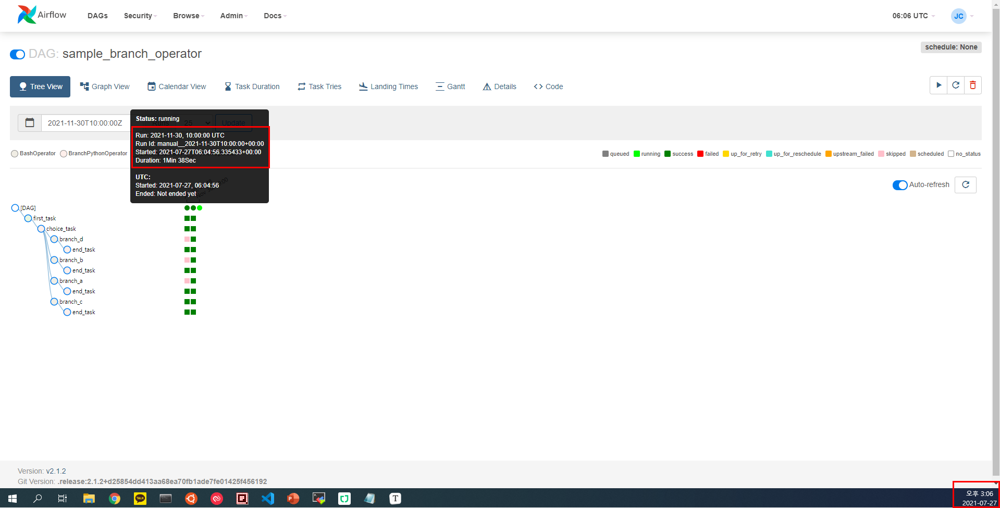

실제로 수행되지는 않고 Running상태로 Scheduler에 걸려있게 됩니다.

<div style="page-break-after: always; break-after: page;"></div>

### Scheduler HA

Airflow는 성능상의 이유와 복원력을 위해 scheduler에 대해 HA 구성을 지원합니다.
scheduler의 HA구성은 기존 메타 데이터 데이터베이스를 활용하도록 설계되었습니다. 
scheduler의 HA는 하단 작업을 반복 수행하게 됩니다.

- 작업 수행이 필요한 DAG를 확인 및 실행시킵니다.
- 예약 가능한 TaskInstances 또는 전체 DagRuns에 일괄 확인합니다.
- 예약 가능한 TaskInstances를 선택하고 실행을 위해 대기열에 전달합니다.

상단의 작업을 위해서는 Metadata Database에 요구 사양이 있습니다.

- PostgreSQL 9.6 이상
- MySQL 8+

### [Scheduler Tuneables](https://airflow.apache.org/docs/apache-airflow/stable/concepts/scheduler.html#scheduler-tuneables)

하단의 설정을 사용하여 scheduler HA 구성을 제어할 수 있습니다.

- [max_dagruns_to_create_per_loop](https://airflow.apache.org/docs/apache-airflow/stable/configurations-ref.html#config-scheduler-max-dagruns-to-create-per-loop)

  scheduler가 Dag를 실행하는 최대 수
  이 값을 낮게 설정하는 한 가지 가능한 이유는 대규모 dags가 있고 여러 일정을 실행하는 경우 하나의 스케줄러가 모든 작업을 수행하는 것을 방지.

- [max_dagruns_per_loop_to_schedule](https://airflow.apache.org/docs/apache-airflow/stable/configurations-ref.html#config-scheduler-max-dagruns-per-loop-to-schedule)

  scheduler가 Dag를 상태 검사하는 최대 수
  이 제한을 늘리면 적은 DAG 수일 경우 문제 없지만 많은(예: 500개 이상의 작업) DAG수 일 경우 처리량이 느려질 수 있습니다.  이 값을 너무 높게 설정하면 하나의 스케줄러가 모든 dag 실행을 수행하여 다른 스케줄러는 작업하지 않을 수 있습니다.

- [use_row_level_locking](https://airflow.apache.org/docs/apache-airflow/stable/configurations-ref.html#config-scheduler-use-row-level-locking)

  scheduler는 Metadata Database에 `SELECT ... FOR UPDATE`를 실행해야 합니다. 따라서 False로 설정하면 한 개의 scheduler만 사용해야합니다.

- [pool_metrics_interval](https://airflow.apache.org/docs/apache-airflow/stable/configurations-ref.html#config-scheduler-pool-metrics-interval)

  풀 사용 통계를 statsd에 전송해야 하는 빈도(초)입니다(statsd_on이 활성화된 경우). 이것은 이것을 계산 하는 데 상대적으로 비용이 많이 드는 쿼리이므로 statsd 롤업 기간과 동일한 기간과 일치하도록 설정해야 합니다.

- [clean_tis_without_dagrun_interval](https://airflow.apache.org/docs/apache-airflow/stable/configurations-ref.html#config-scheduler-clean-tis-without-dagrun-interval)

  더 이상 일치하는 DagRun 행이 없는 것으로 확인된 TaskInstance 행을 "정리"하기 위해 각 스케줄러가 검사 빈도입니다.

  일반적인 작업에서는 스케줄러가 이 작업을 수행하지 않으며 UI를 통해 행을 삭제하거나 DB에서 직접 행을 삭제해야만 이 작업을 수행할 수 있습니다. 이 검사가 중요하지 않은 경우 이 값을 더 낮게 설정할 수 있습니다. 작업은 정리가 수행될 때까지 어떤 상태로 유지되고 이 시점에서 실패로 설정됩니다.

- [orphaned_tasks_check_interval](https://airflow.apache.org/docs/apache-airflow/stable/configurations-ref.html#config-scheduler-orphaned-tasks-check-interval)

  고아 작업이나 죽은 SchedulerJobs를 확인해야 하는 빈도(초)입니다.

[scheduler_doc](https://airflow.apache.org/docs/apache-airflow/stable/concepts/scheduler.html#scheduler-tuneables)에서 발췌했습니다.

<div style="page-break-after: always; break-after: page;"></div>

## 3. Airflow Multi Node 구성(HA)

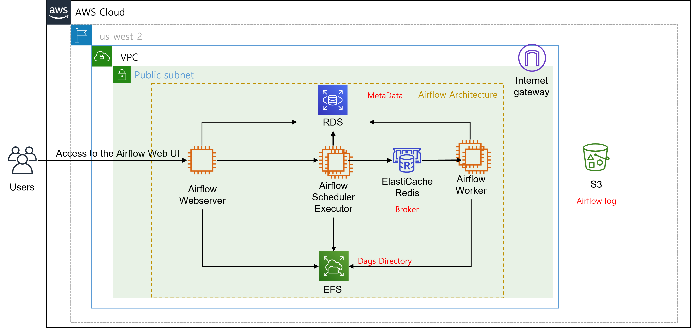

Resource list:

1. EC2 : Airflow Webserver, Scheduler, Executor, Worker (총 3대)
2. RDS(MySQL) : Metadata Database
3. EFS : Dag Directory
4. Elasticache : Broker
5. S3 : Log Storage

### 1. RDS - (Metadata Database)

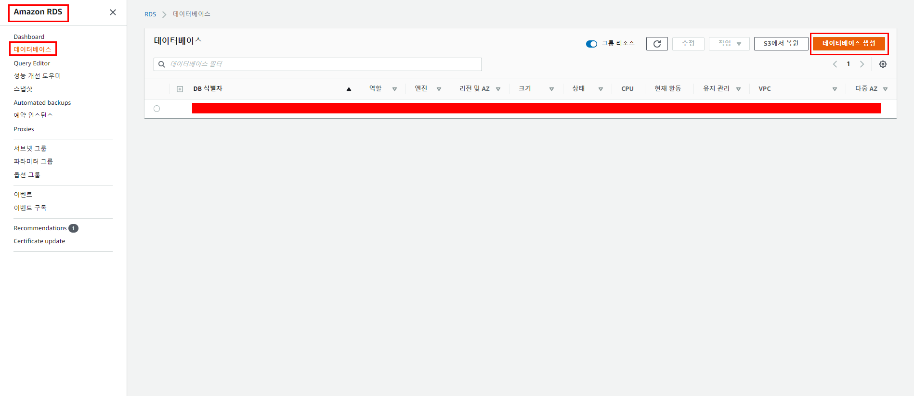

1. 데이터베이스 생성 방식 선택 : `표준 생성`

2. 엔진 유형 : `MySQL`

3. 에디션 : `MySQL Community`

   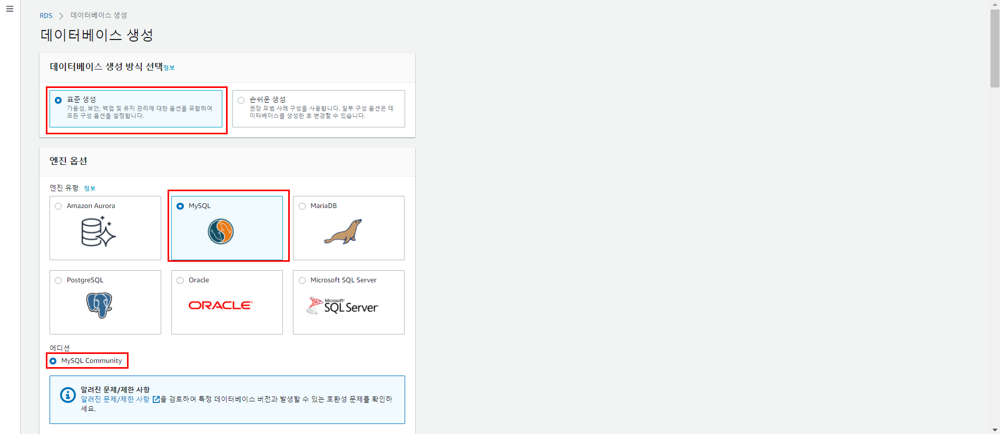

4. 버전 : `MySQL 8.0.23`

5. 템플릿 : `프로덕션`

6. DB 인스턴스 식별자 : `cjm-airflow-metadb`

7. 마스터 사용자 이름 : `airflow`

8. 마스터 암호 : `Bespin12!`

   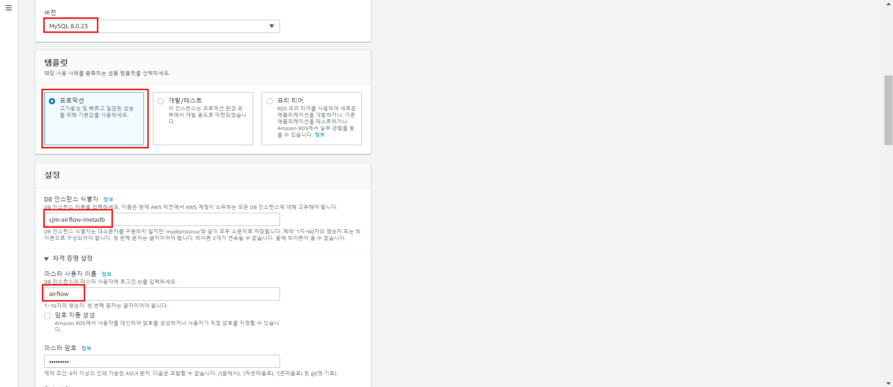

9. DB 인스턴스 클래스 : 버스터블 클래스(t 클래스 포함), `db.t3.micro`

   

10. 다중 AZ 배포 : `대기 인스턴스를 생성하지 마십시오`

11. Virtual Private Cloud(VPC) : `{EC2와 동일한 VPC}`

12. 서브넷 그룹 : `{Public Subnet Group}`

13. 퍼블릭 액세스 가능 : `예`

14. VPC 보안 그룹 : `기존 항목 선택`
    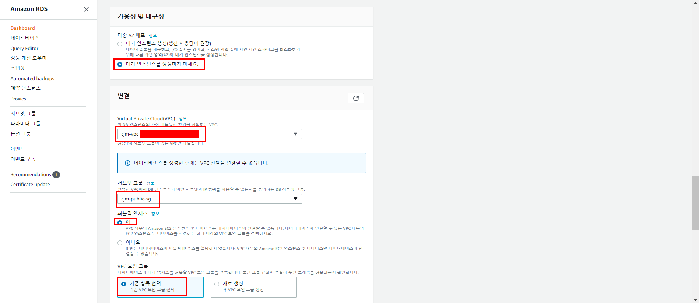

15. 가용 영역 : `us-west-2a`

16. 데이터베이스 포트 : `3306`

    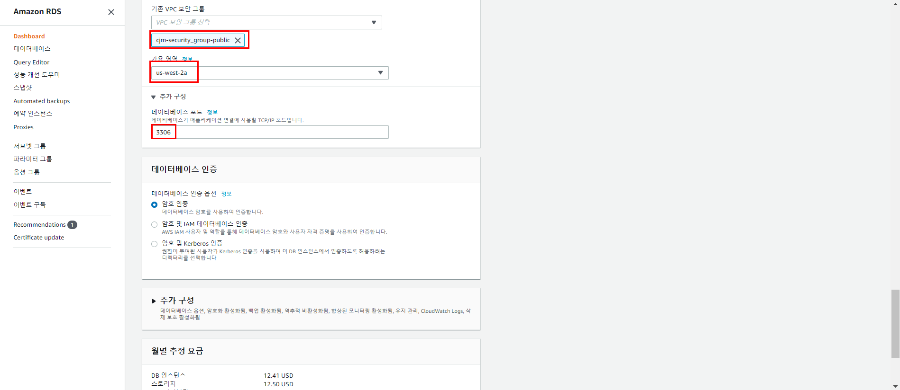

나머지는 Default option으로 설정

<div style="page-break-after: always; break-after: page;"></div>

### 2. Elasticache (Redis)

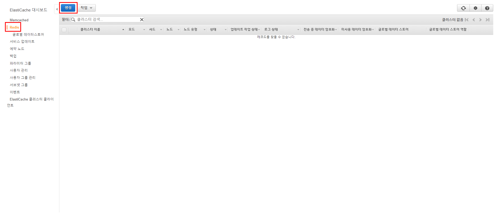

1. 클러스터 엔진 : Redis 
   클러스터 모드 비활성

2. 위치선택 : Amazon 클라우드

3. 이름 : `cjm-airflow-broker`

4. 설명 : `Redis Broker For Airflow`

5. 엔진 버전 : `6.x`

6. 포트 번호 : `6379`

   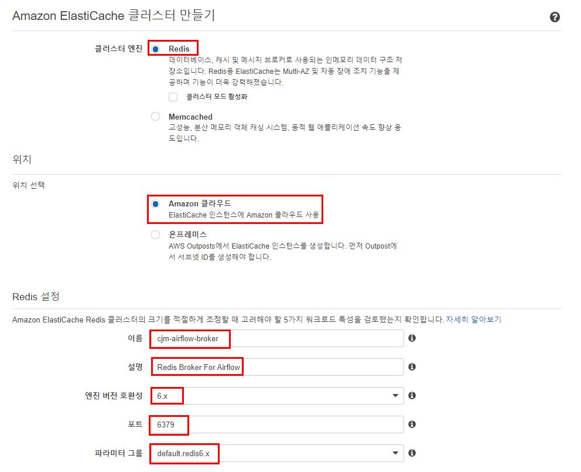

7. 노드 유형 : `cache.r6g.large`

8. 복제본 갯수 : `0`

9. 다중 AZ : `비활성`

10. 서브넷 그룹 : `{Public Subnet Group}`

11. 보안 : 현재 IP에 모든 트래픽을 허용하는 SG로 선택했습니다.

    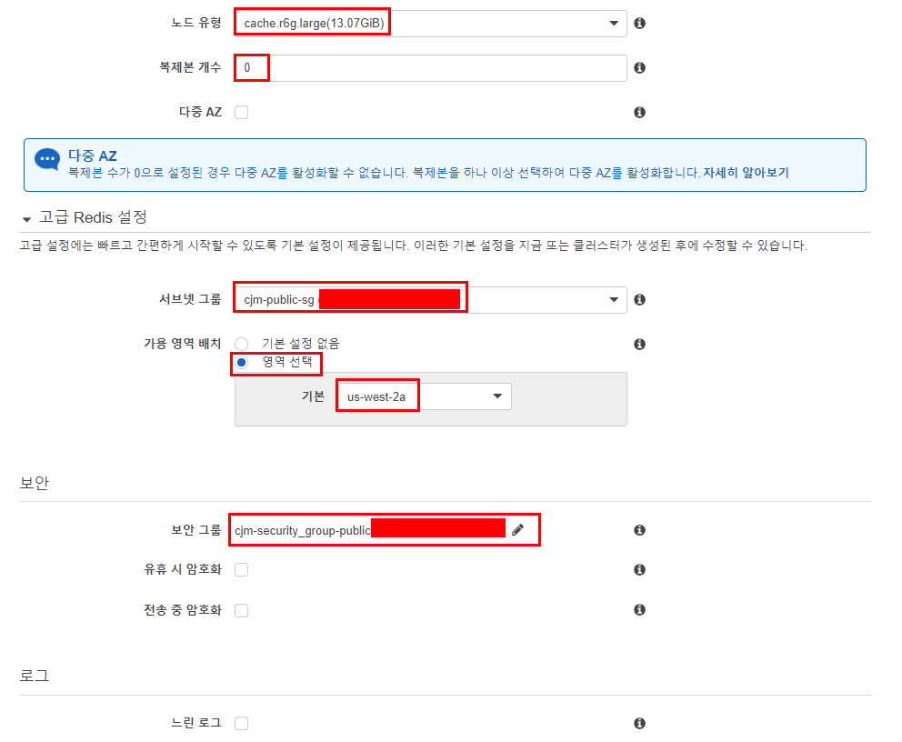

    

12. 사용자 생성

    1. 사용자 ID : `cjm-airflow`

    2. 사용자 이름 : `airflow`

    3. 암호 : `Bespin_DataOps_CJM12!!` (16~128 사이의 문자열)

    4. 액세스 문자열 : `on ~* +@all`
       [액세스 문자열을 사용하여 권한 지정](https://docs.aws.amazon.com/ko_kr/AmazonElastiCache/latest/red-ug/Clusters.RBAC.html#Access-string)를 참고하여 권한 부여합니다.

       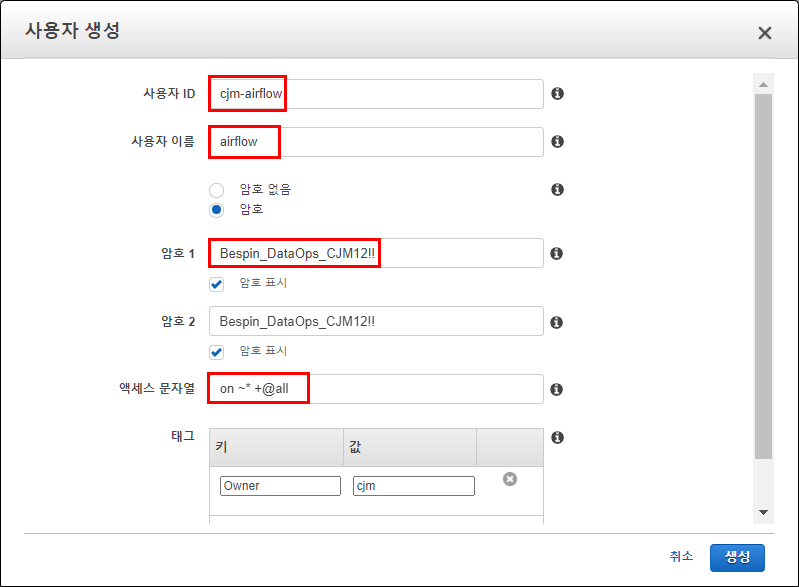

<div style="page-break-after: always; break-after: page;"></div>

### 3. S3 - (Logs)

기존 Bucket에 Airflow log용 폴더 추가

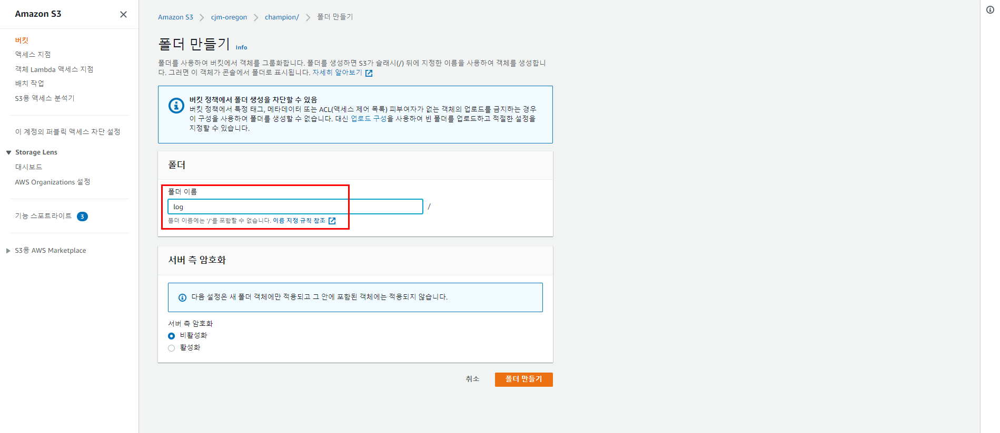

<div style="page-break-after: always; break-after: page;"></div>

### 4. EFS - (Shared Directory : Configration, DAGs, Plugins)

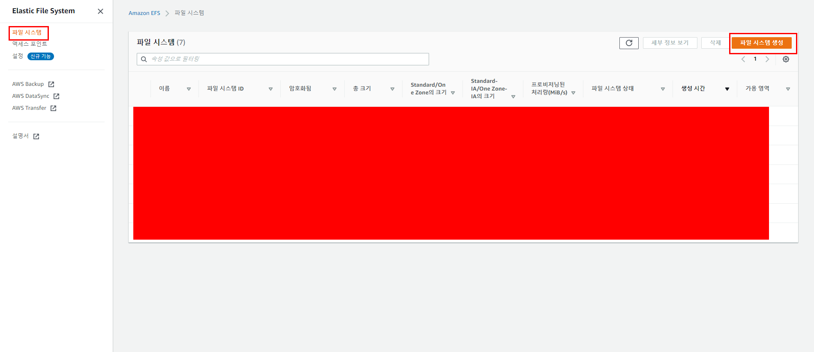

1. 선택 **파일 시스템 생성** 을(를) 열려면 **파일 시스템 생성** 대화 상자.

2. 사용자 지정을 선택합니다.

   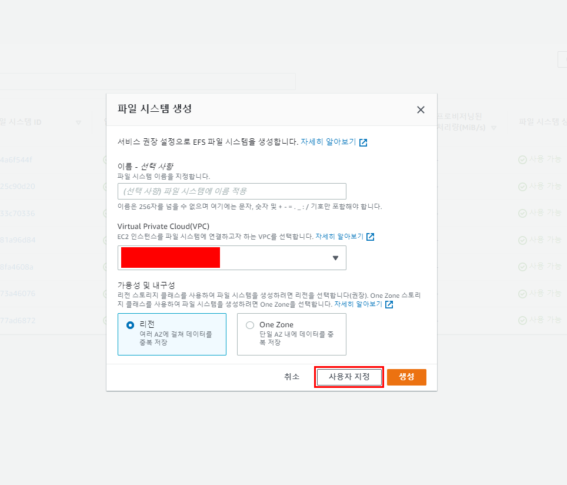

3. 파일 시스템 설정

   1. 이름 : `cjm-airflow-efs`

   2. 가용성 및 내구성 : `One Zone`

   3. 가용 영역 : `us-west-2`

   4. 성능 모드 : `범용`

   5. 처리량 모드 : `버스트`

      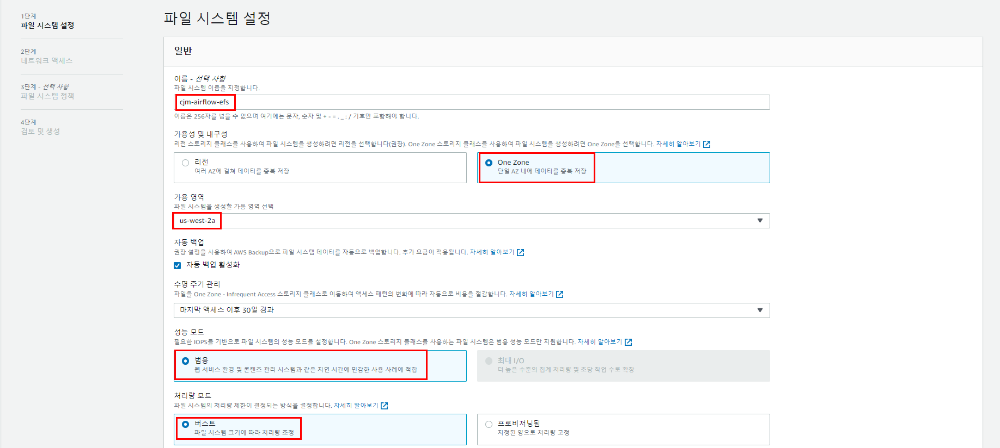

4. 네트워크 설정

   1. VPC 설정: airflow 서버와 같은 VPC로 설정합니다.

   2. 탑재 대상 설정 : airflow 서버가 있는 가용영역과 서브넷에 설정합니다

   3. 주의 사항 : VPC는 DNS 옵션이 활성화 되어있어야 합니다.

      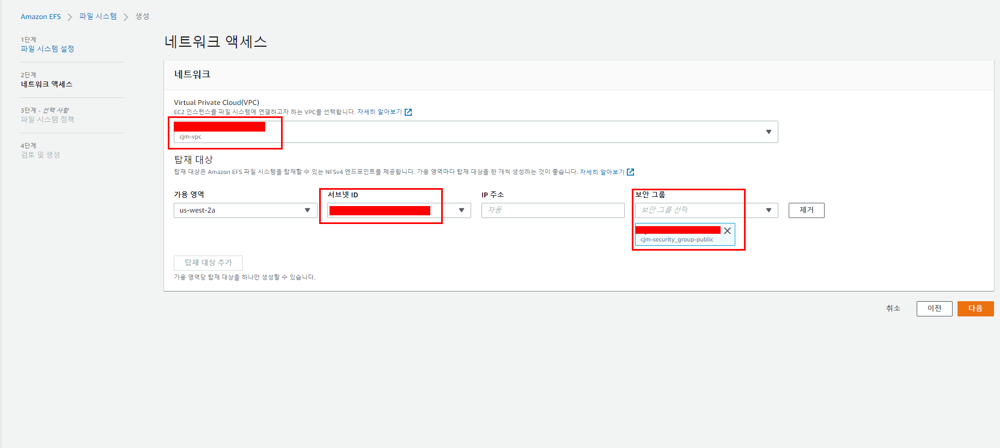

5. 파일 시스템 정책 : 미설정

6. 검토 및 생성

7. 파일 시스템 페이지에 만든 파일 시스템의 상태를 보여주는 배너가 맨 위에 표시됩니다. 
   파일 시스템 세부 정보 페이지에 액세스하려면 파일 시스템이 사용 가능해질 때 배너에 액세스할 수 있습니다. (파일 시스템 이름 옆 괄호안의 문자열이 파일 시스템의 ID입니다. ID 값은 mount시 사용됩니다.)

   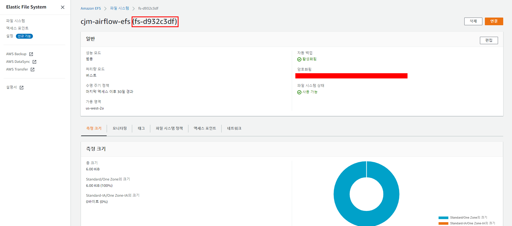

   <div style="page-break-after: always; break-after: page;"></div>

### 5. EC2 - (Webserver)

1. AMI 선택 : `Amazon Linux 2 AMI (HVM), SSD Volume Type`

   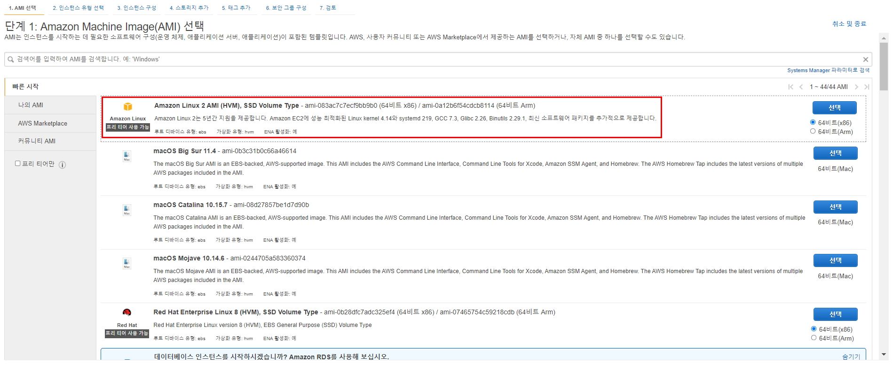

2. 인스턴스 유형 : `t2.large`

   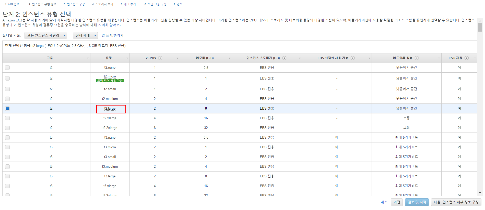

3. 인스턴스 갯수 : 1

4. Virtual Private Cloud(VPC) : `{RDS와 동일한 VPC}`

5. 서브넷 그룹 : `{Public Subnet Group}`

   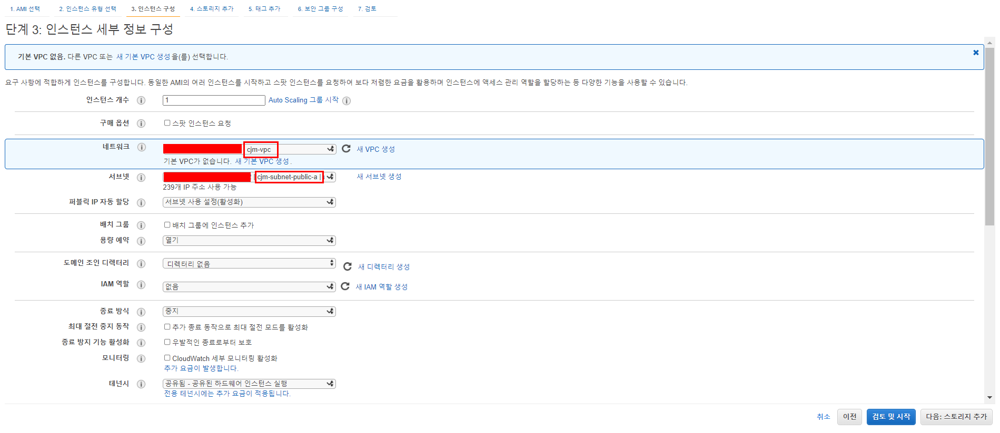

나머지는 Default 값으로 생성

<div style="page-break-after: always; break-after: page;"></div>

### 6. Airflow 설정

하위 작업을 Airflow Webserver에서 작업 후 AMI 등록하여 해당 AMI로 Scheduler 및 Worker를 구성합니다.

#### 1. Airflow 공통 설정

```sh
# EC2 기본 설치
sudo yum update -y
sudo yum install zlib-devel bzip2-devel openssl-devel ncurses-devel sqlite-devel python3-devel.x86_64 cyrus-sasl-devel.x86_64 -y
sudo yum install gcc -y
sudo yum install libevent-devel -y
sudo pip3 install wheel
sudo pip3 install boto3 PyMySQL celery flask-bcrypt
sudo pip3 install 'apache-airflow[aws]'
sudo pip3 install "SQLAlchemy==1.3.18"

# AIRFLOW_HOME 설정
export AIRFLOW_HOME=/home/ec2-user/airflow
```

#### 2. Metadata Database 설정

Library 설치

```sh
# MySQL server 설치
# RPM 저장소 패키지를 설치
sudo yum install -y https://dev.mysql.com/get/mysql80-community-release-el7-3.noarch.rpm

# yum 명령을 사용하여 구성된 저장소 목록을 볼 수도 있습니다.
sudo yum repolist

# MySQL 8 서버 패키지를 설치
sudo yum install -y mysql-community-server

# MySQL 서버 서비스를 시작
sudo systemctl enable --now mysqld

# MySQL 서버 서비스가 시작되어 실행 중인지 확인
systemctl status mysqld

# 추가 라이브러리 설치
sudo yum install -y mysql-devel
# airflow plugin 설치
sudo pip3 install 'apache-airflow[mysql]'
```

DB 및 계정 생성

```sh
# RDS에 airflow metadb와 계정 생성
# MySQL 접속
mysql -u [admin username] -h [RDS Endpoint] -p

# RDS에 airflow metadb 생성
CREATE DATABASE airflow CHARACTER SET UTF8mb3 COLLATE utf8_general_ci;
# RDS에 airflow 계정 생성
# 로컬
CREATE USER 'airflow'@'localhost' IDENTIFIED BY 'Bespin12!';
# db에 대한 권한 부여
GRANT ALL privileges on airflow.* to airflow@localhost;
GRANT ALL privileges on airflow.* to airflow@'%';
flush privileges;
```

#### 3. EFS 설정

```sh
# EFS 마운트 도우미 라이브러리 설치 amazon-efs-utils
# 다음 명령을 실행해 amazon-efs-utils를 설치합니다. (linux2 ami, linux ami에서 가능)
sudo yum install -y amazon-efs-utils

# AIRFLOW_HOME 폴더 생성
mkdir -p ~/airflow

# EFS 마운트
sudo mount -t efs {파일 시스템의 ID}:/ ~/airflow

# 소유권 변경
sudo chown ec2-user ~/airflow

# /etc/fstab에서 영구 마운트 선언
# - 서버를 재시작 한 경우 /etc/fstab 경로에 마운트 정보가 없으면 마운트 정보가 삭제된다.
# - 따라서 /etc/fstab에 마운트정보를 작성한다.
sudo vi /etc/fstab

# 하단 내용을 추가 합니다.
{EFS_ID}.efs.{Region_Name}.amazonaws.com:/ {Mount 절대 경로} nfs4 nfsvers=4.1,rsize=1048576,wsize=1048576,hard,timeo=600,retrans=2,noresvport,_netdev 0 0
```

#### 4. Executor 및 Broker 설정

```sh
# Celery 설치 (Celery 서버)
sudo pip3 install celery

# airflow plugin celery 설치
sudo pip3 install 'apache-airflow[celery, redis]'
```

#### 5. airflow.cfg 설정

```sh
# 사용할 executor 설정
# executor = SequentialExecutor
executor = CeleryExecutor

# airflow.cfg 파일 내 다음 설정을 변경
sql_alchemy_conn = mysql://[USER]:[PASSWORD]@[IP]:3306/airflow

# [core]
# Airflow can store logs remotely in AWS S3. Users must supply a remote
# location URL (starting with either 's3://...') and an Airflow connection
# id that provides access to the storage location.
remote_logging = True
remote_base_log_folder = s3://{my-bucket}/{path_to_logs}
remote_log_conn_id = MyS3Conn

# Use server-side encryption for logs stored in S3
encrypt_s3_logs = False

# [webserver]
# Set to true to turn on authentication:
# https://airflow.apache.org/security.html#web-authentication
auth_backend = airflow.api.auth.backend.basic_auth

broker_url = redis://{액세스 문자열}@{Redis Endpoint}:6379/0
result_backend = db+mysql://{DB username}:{DB password}@{DB Endpoint}/{DB Name}
```

S3 Connection에 입력한 Connection은 Webserver에서 접속해서 하단과 같이 생성합니다.

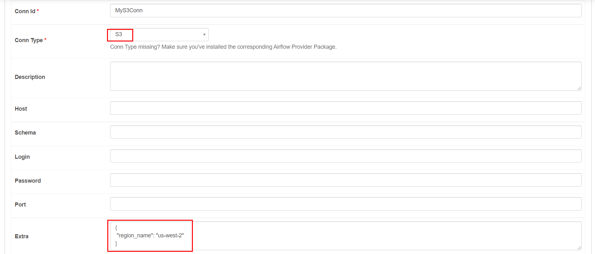

<div style="page-break-after: always; break-after: page;"></div>

### 7. EC2 - (Worker, Scheduler)

Webserver에 대한 설정이 끝나면 해당 EC2에 대한 AMI를 등록 후 Worker 및 Scheduler 역할을 할 EC2 2대를 추가로 생성합니다.

1. AMI 등록

   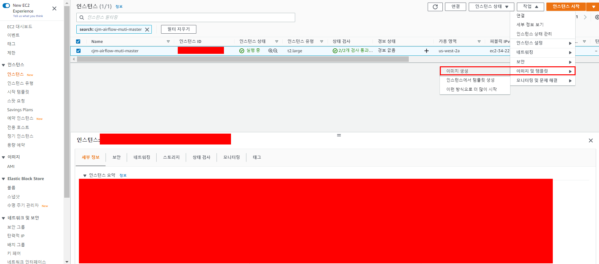

   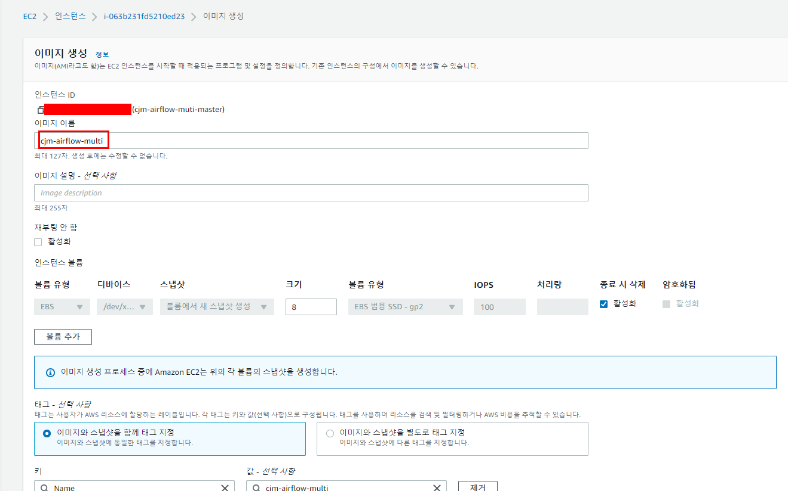

   

2. EC2 생성
   Webserver와의 차이점은 AMI와 생성 갯수 뿐입니다.

   AMI

   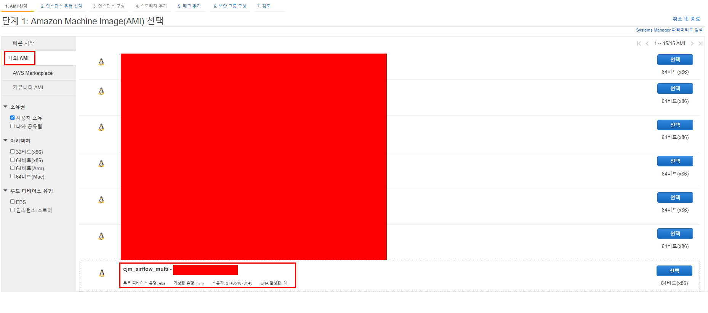

   Instance Count

   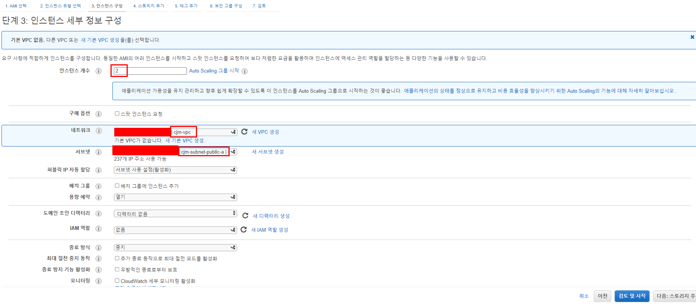

<div style="page-break-after: always; break-after: page;"></div>

<div style="page-break-after: always; break-after: page;"></div>

## 과제

[Data](Mall_Customers.csv) :

| Column                 | Description                                                  |
| ---------------------- | ------------------------------------------------------------ |
| CustomerID             | Unique ID assigned to the customer                           |
| Gender                 | Gender of the customer                                       |
| Age                    | Age of the customer                                          |
| Annual Income (k$)     | Annual Income of the customee                                |
| Spending Score (1-100) | Score assigned by the mall based on customer behavior and spending nature |

(Data 출처 : https://www.kaggle.com/vjchoudhary7/customer-segmentation-tutorial-in-python)

**모든 AWS 관련 작업은 boto3를 사용 금지, Console 작업 금지**

상단의 Data가 S3에 위치해 있을 때 (s3://cjm-oregon/champion/data/Mall_Customers.csv)

#### DAG_1

1. EMR 생성
2. DAG_2 호출 (External Trigger)
3. DAG_2 완료 시까지 상태 체크 (External Sensor)
4. EMR 종료
5. 수행 여부를 E-mail로 전송

#### DAG_2

1. DAG_1에서 생성한 EMR에 S3의 Data 적재 (어떤 형태든 무관)
   1. Hive Table 권장
2. 복사한 Data를 `Spending Score (1-100)`을 오름차순으로 변경
3. 변경한 Data를 S3에 Parquet로 저장
   1. pyspark 이용할 것