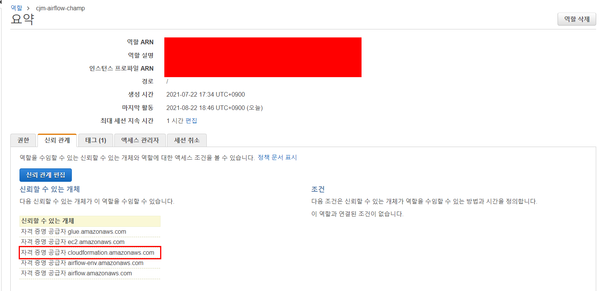
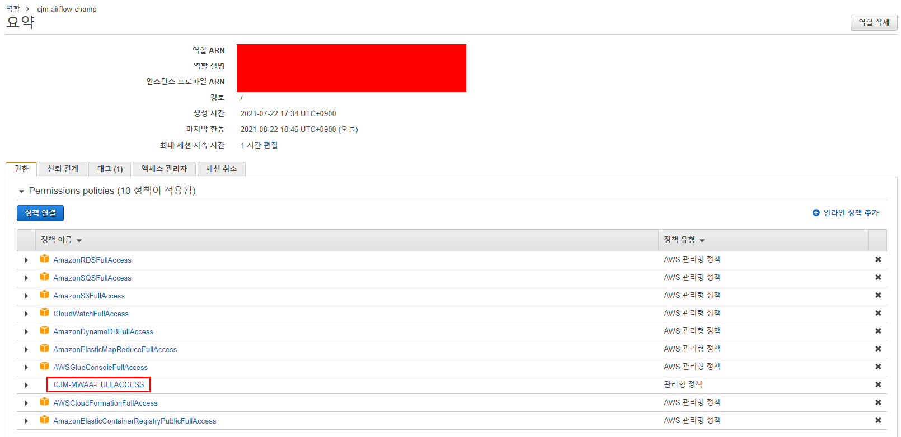
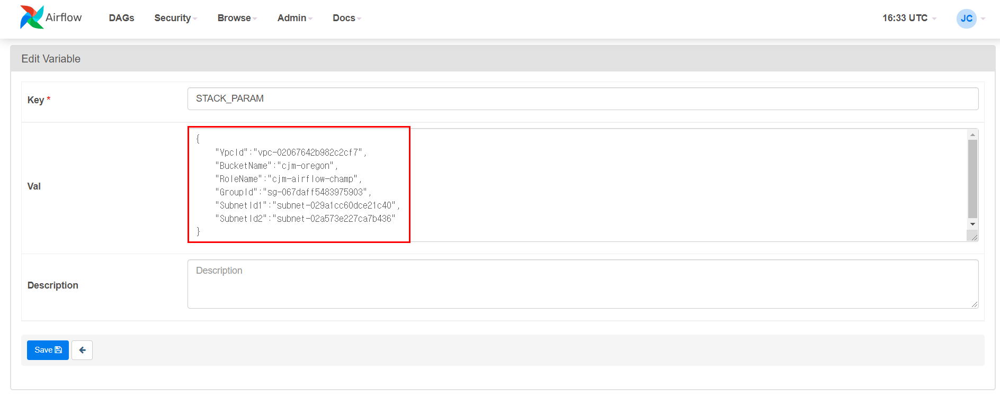

# Apache Airflow를 MWAA로 Migration

MWAA는 IAM을 기준으로 User를 판단하기 때문에 기존에 사용하던 User와는 차이가 있다.
또한 Meta Database나 Computing Server가 별도로 생성되고 접근할 수 없기 때문에 User를 제외한 Variable, Connection, Requirements, DAGS를 기준으로 Migration을 진행해야합니다.

## 1. 고려사항

1. Variable
   변수는 DAG 이관 시 DAG 내부에서 사용되기 때문에 똑같이 이관되어야 합니다.
   변수는 Airflow CLI로 import/export를 모두 지원한다.
   따라서 기존 Airflow에서 Export 진행 후 MWAA의 내부에서 적재 후 Import를 진행하면 된다.
2. Connection
   Connection 또한 DAG 이관 시 DAG 내부에서 사용되기 때문에 똑같이 이관되어야 합니다.
   Connection 에 대한  import/export는 Airflow 버전별로 상이합니다.
   Airflow 2.1.2 이상부터는 import/export를 모두 지원하지만 MWAA의 최신 버전인 2.0.2는 Import는 지원하지 않으므로 DAG를 통해 programming으로 ADD 또는 Update를 진행해야합니다.
3. DAGS
   Dag들은 기존 그대로 사용하면 됩니다.
   `render_template_as_native_obj`와 같은 옵션들은 Airflow 버전별 지원안할수도 있으니 이런 옵션들은 고려해서 이관해야합니다.
4. Requirements
   Airflow에서 사용되는 Plugin들을 MWAA에서 계속 사용하기 위해 필요합니다.
   기존 library를 기준으로 requirements.txt를 만들어서 MWAA에 적용해야합니다.

<div style="page-break-after: always; break-after: page;"></div>

## 2. Migration

기존 Resource들(S3, VPC 등)을 이용하면서 MWAA를 생성하기 위해서는 기존 Resource들을 Cloudformation Stack에 올립니다. 또한 Cloudformation에서 사용하기 위해 IAM 조정등을 진행합니다.

1. IAM 수정

   1. Cloudformation에서 사용하기 위한 신뢰관계 추가

      ```json
      {
        "Version": "2012-10-17",
        "Statement": [
          {
            "Effect": "Allow",
            "Principal": {
              "Service": [
                "ec2.amazonaws.com",
                "airflow-env.amazonaws.com",
                "glue.amazonaws.com",
                "airflow.amazonaws.com",
                "cloudformation.amazonaws.com"
              ]
            },
            "Action": "sts:AssumeRole"
          }
        ]
      }
      ```

      

   2. MWAA 생성 및 사용을 위한 Policy 생성
      

      [IAM_POLICY](codes/policy_for_mwaa.json)

2. Cloudformation에서 사용할 yaml 파일 생성

   1. 기존 Resource를 Stack에 올리고 싶은 경우 yaml파일을 통해 Stack에 올립니다.
      하지만 이 경우 output까지 한번에 진행할 수 없습니다. 
      
      [Get_Resource](codes/get_resource.yaml)
   2. 때문에 Stack 생성 후 update를 통해 output 설정을 합니다.
      
      [Export_Resource](codes/export_resource.yaml)
   3. output을 활용 mwaa 생성용 yaml 파일에서 기존 resource를 가져온 stack의 output을 참조합니다.
      yaml 파일 내부의 s3 dag와 requirements.txt는 본인 resource에 맞게 수정해야합니다.
      
      [Mwaa_Env](codes/mwaa_env.yaml)

3. 변수에 기존 Resource 정보들을 담은 json 등록
   하단 json 값을 본인 resource id로 변경하면 됩니다.

   ```json
   {
       "VpcId":"{vpc_id}",
       "BucketName":"{bucket_name}",
       "RoleName":"{role_name}",
       "GroupId":"{security_group_id}",
       "SubnetId1":"{subnet_id1}",
       "SubnetId2":"{subnet_id2}"
   }
   ```

   

   [parameter](codes/param.json)

4. Variable, Connection, Requirements, DAGS Export
   상단의 파일들을 대상 S3에 복사합니다.
   
   [Export_Airflow](codes/export_airflow.py)
   
5. MWAA에서 import를 진행할 DAG 적재.
   
   [Import_Config](codes/import_config.py)
   
6. 상단에서 생성한 yaml파일을 사용하여 Mwaa 생성.
   
   [Mwaa_Mig](codes/mwaa_mig.py)

<div style="page-break-after: always; break-after: page;"></div>

## 과제

1. EC2 Airflow > MWAA Migration (**AWS 콘솔 사용 금지**)
2. 4주차 과제를 MWAA에서 수행
3. 일련의 과정을 Airflow DAG로 구성