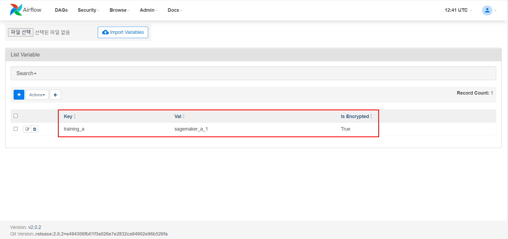
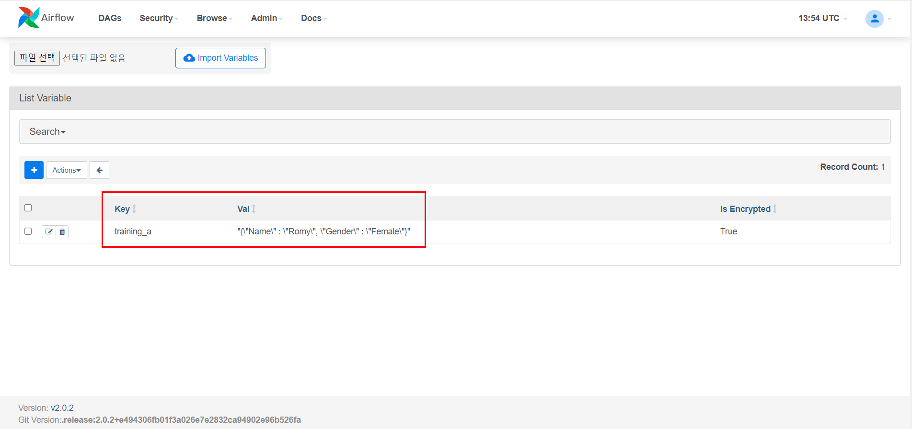

# MWAA 기능 test

MWAA와의 같은 환경의 Lambda 또는 EC2에서 MWAA CLI test

1. Variable 변경

   AS-IS Variable

   


   ```sh
   # MWAA CLI
   variables set {KEY} {VALUE}
   # json을 Value 값으로 변경하려는 경우
   variables set {KEY} --json "{"KEY" : "VALUE", "KEY" : "VALUE"}"
   ```

   ```python
   # Test code
   import json
   import boto3
   import requests
   import base64
   from pprint import pprint
   
   # Your MWAA Name
   resource_id = "cjm-cdf-MwaaEnvironment"
   
   client = boto3.client("mwaa", region_name="us-west-2")
   token = client.create_cli_token(Name=resource_id)
   url = "https://{0}/aws_mwaa/cli".format(token["WebServerHostname"])
   # MWAA CLI to Body
   body = """variables set training_a --json "{"Name" : "Romy", "Gender" : "Female"}""""
   headers = {
       "Authorization" : "Bearer "+token["CliToken"],
       "Content-Type": "text/plain"
       }
   r = requests.post(url, data=body, headers=headers)
   
   mwaa_std_out_message = base64.b64decode(r.json()["stdout"]).decode("utf8")
   pprint(mwaa_std_out_message)
   ```

   TO-BE

   

2. 전체 DAG 조회

   ```sh
   # MWAA CLI
   # Output 변경 가능 (table, yaml, plain text)
   dags report -o json
   ```

   ```python
   # Test code
   import json
   import boto3
   import requests
   import base64
   from pprint import pprint
   
   # Your MWAA Name
   resource_id = "cjm-cdf-MwaaEnvironment"
   
   client = boto3.client("mwaa", region_name="us-west-2")
   token = client.create_cli_token(Name=resource_id)
   url = "https://{0}/aws_mwaa/cli".format(token["WebServerHostname"])
   # MWAA CLI to Body
   body = "dags report -o json"
   headers = {
       "Authorization" : "Bearer "+token["CliToken"],
       "Content-Type": "text/plain"
       }
   r = requests.post(url, data=body, headers=headers)
   
   mwaa_std_out_message = base64.b64decode(r.json()["stdout"]).decode("utf8")
   pprint(json.loads(mwaa_std_out_message))
   ```

   ```json
   // result json
   [
       {
           "dag_num": "1",
           "dags": ["topic_2_dag_2"],
           "duration": "0:00:00.084525",
           "file": "/topic_2_dag_2.py",
           "task_num": "3"},
       {
           "dag_num": "1",
           "dags": ["mwaa_emr_2"],
           "duration": "0:00:00.049332",
           "file": "/mwaa_emr_2.py",
           "task_num": "3"},
       {
           "dag_num": "1",
           "dags": ["import_config"],
           "duration": "0:00:00.001544",
           "file": "/import_config.py",
           "task_num": "3"
       }
   ]
   ```

   

3. 특정 DAG 조회

   ```sh
   # MWAA CLI
   # Output 변경 가능 (table, yaml, plain text)
   dags list-jobs -d DAG_ID -o json
   ```

   ```python
   # Test code
   import json
   import boto3
   import requests
   import base64
   from pprint import pprint
   
   # Your MWAA Name
   resource_id = "cjm-cdf-MwaaEnvironment"
   
   client = boto3.client('mwaa', region_name='us-west-2')
   token = client.create_cli_token(Name=resource_id)
   url = "https://{0}/aws_mwaa/cli".format(token['WebServerHostname'])
   # MWAA CLI to Body
   body = "dags list-jobs -d import_config -o json"
   headers = {
       'Authorization' : 'Bearer '+token['CliToken'],
       'Content-Type': 'text/plain'
       }
   r = requests.post(url, data=body, headers=headers)
   
   mwaa_std_out_message = base64.b64decode(r.json()['stdout']).decode('utf8')
   pprint(json.loads(mwaa_std_out_message))
   ```

   ```json
   // result json
   [
       {
           "dag_id": "import_config",
           "end_date": "2021-09-13 14:20:33.075438+00:00",
           "job_type": "LocalTaskJob",
           "start_date": "2021-09-13 14:20:29.162906+00:00",
           "state": "success"
       }
   ]
   ```

4. 전체 DAG 실행 내역 조회

   ```sh
   # MWAA CLI
   # Output 변경 가능 (table, yaml, plain text)
   dags list-runs -o json
   ```

   ```python
   # Test code
   import json
   import boto3
   import requests
   import base64
   from pprint import pprint
   
   # Your MWAA Name
   resource_id = "cjm-cdf-MwaaEnvironment"
   
   client = boto3.client('mwaa', region_name='us-west-2')
   token = client.create_cli_token(Name=resource_id)
   url = "https://{0}/aws_mwaa/cli".format(token['WebServerHostname'])
   # MWAA CLI to Body
   body = "dags list-runs -o json"
   headers = {
       'Authorization' : 'Bearer '+token['CliToken'],
       'Content-Type': 'text/plain'
       }
   r = requests.post(url, data=body, headers=headers)
   
   mwaa_std_out_message = base64.b64decode(r.json()['stdout']).decode('utf8')
   pprint(json.loads(mwaa_std_out_message))
   ```

   ```json
   // result json
   [
       {
           "dag_id": "import_config",
           "end_date": "2021-09-13T14:20:33.002278+00:00",
           "execution_date": "2021-09-13T14:20:27.596561+00:00",
           "run_id": "manual__2021-09-13T14:20:27.596561+00:00",
           "start_date": "2021-09-13T14:20:27.609722+00:00",
           "state": "success"
       }
   ]
   ```

   

5. 특정 DAG 실행 내역 조회

   ```sh
   # MWAA CLI
   # Output 변경 가능 (table, yaml, plain text)
   dags list-runs -d DAG_ID -o json
   ```

   ```python
   # Test code
   import json
   import boto3
   import requests
   import base64
   from pprint import pprint
   
   # Your MWAA Name
   resource_id = "cjm-cdf-MwaaEnvironment"
   
   client = boto3.client('mwaa', region_name='us-west-2')
   token = client.create_cli_token(Name=resource_id)
   url = "https://{0}/aws_mwaa/cli".format(token['WebServerHostname'])
   # MWAA CLI to Body
   body = "dags list-runs -d import_config -o json"
   headers = {
       'Authorization' : 'Bearer '+token['CliToken'],
       'Content-Type': 'text/plain'
       }
   r = requests.post(url, data=body, headers=headers)
   
   mwaa_std_out_message = base64.b64decode(r.json()['stdout']).decode('utf8')
   pprint(json.loads(mwaa_std_out_message))
   ```

   ```json
   // result json
   [
       {
           "dag_id": "import_config",
           "end_date": "2021-09-13T14:20:33.002278+00:00",
           "execution_date": "2021-09-13T14:20:27.596561+00:00",
           "run_id": "manual__2021-09-13T14:20:27.596561+00:00",
           "start_date": "2021-09-13T14:20:27.609722+00:00",
           "state": "success"
       }
   ]
   ```

   

6. 특정 DAG 실행 상태 조회

   ```sh
   # MWAA CLI
   dags state DAG_ID execution_date
   ```

   ```python
   # Test code
   import json
   import boto3
   import requests
   import base64
   import ast
   from pprint import pprint
   
   # Your MWAA Name
   resource_id = "cjm-cdf-MwaaEnvironment"
   
   client = boto3.client('mwaa', region_name='us-west-2')
   token = client.create_cli_token(Name=resource_id)
   url = "https://{0}/aws_mwaa/cli".format(token['WebServerHostname'])
   # MWAA CLI to Body
   body = "dags state import_config '2021-09-13T14:20:27.596561+00:00'"
   headers = {
       'Authorization' : 'Bearer '+token['CliToken'],
       'Content-Type': 'text/plain'
       }
   r = requests.post(url, data=body, headers=headers)
   
   mwaa_std_out_message = base64.b64decode(r.json()['stdout']).decode('utf8')
   status = mwaa_std_out_message.split("\n")[-2]
   pprint(status)
   ```

   ```sh
   # result
   'success'
   ```

